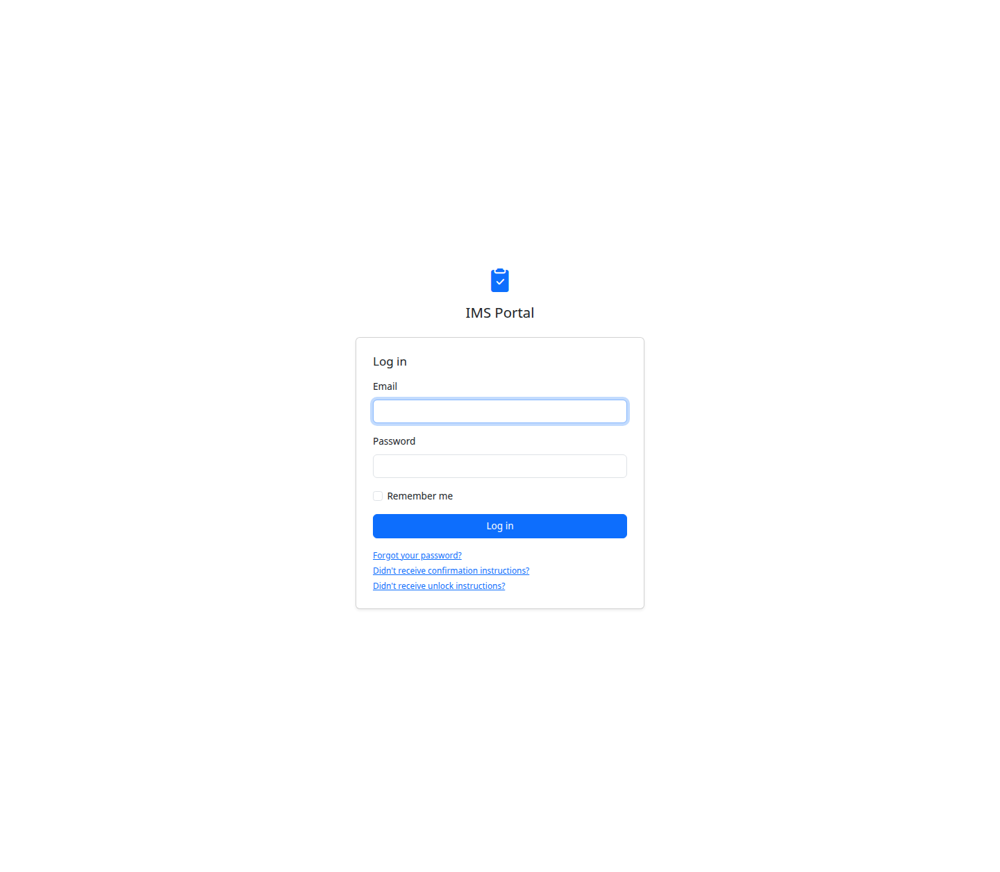
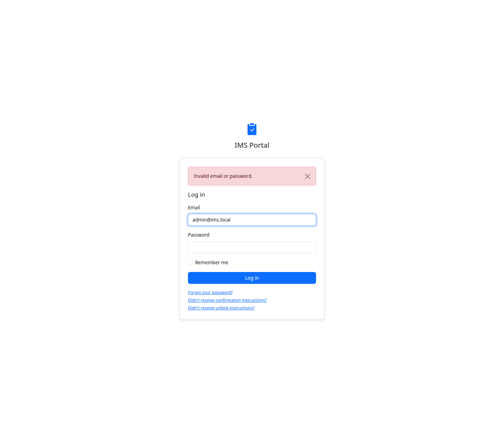
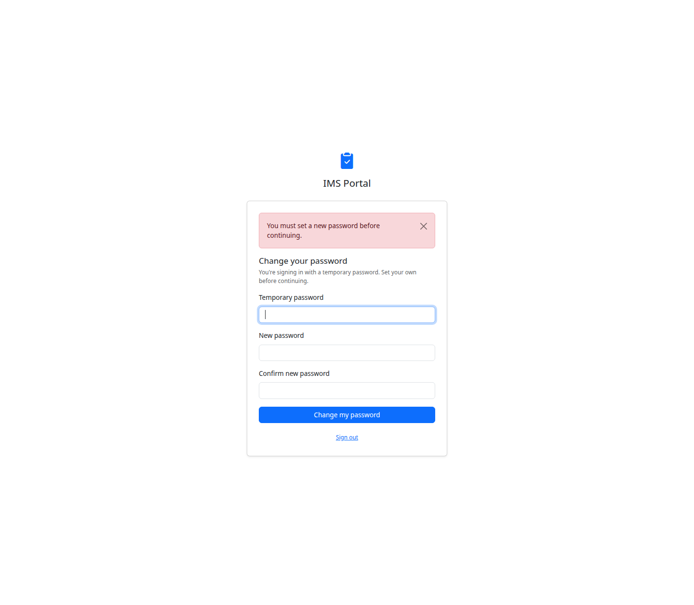
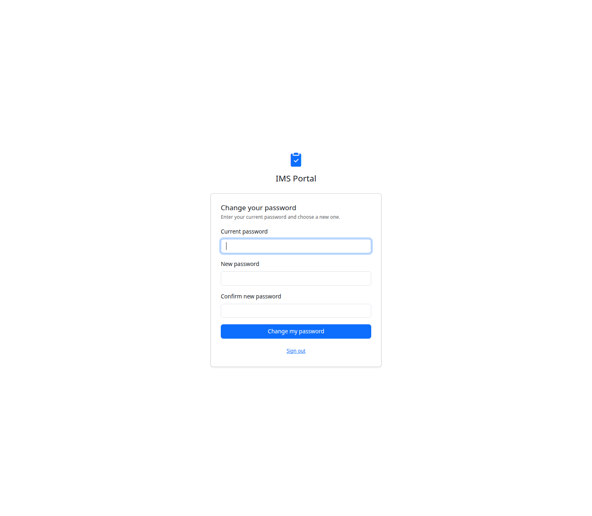
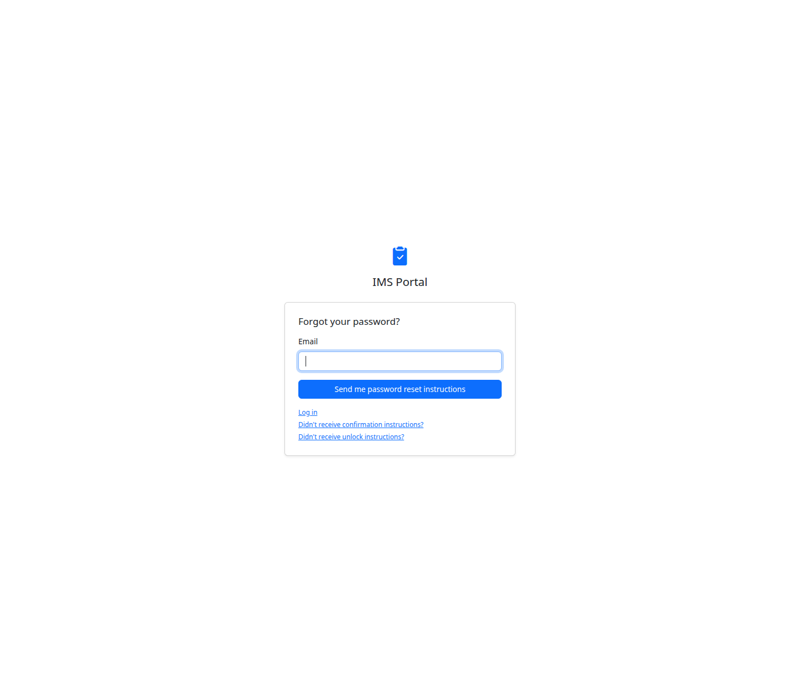
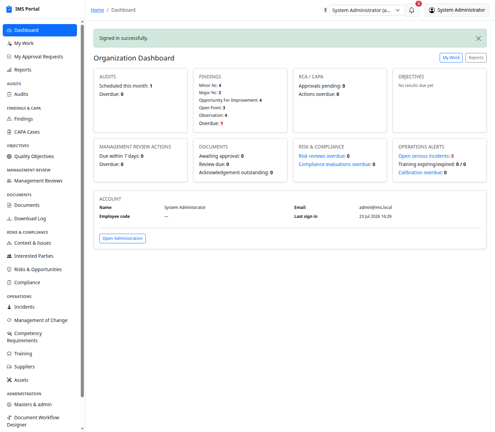
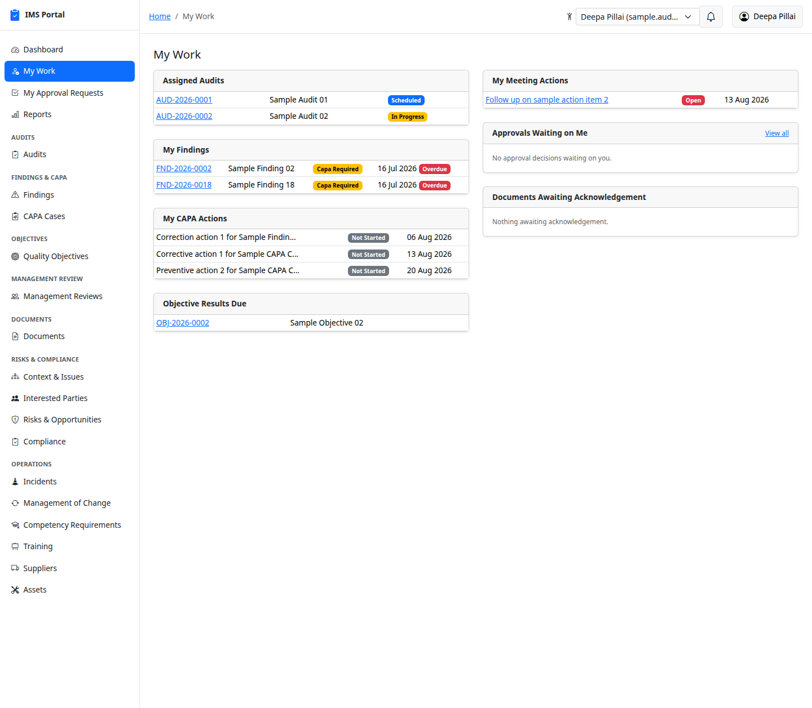
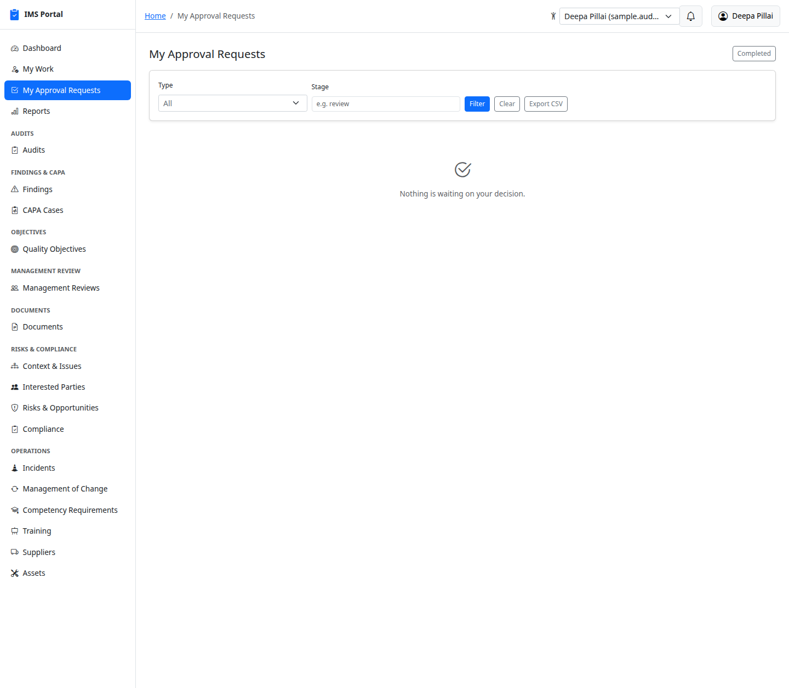
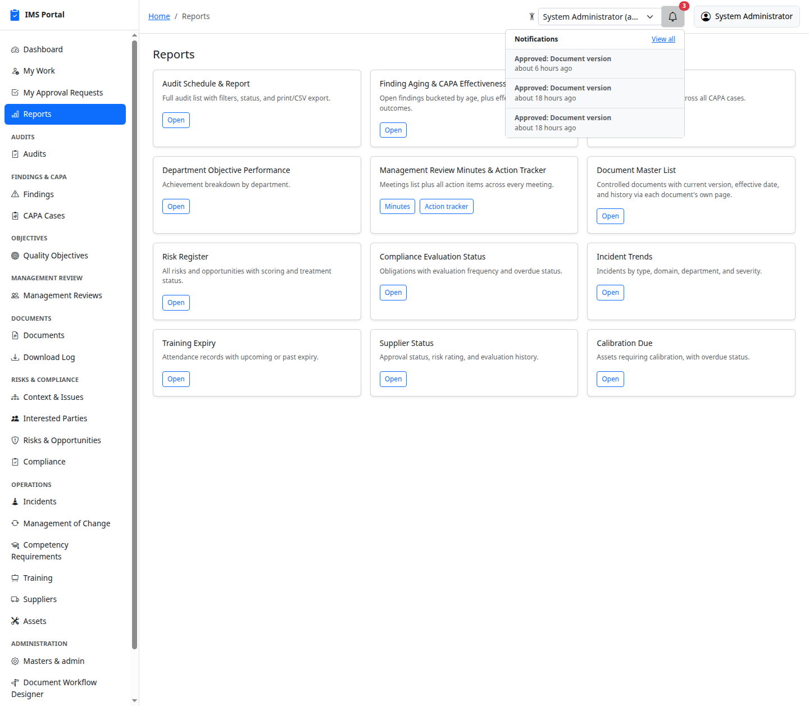
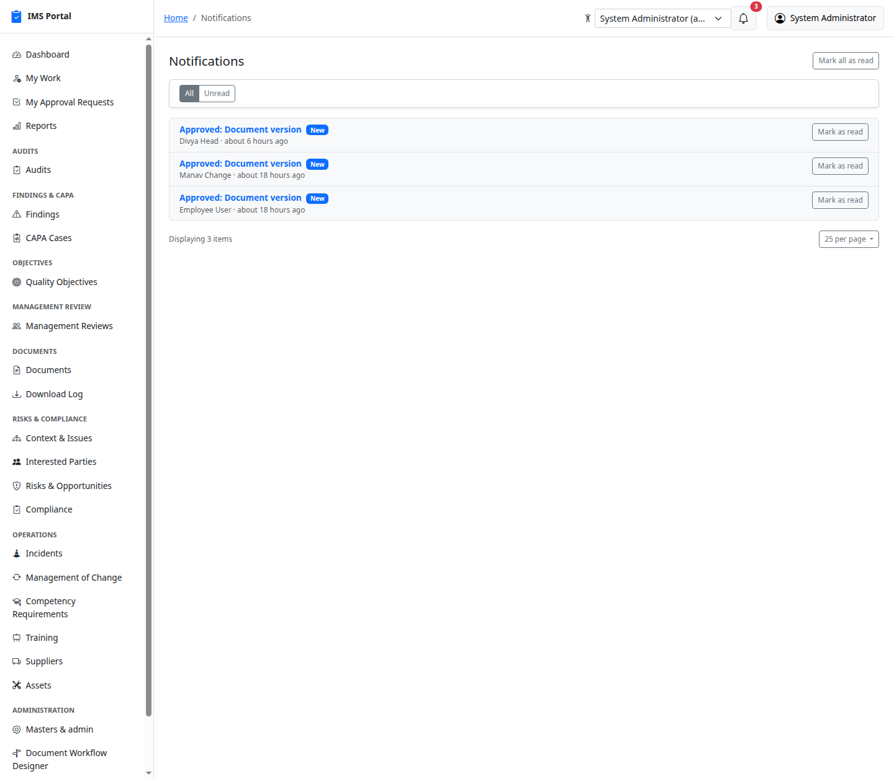

# Getting Started

Every screenshot in this guide is taken from a real, running copy of the app
seeded with the sample data created by `bin/rails sample_data:seed` (see the
main [README](README.md) for how to reproduce it).

## Signing in

Go to `/users/sign_in`. The app never lets you self-register — an
administrator creates your account (Masters & admin → Users, or the
`sample_data:seed`/demo seed for non-production copies), and you sign in with
the email and password you were given.

An incorrect email or password shows a plain-language error and re-displays
the form with your email preserved (never the password):

After too many failed attempts Devise locks the account automatically
(`lockable`); the account owner gets an unlock email, or an admin can unlock
them from Masters & admin → Users.

## Forced password change

Every account an administrator creates starts with `must_change_password`
set — the temporary password only works to get to one screen: **Change your
password**. Every other page (except sign-out) redirects here until it's
done:

You enter the temporary password once as "Temporary password", then your own
new password twice. After that you're a normal user with full access to
whatever your roles grant. You can voluntarily change your password the same
way later from the account menu → **Change password** — the only difference
is the field is labeled "Current password" instead:

Forgot your password entirely? Use **Forgot your password?** on the sign-in
page to get a reset email:

## The dashboard and navigation

After signing in you land on the **Organization Dashboard** — an
at-a-glance summary of every module: open audits, findings by kind, RCA/CAPA
approvals pending, objective status, management review actions, document
approvals, risk/compliance overdue counts, and cross-module operational
alerts (serious incidents, training expiry, calibration overdue).

The left sidebar is the map of the whole app, grouped exactly the way the
business groups the work: **Audits** (Audit Programme, Audits, Report
Download Log); **Findings & CAPA** (Findings, CAPA
Cases); **Objectives**; **Management Review**; **Documents**; **Risks &
Compliance** (Context & Issues, Interested Parties, Risks & Opportunities,
Compliance); **Operations** (Incidents, Management of Change, Competency
Requirements, Training, Suppliers, Assets); and **Administration** (Masters
& admin, Document Workflow Designer). Every item you see is filtered by
what your role is actually allowed to access — two users can have visibly
different sidebars.

The topbar (present on every page) has: the accessibility-mode toggle, a
role switcher (if you hold more than one role or a per-user access
override), the **site picker** (only if you can reach more than one site),
the notification bell, and your account menu.

If your organization runs more than one plant, everything you see —
dashboard counts included — is limited to the site(s) you are posted at.
The site picker lets a corporate user switch between **All sites** and one
plant at a time, re-scoping every page at once. See
[Sites](31-sites.md). With a single site there is no picker and nothing
changes.

## My Work — your personal queue

**My Work** is the cross-module "what's on my plate" view: it pulls
together every audit you're a participant on, every finding/CAPA action
you own or are assigned, every objective result that's due from you, every
meeting action item assigned to you, every approval decision waiting on
you, and every document awaiting your acknowledgement — each in its own
card, each linking straight to the record:

A user with nothing outstanding sees the same cards with a plain "No
assigned audits." / "Nothing awaiting acknowledgement." empty state instead
of an error or a blank page — every list in this app follows that rule.

## My Approval Requests

Anything you've *submitted* that's waiting on someone else's decision
(document versions, management review minutes, and other approval-gated
records) shows up here, split into pending and completed tabs. Nothing
submitted yet gives you the same kind of empty state:

## Notifications

The bell in the topbar shows a live unread count. Click it for a quick
dropdown of the most recent items, each linking to the record and to **View
all**:

**View all** (or the sidebar isn't needed — the bell is on every page) opens
the full, paginated notification list, with **Mark as read** per item and
**Mark all as read** in one click. Every assignment, submission, approval
decision, approaching/overdue due date, meeting invitation, and document
publication creates one of these (and, per the org's mail settings, an
email) automatically:

## Reports

**Reports** (sidebar, top) is the printable/exportable side of the
dashboard: one card per cross-module report — Audit Schedule & Report,
Finding Aging & CAPA Effectiveness, Department Objective Performance,
Management Review Minutes & Action Tracker, Document Master List, Risk
Register, Compliance Evaluation Status, Incident Trends, Training Expiry,
Supplier Status, and Calibration Due. See
[Dashboards & Reports](16-dashboards-and-reports.md) for what each one shows
and how to export it.

---
Next: [Masters & Admin](01-masters-and-admin.md)
