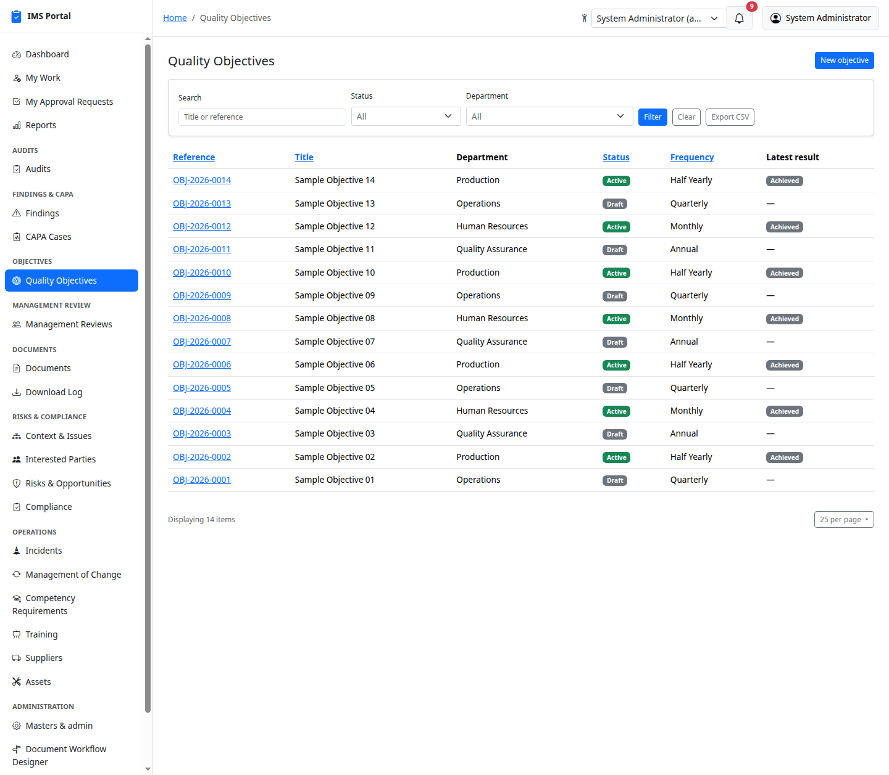
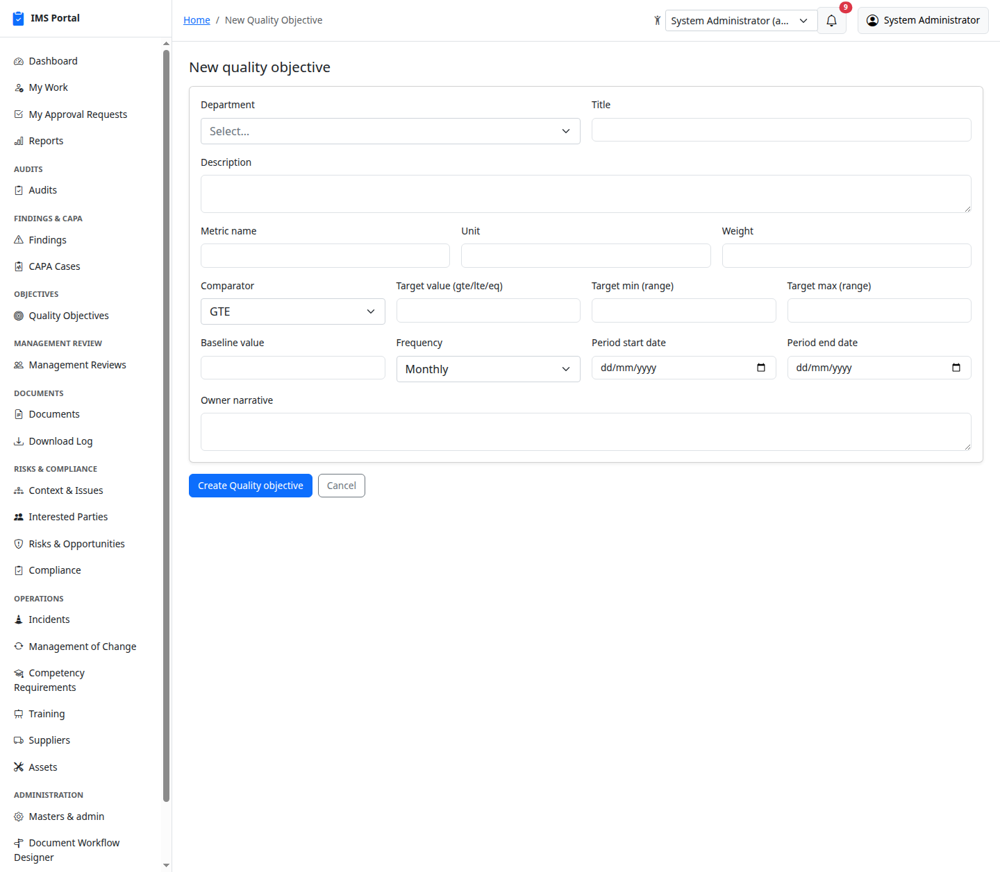
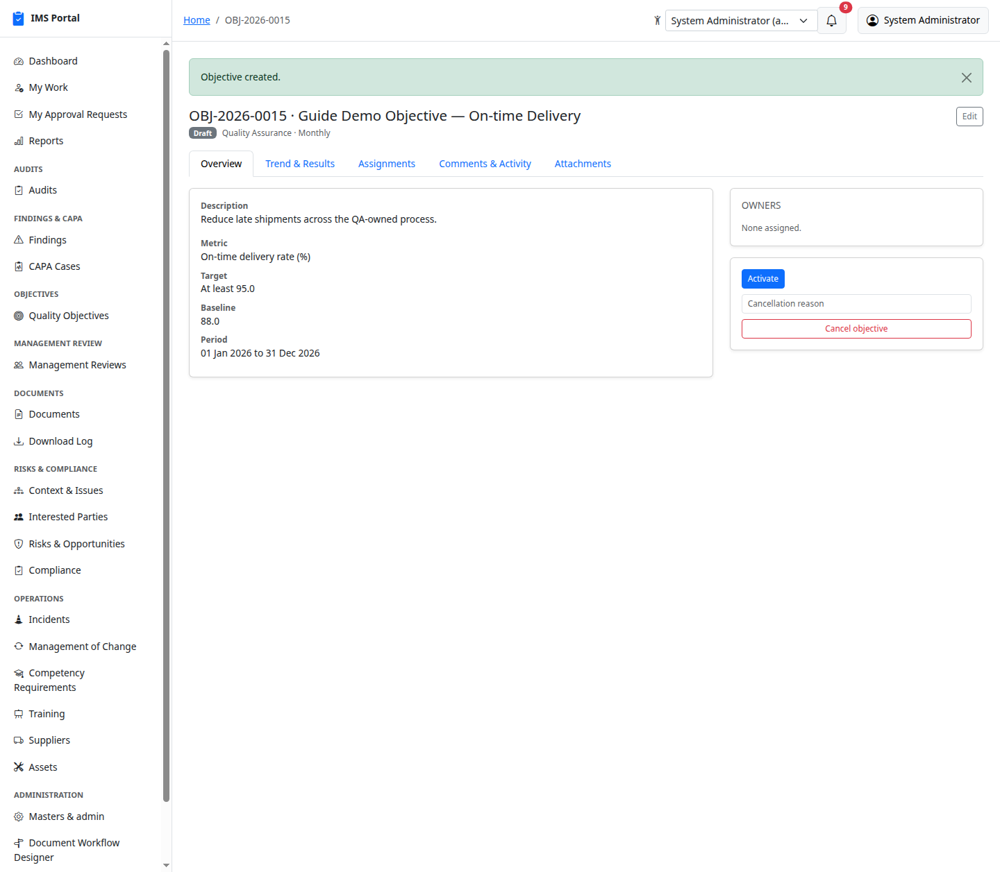
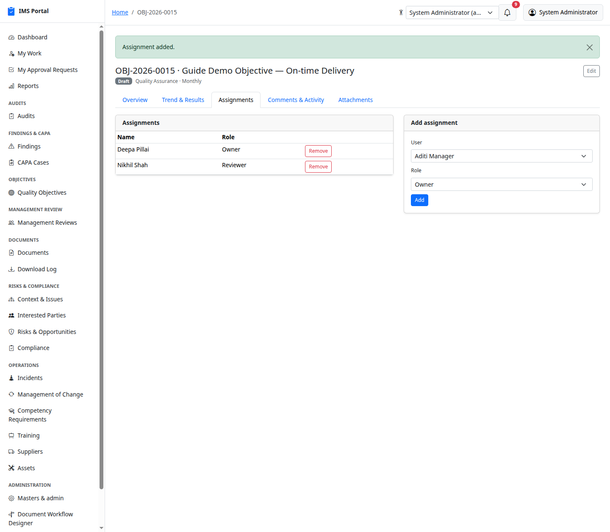
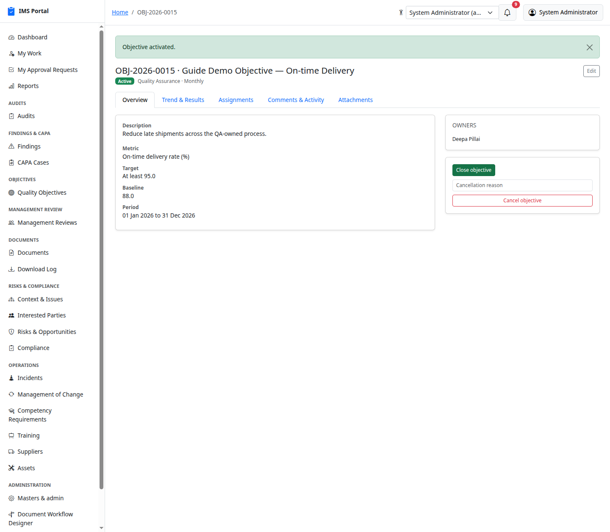
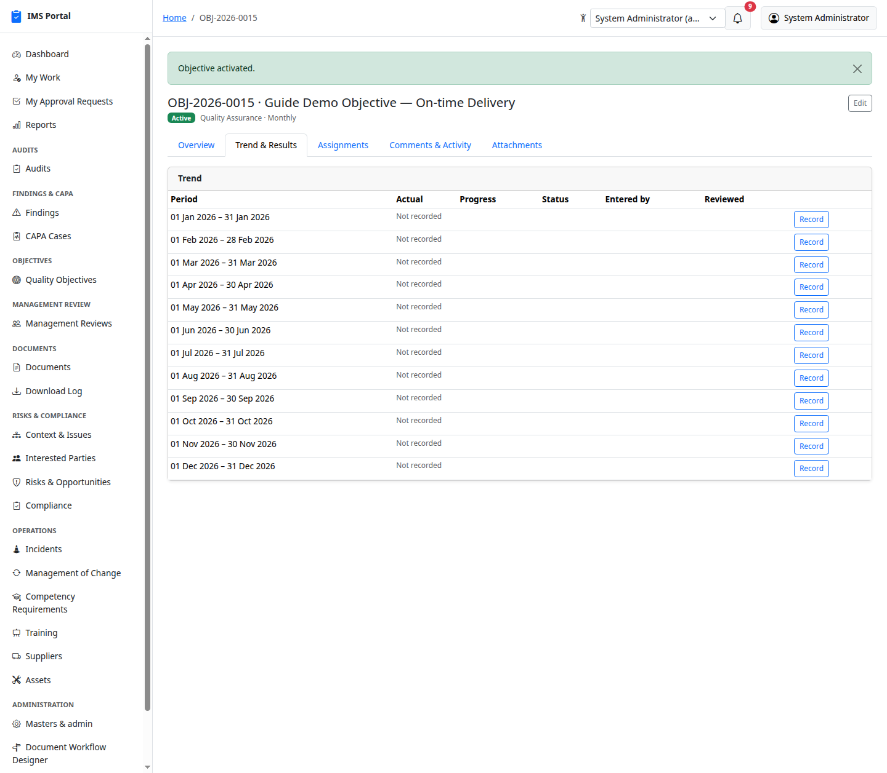
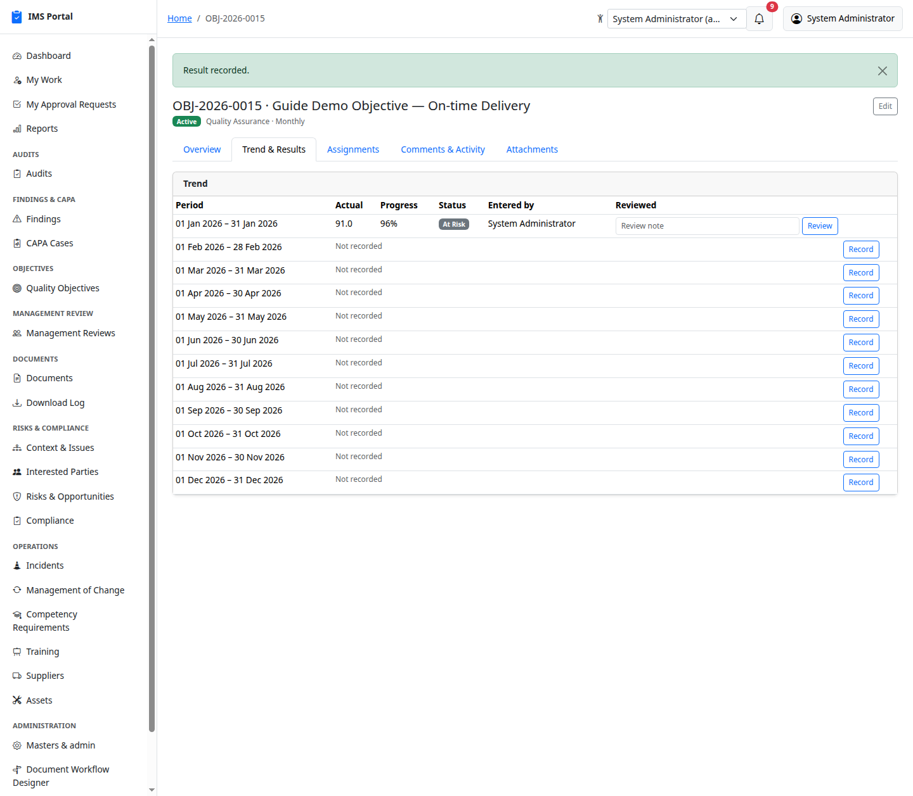
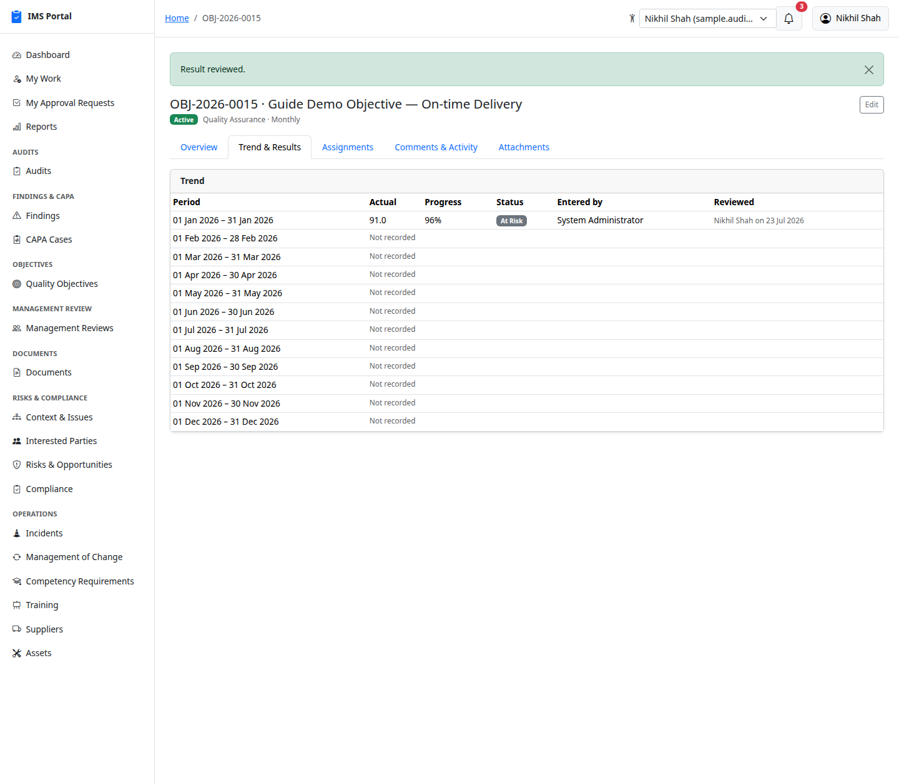
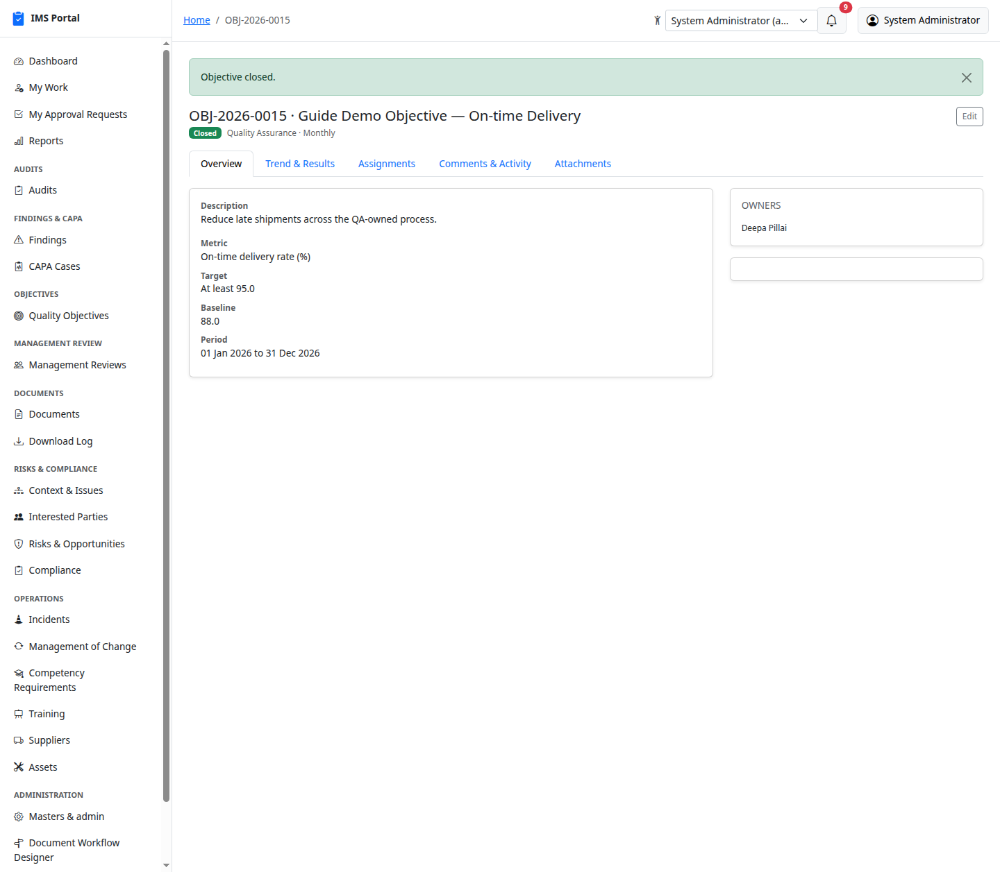
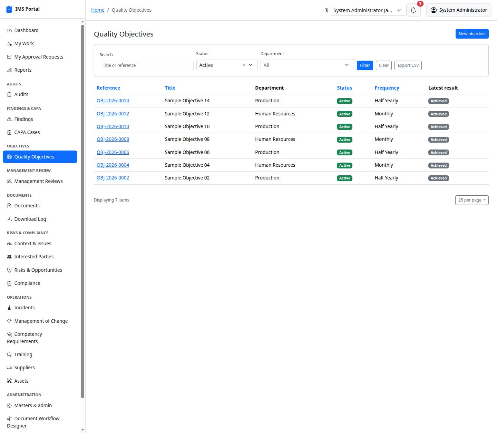

# Quality Objectives

Sidebar → **Objectives → Quality Objectives**. Departmental objectives with
a measurable target, a periodic reporting cadence, and a computed
achievement trend.

## List and create

**New Objective** ties the objective to a department and defines the
metric: comparator (**GTE** / **LTE** / **EQ** / **range**), target value
(or min/max for a range), optional baseline and unit, reporting
**frequency** (monthly/quarterly/half-yearly/annual), and the overall
period the objective covers:

Saving creates it in **Draft**:

## Assignments

Multiple people can be assigned to one objective, each with a role —
**Owner**, **Contributor**, or **Reviewer**. Owners/contributors can
record results; only reviewers (or the department head) can mark a result
as reviewed:

## Activating and tracking results

**Draft → Active** is a single click, once owners are assigned:

The **Trend & Results** tab auto-generates one row per expected reporting
period for the whole year (derived from frequency + the objective's date
range) — each starts **Not recorded** with a **Record** button:

Recording a result computes **Progress** and a **Status** (e.g. **At
Risk**, **Achieved**, **Missed**) automatically from the comparator/target
— nothing to calculate by hand:

A reviewer adds an optional note and marks it **Reviewed**, which stamps
who and when — after that the row is read-only:

## Closing and cancelling

**Active → Closed** with one click once the reporting period is done:

Draft or Active objectives can also be **Cancelled** with a required
reason from the Overview tab (same pattern as Audits/CAPA Cases).

## Filtering

Achievement across every department rolls up into the **Department
Objective Performance** report — see
[Dashboards & Reports](16-dashboards-and-reports.md).

---
Previous: [CAPA Cases](04-capa-cases.md) · Next: [Management Reviews](06-management-reviews.md)
