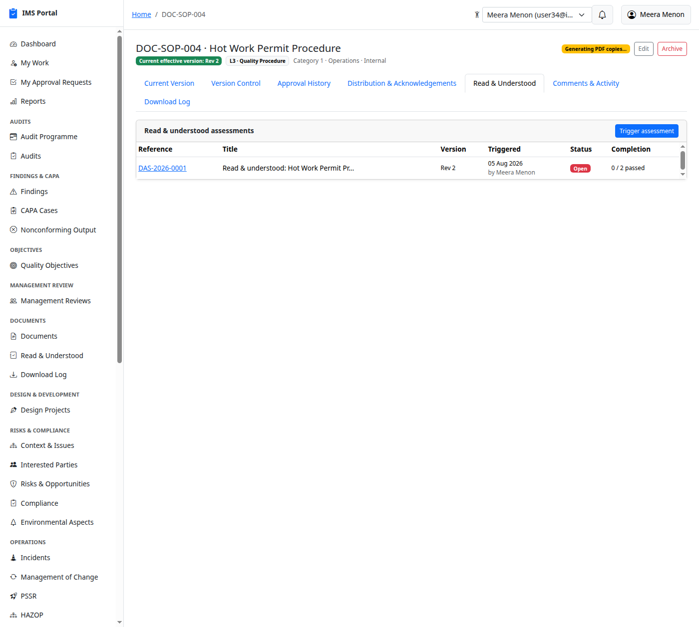
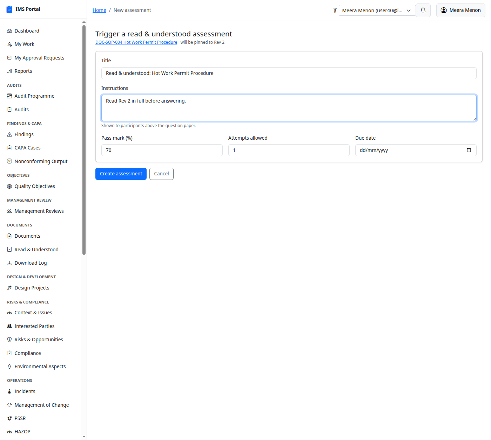
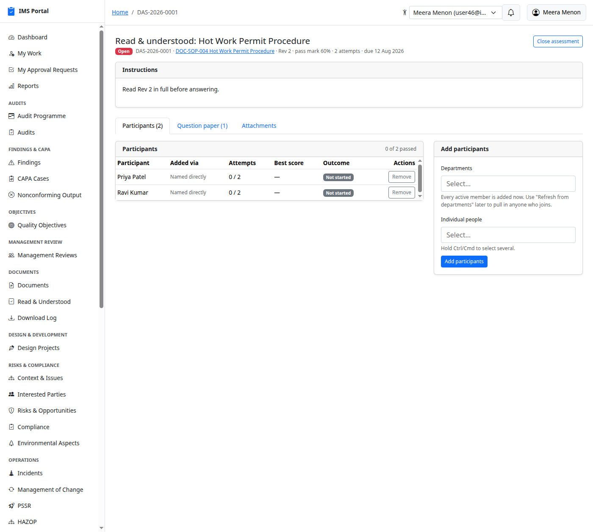
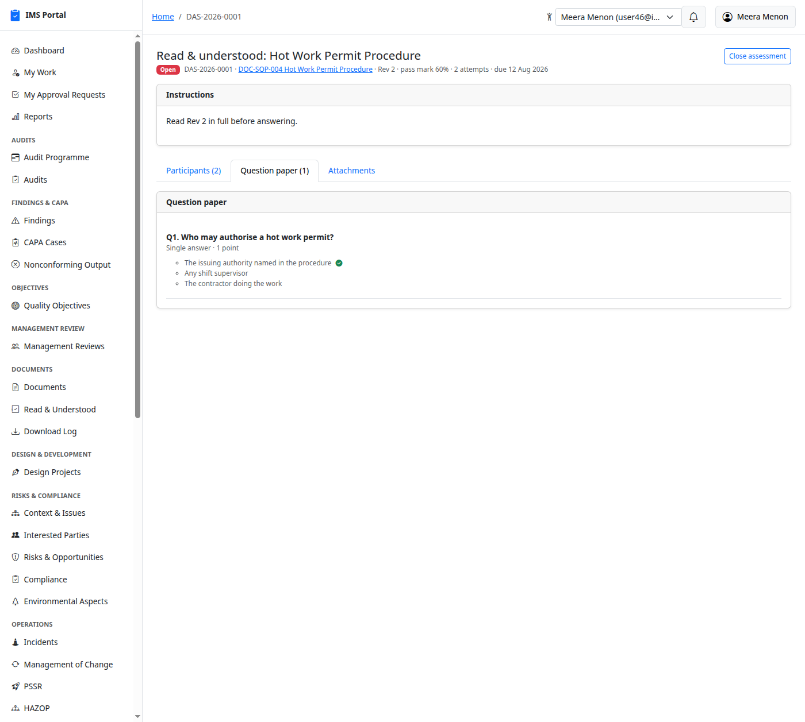
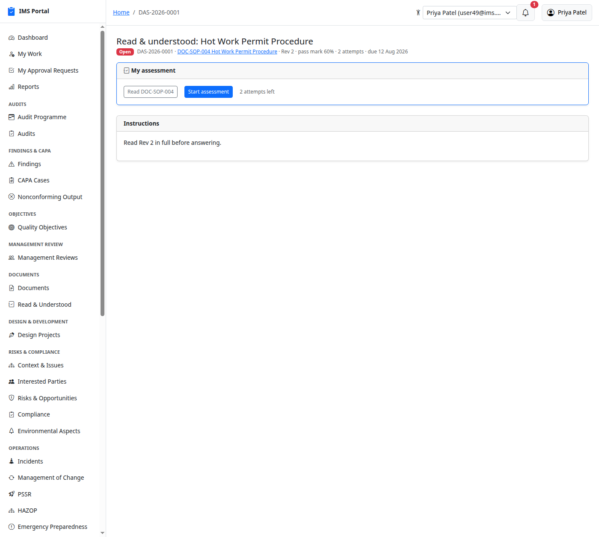
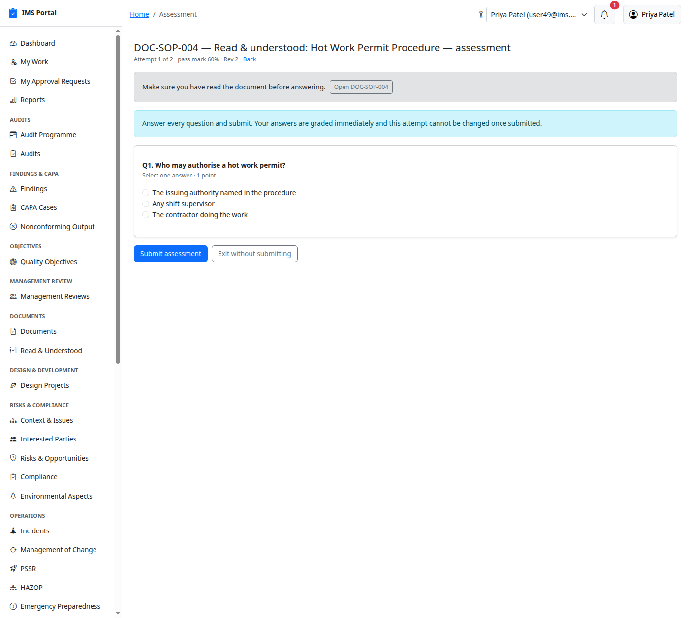
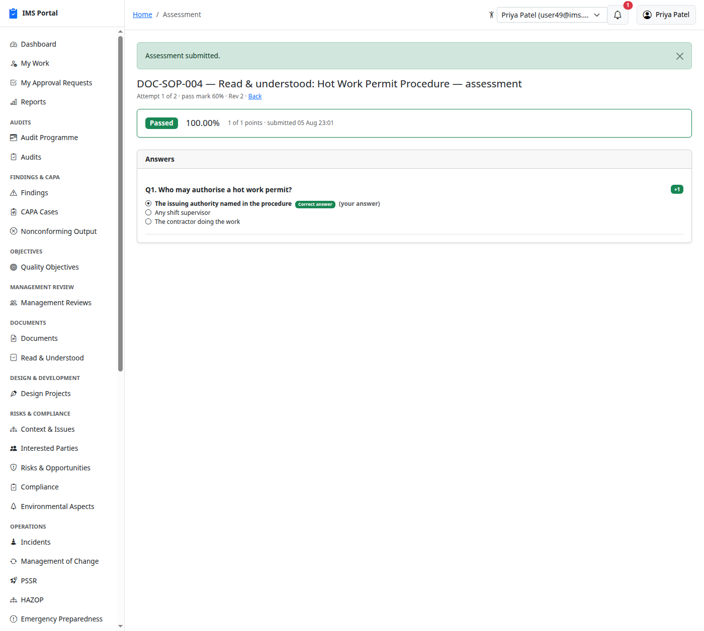
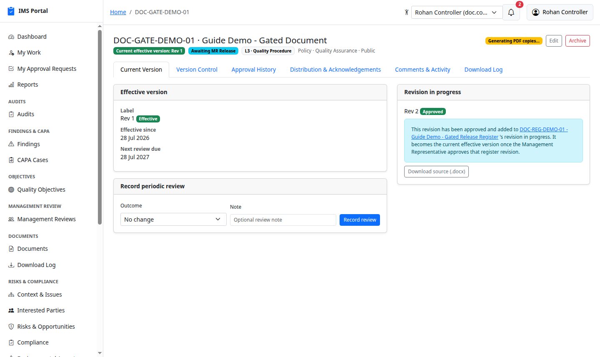
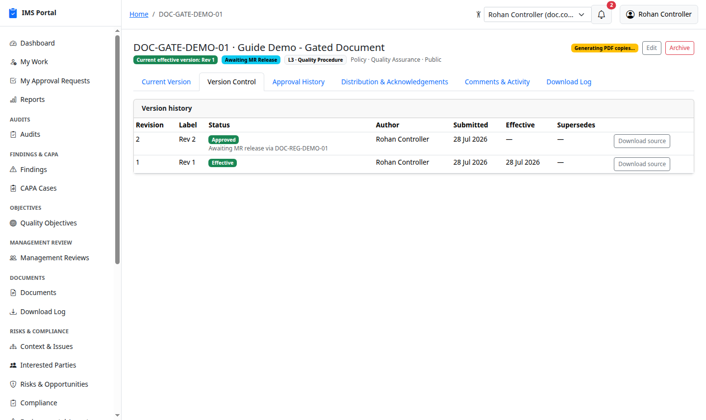
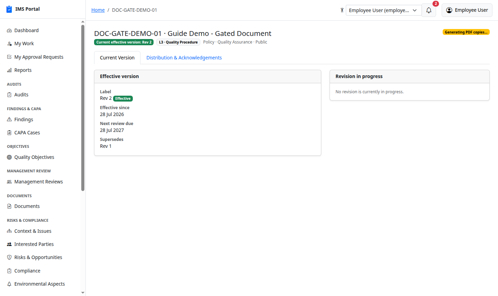

# Documents

Sidebar → **Documents → Documents**. Controlled documents with sequential
review/publish approvals, immutable published revisions, distribution and
acknowledgement tracking, and generated Control/Master copy PDFs with a
cover sheet and approval signatures baked in. Who can create, review, and
publish for each department is configured once in the
[Document Workflow Designer](01-masters-and-admin.md#document-workflow-designer).

## List and create

**New Document** picks a category (which sets the `DOC-<category>-NNN`
numbering and default review frequency), title, department (only
departments you're a configured creator for are offered, unless you can
manage documents globally), owner, confidentiality, review frequency, QMS
level, and related standards/clauses:

A document with no revisions yet has nothing to view or download:

### Documents that go to every site

In a multi-site organization a document belongs to the site it was created
at, like every other record. A corporate-issued document — a group HSE
policy, a company-wide procedure — can instead be marked **shared with all
sites**: it is then readable, downloadable and acknowledgeable at every
plant while still being owned, revised and approved centrally. Shared
documents carry an **All sites** badge on the list.

This is one of only two things in the app that deliberately cross the site
boundary (the other is an audit that spans all sites). See
[Sites](31-sites.md).

## First revision → review → publish

**Start new revision** (Current Version tab) takes a label, change
summary, and a `.docx` file:

It saves as an editable **Draft** revision — edit it freely, replace the
file, or re-save until it's ready:

**Submit for approval** shows exactly who the configured reviewers and
publishers are for this department before you submit (and warns if none
are configured), plus lets you add extra approvers for this submission
only:

The Approval History tab shows both stages — **every** reviewer must
approve before it moves to the publish stage, and **every** publisher must
approve before it goes effective:

Reviewers and publishers approve from **My Approval Requests**, same as
everywhere else. Once the last publisher approves, the revision becomes
the document's **effective, current version** — immutable from here on:

## The generated Control/Master Copy PDFs

Publishing kicks off a background job that renders a **Control Copy** and
a **Master Copy** PDF, each with an auto-generated cover sheet — document
number, title, department, revision, issue date, and a full approval
signature table with real timestamps — watermarked accordingly:

**Download Control Copy** / **Download Master Copy** on the document's
header stay disabled/show a "still generating" message until that job
finishes; every download (not just view) is logged.

## Version Control and other tab visibility

Every past revision stays visible on the **Version Control** tab, with its
status, author, submission and effective dates, and what it superseded:

**Record periodic review** (Current Version tab) logs a review outcome
("No change" or otherwise) with an optional note against the effective
version, independent of starting a new revision:

Not everyone sees every tab on a document's page. Two rules apply, and
they're independent of each other:

**View Department / View All** (`document_access_level`) only ever see
**Current Version**, **Distribution & Acknowledgements**, and, where
applicable, **Preview** — nothing else:

**Admin Department / Admin All** see every tab *except* Version
Control — Approval History, Comments & Activity, and Download Log join
the set above:

**Version Control** is a tab that isn't governed by `document_access_level`
at all — it's its own row in the
[Access Control Matrix](01-masters-and-admin.md#non-model-rows-feature-level-toggles-not-just-whole-records)
("Documents — Version Control tab"), seeded by default so the **Document
Controller** role sees it and no one else does, but from there it's a
normal matrix cell — an admin can grant it to another role, or to one
specific user, from Masters & admin → Access Control Matrix without any
code change:

Approval History/Comments & Activity/Download Log have a second matrix row
of their own too — **"Documents — Approval/Activity/Download Log
tabs"** — but unlike Version Control it ships with no default rule, since
Admin Department/Admin All already show these three tabs on their own.
Use this row when you need to widen access *without* promoting someone to
an admin tier — e.g. granting one particular auditor visibility into
approval history on documents, while everyone else with their role stays
on the narrow View-tier tab set.

## Distribution and acknowledgement

Distribute the effective version to a **site**, department, location, role,
or individual user, optionally **requiring acknowledgement**:

A distributed user sees the version in their own **My Work → Documents
Awaiting Acknowledgement** (see [Getting Started](00-getting-started.md))
and can acknowledge it directly from the Distribution tab; acknowledgement
timestamps accumulate below the distribution list:

## Read & Understood assessments

Acknowledgement above records that somebody *clicked* to say they had read
a revision. For a safety-critical procedure that often isn't enough — a
**Read & Understood assessment** puts a real multiple-choice paper against
a specific revision, and only a pass counts.

The **Read & Understood** tab lists every assessment raised against the
document, and **Read & Understood** in the sidebar lists them across the
whole app (searchable, filterable, CSV-exportable like every other list):

### Who can raise one

The **Management Representative** — for any document in the organization —
and the **publisher** of the document's department (the Document Workflow
Roles set up in Masters & admin), plus the IMS Admin. Deliberately not the
document's creator or the Document Controller: asking people to prove they
have understood a revision is a decision about the *released* text, so it
belongs to whoever released it. If you cannot see the **Trigger
assessment** button, that is why.

### Raising one

**Trigger assessment** takes a title, optional instructions shown to
candidates, a pass mark, attempts allowed, and a due date:

**The revision is pinned when you create it, and never moves.** The form
tells you which one it will be. If the document is revised later, this
assessment still refers to the revision people actually read — a new
revision gets its own assessment. Raising several against one document
over time is normal, and each has its own `DAS-YYYY-NNNN` reference.

A document with no effective version yet can't be assessed — there's
nothing to be assessed on.

### Who takes it

Add **individual people**, whole **departments**, or both:

Picking a department adds its active members as real rows there and then,
so the list is a fixed, auditable roster rather than something that
silently changes underneath you. **Refresh from departments** pulls in
anyone who joined since — it only ever *adds*: someone who has left is
never quietly dropped, because they may already have sat it.

A participant who has already sat it can't be removed at all — the attempt
is the evidence.

### The paper, and sitting it

Questions work exactly as they do for training — single-answer and
multiple-answer, the latter marked all-or-nothing — see
[Competency & Training](13-competency-and-training.md#building-the-question-paper):

**Trigger assessment** releases it to everyone on the list and notifies
them. It refuses without at least one participant and one answerable
question. Each participant gets their own panel, with a link to read the
document first:

**Passing records the acknowledgement for you** — the participant does not
have to pass the assessment *and* separately click "I have read this". The
acknowledgement is against the pinned revision:

Outstanding participants are chased daily while the assessment is open,
and once the due date passes whoever triggered it is told how many are
still outstanding. Open assessments also appear in each participant's
**My Work → Documents To Read & Confirm**.

A triggered assessment can't be edited or deleted — only **closed**, which
stops further attempts and grades anything still in progress. Only a draft
can be deleted.

## Download log

Every control/master copy download (who, when, which copy) is logged per
document — and in full across the whole app from the sidebar's own
**Download Log**:

## Archiving

**Archive** removes a document from the active list (a soft state, not a
delete — its history and downloads stay intact) with a confirmation
prompt:

## Master Document Register

A Master Document Register is a controlled document that lists other
controlled documents — same version control, approvals, and publishing as
any document above, plus its own linked-document bookkeeping. Pick
**Master Register** as the Type when creating it (Type can't be changed
after creation, same as Category/Department):

This entire feature is on by default, org-wide, but a super admin can turn
it off from Masters & admin → [Settings](01-masters-and-admin.md#settings)
(**Master Document Register**) for an organization that doesn't want it at
all. Once off: **Master Register** disappears from the Type choices on new
documents, the **Master Register** dropdown (below) is no longer offered
on ordinary documents either, and no more documents can be linked in —
either by hand or automatically. Nothing already saved is deleted or
hidden beyond the Linked Documents tab itself — an existing register's
other tabs (Version Control, Approval History, etc.) keep working exactly
like any other document's.

### Linking documents

The **Linked Documents** tab (only shown on a register) lets you add any
published controlled document — adding one automatically starts a draft
revision of the register if none is in progress, the same
**Start new revision** mechanism used above. This stays available even
after the register has already published — adding a document once there's
no revision in progress starts a fresh draft that carries every
already-published entry forward first, so nothing is ever lost:

Document number, title, current revision, effective date, owner, status,
and next review date are all shown live from the linked document — never
typed in by hand, and never a draft/in-review/rejected version, since only
a document's currently effective revision can ever be linked. **Remove**
only appears on a revision still in progress — once a revision has
published, its entries are read-only history, same as any other document.
Adding straight after a publish, with no revision in progress, looks like
this — the **Add** panel is there, and both the carried-forward and the
newly linked document already show as entries on the new Rev 3 draft:

**Download Index (PDF)**, in the same tab's card header, generates a
standalone PDF listing every currently linked document with those same
columns — the exact same content, built fresh from the live entries each
time it's downloaded (no waiting, nothing to regenerate).

### No file to upload

Unlike an ordinary document, a register's **Start new revision** and
**Save draft** forms never ask for a `.docx` file — a register has nothing
to upload:

The Linked Documents Index *is* its content: once MR approves, it's
rendered straight into the register's own Control/Master Copy PDFs, cover
sheet and watermark included, exactly like every other document's:

### MR-only approval

Submitting a register's revision skips the usual reviewer/publisher
roster entirely — it goes to whoever holds the **Management
Representative** role only:

MR approval works exactly like every other approval queue in this
app — from **My Approval Requests**:

Once approved, the register publishes like any document — a new revision
of the **register itself**, with its own Control/Master Copy PDFs:

### Automatic Pending Update

Whenever a document linked into a register publishes a *new* revision,
the register detects it automatically: a fresh draft revision is created
(or an already in-progress one is refreshed) with the linked document's
latest revision/effective date already filled in, and the register is
flagged **Pending Update** until the MR reviews and approves that draft:

The Linked Documents tab on that draft already shows the refreshed
revision — nothing to re-enter by hand:

Publishing the register's own next revision (same MR approval flow above)
clears **Pending Update** and, as always, never touches the linked
document's own revision history — that stays governed entirely by its own
review/publish workflow, completely unchanged by any of this.

### Requiring every document to declare its register

A super admin can turn on the **Require Master Register link** setting
(RailsAdmin → Settings — see
[Masters & Admin](01-masters-and-admin.md#settings)). Once on:

- Creating or editing a controlled document shows a required **Master
  Register** dropdown (never shown on a register itself).
- The first time that document publishes a revision, it's added to its
  declared register automatically — no manual "Add" step needed — flagging
  the register **Pending Update** exactly as if someone had linked it by
  hand. Every later revision keeps auto-refreshing that entry the same way.

This is an addition, not a replacement: manually linking documents into a
register (above) still works regardless of this setting, and a document can
still be linked into other registers beyond its own declared one.

### Gated release — publishing waits for MR approval

Once a controlled document has declared its primary **Master Register**
(above), finishing its normal reviewer/publisher approval no longer makes
that revision effective right away. It rests **Approved**, gets folded
into the register's revision in progress automatically, and only goes live
once the Management Representative approves that register revision — the
same MR approval this register already goes through for any other reason.
Everyone else keeps seeing the previous effective version, completely
unaware anything is even in progress, until release:

The Version Control tab (Document Controller and similarly authorized
roles only) shows exactly where it stands, right alongside the full
history:

The moment the MR approves the register, release happens in the same
action — the document becomes effective, its Control/Master Copy PDFs
generate with the correct release date, and it's now visible to everyone
exactly like any other published document:

A few things worth knowing:

- Only a document's **declared primary register** ever gates its release.
  Manually linking a document into *other* registers (as described above)
  never blocks or delays it — those stay purely informational, refreshed
  only once the document is actually effective.
- If the register rejects instead, the revision stays exactly where it
  was — still Approved, still unreleased, still safe. Nothing is lost:
  correct the register (or resubmit it as-is) and it releases cleanly on
  the next approval.
- A document already carrying a revision through this gate can't have its
  primary register swapped out from under it, and can't have that revision
  unlinked from the register — it always rides through to release.
- This only applies while the **Master Document Register** setting is on
  and the document has a primary register set. Otherwise, publishing works
  exactly as it always has — straight to effective the moment the last
  publisher approves.

---
Previous: [Management Reviews](06-management-reviews.md) · Next: [Context & Interested Parties](08-context-and-interested-parties.md)
