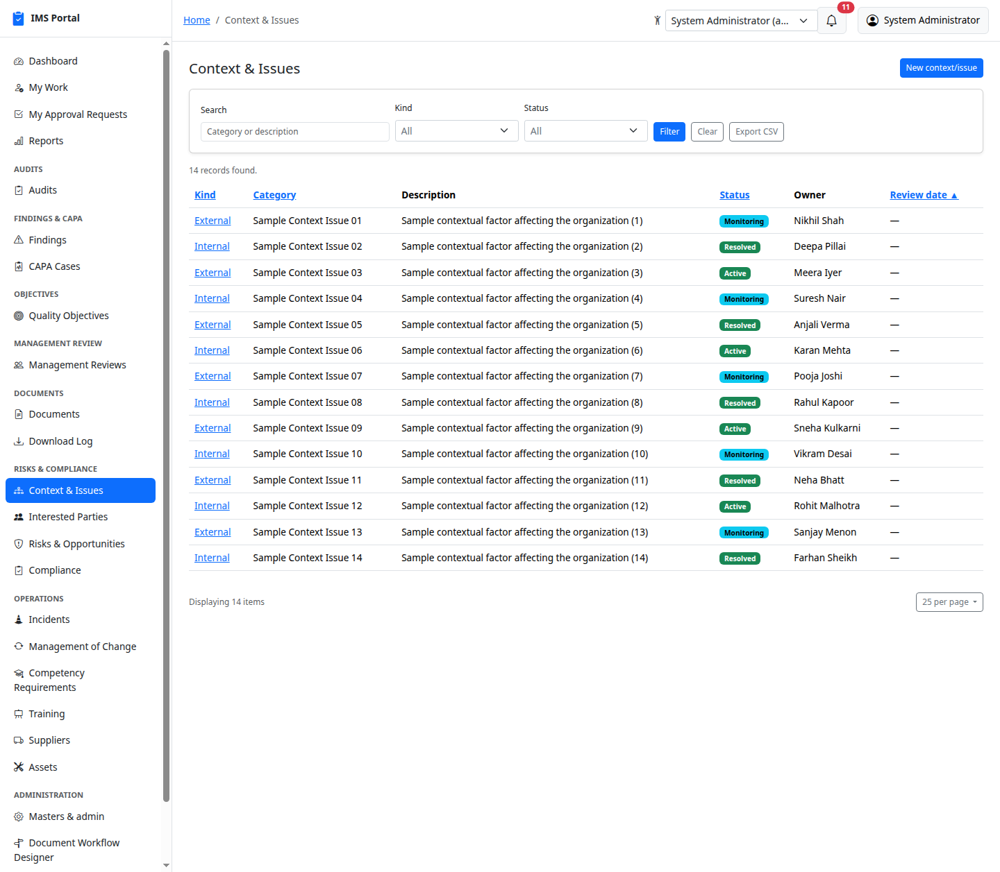
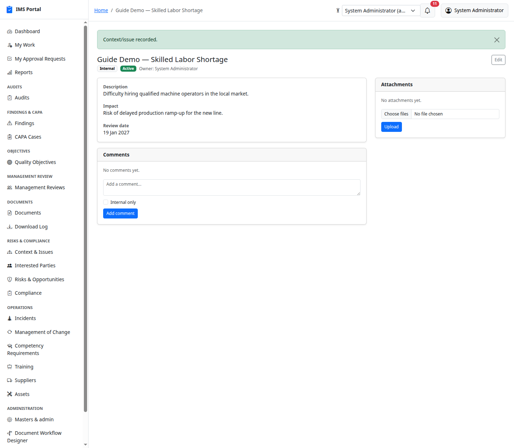
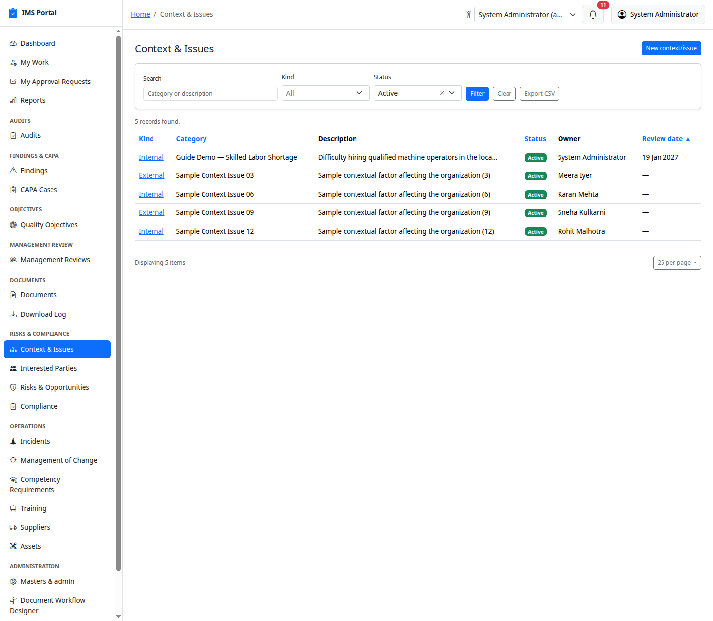
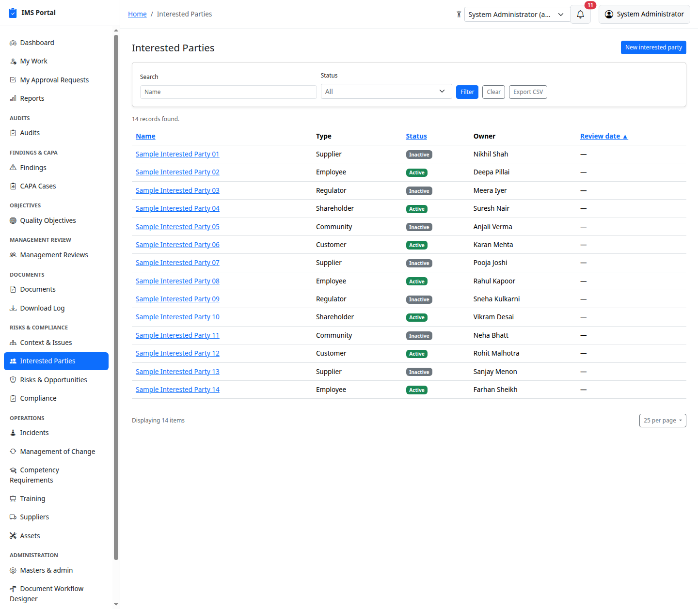
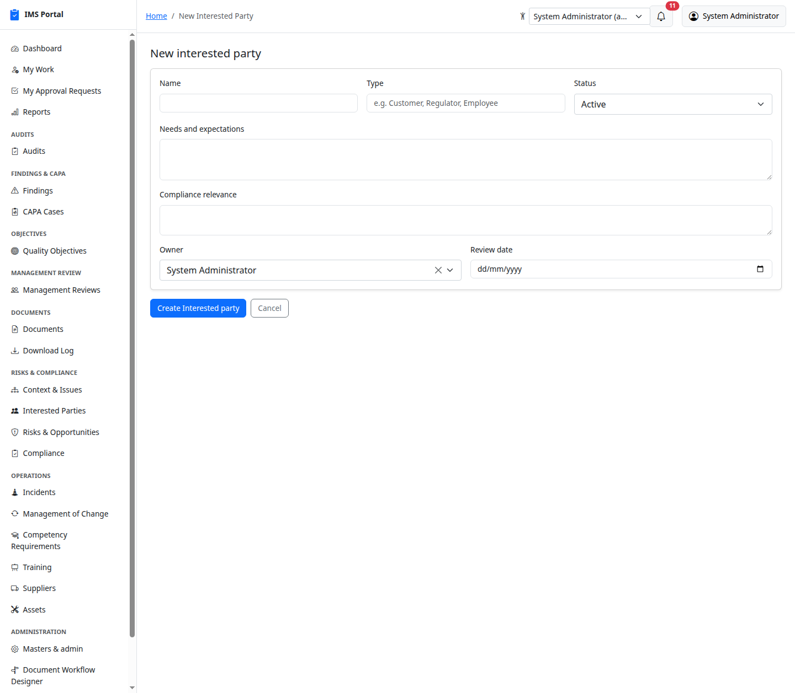
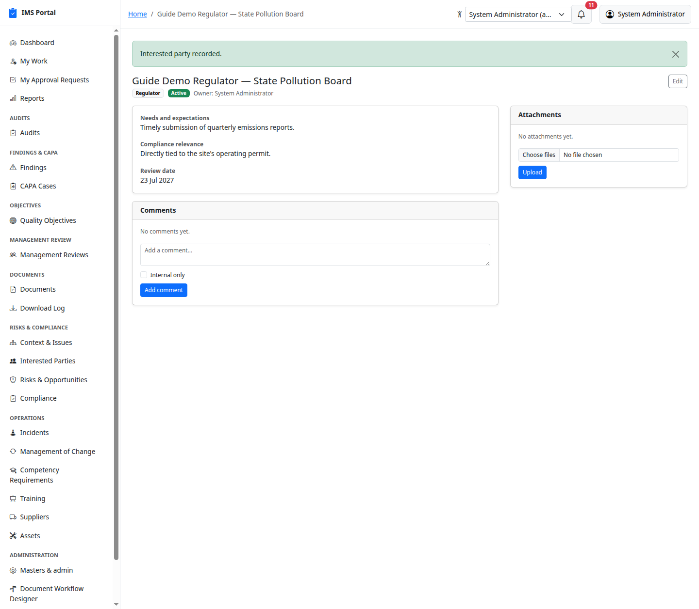

# Context & Interested Parties

Sidebar → **Risks & Compliance → Context & Issues** and **Interested
Parties**. The ISO clause 4 baseline: organizational context issues and
the parties whose needs and expectations the management system has to
account for. Both are simple, single-stage records — log it, keep it
current, review it periodically — with the standard Comments/Attachments
panels rather than a multi-step workflow.

## Context & Issues

List, filter, create:

Each issue is **Internal** or **External**, has a free-text category,
description, optional impact note, an owner, a status (**Active /
Monitoring / Resolved**), and a review date:

Filtering works like every other list:

## Interested Parties

List, filter, create:

Each party has a free-text type (Customer, Supplier, Regulator, Employee —
whatever fits), their needs and expectations, optional compliance
relevance, an owner, a status (**Active / Inactive**), and a review date:

Both feed directly into risk and compliance work — a Risk & Opportunity or
a Compliance Obligation will often reference the context issue or
interested party that motivated it.

---
Previous: [Documents](07-documents.md) · Next: [Risks & Opportunities](09-risks-and-opportunities.md)
