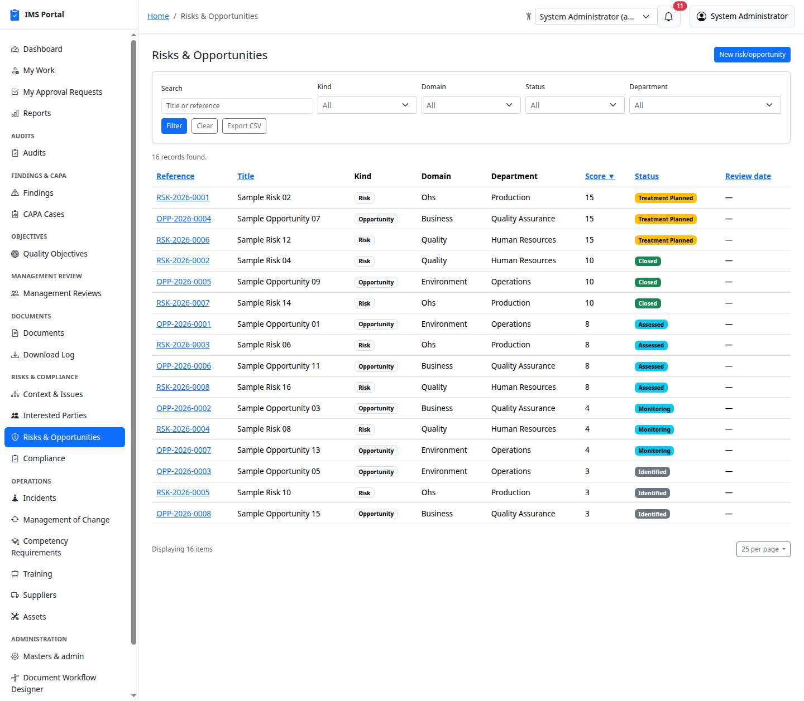
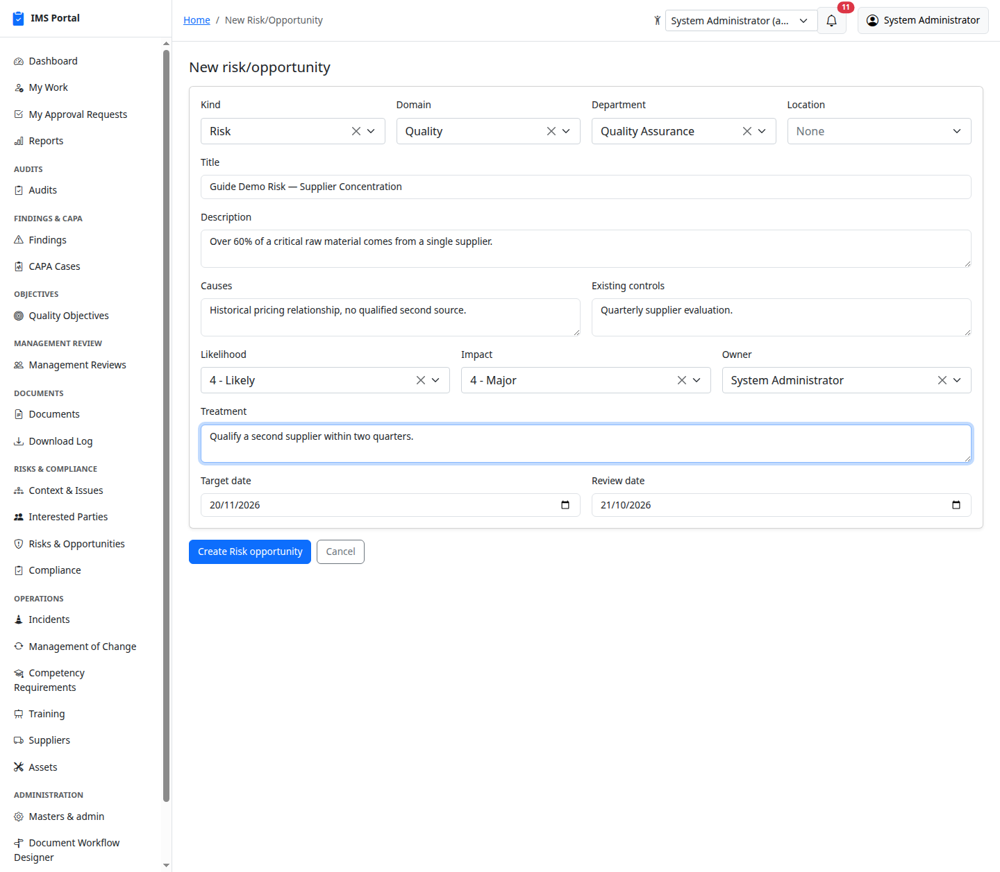
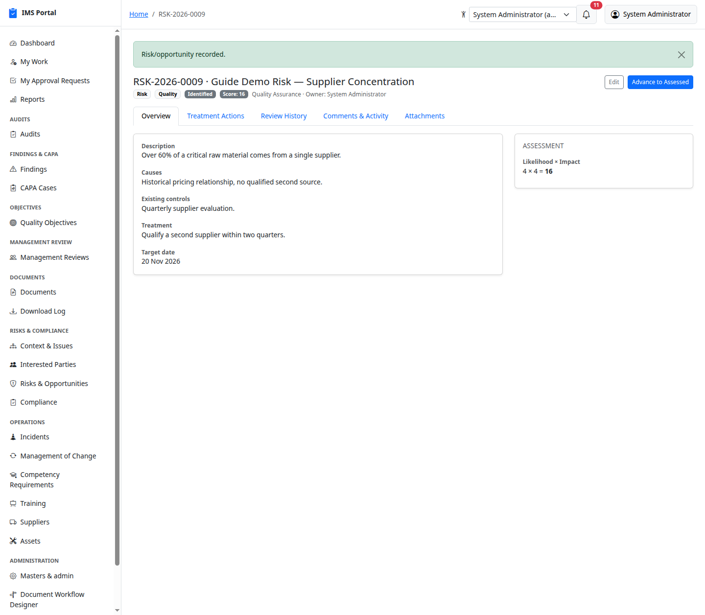
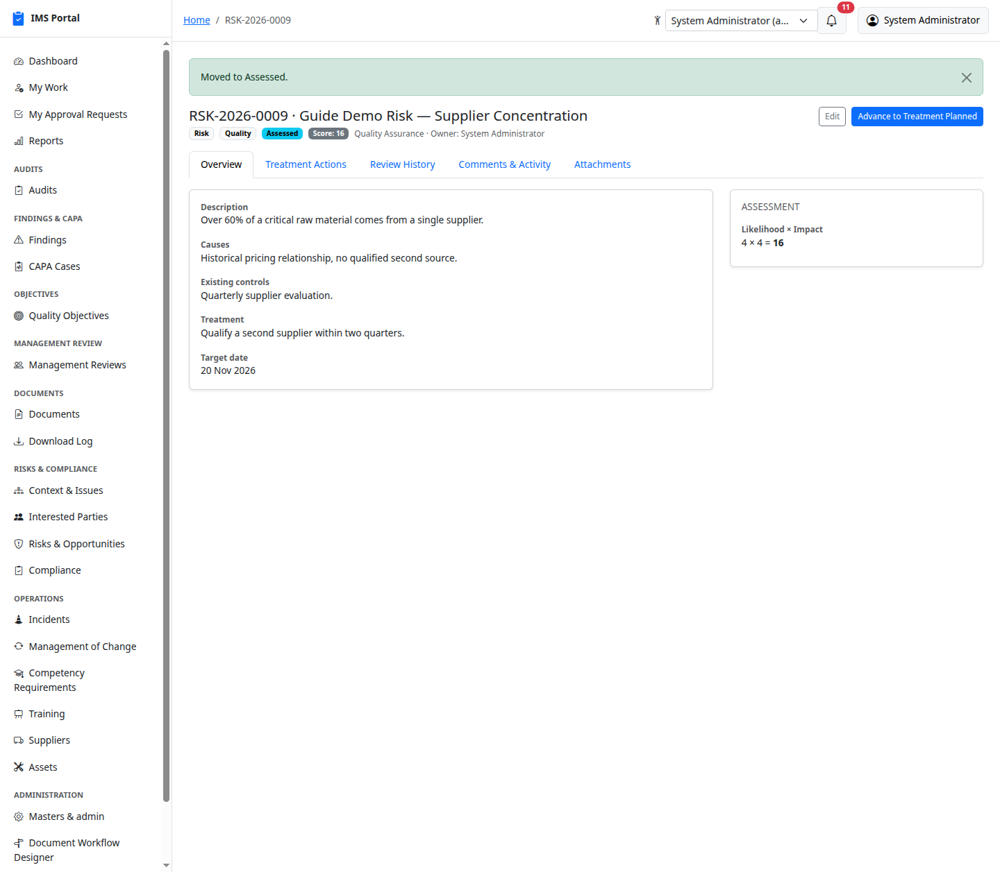
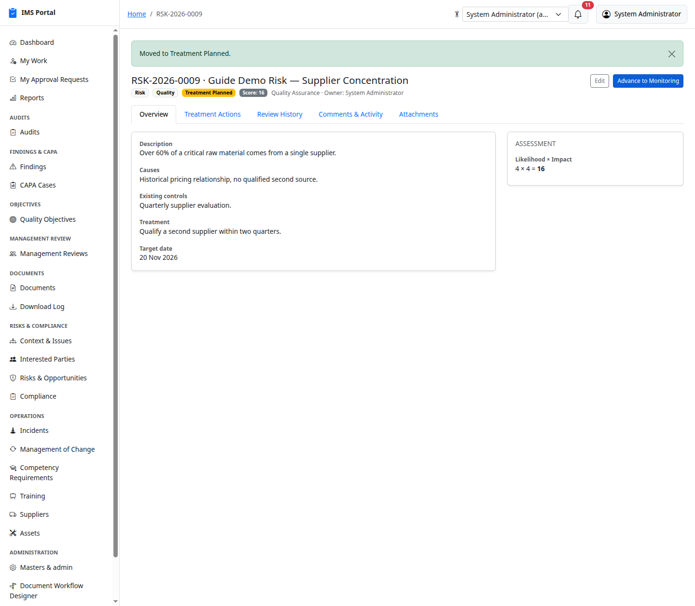
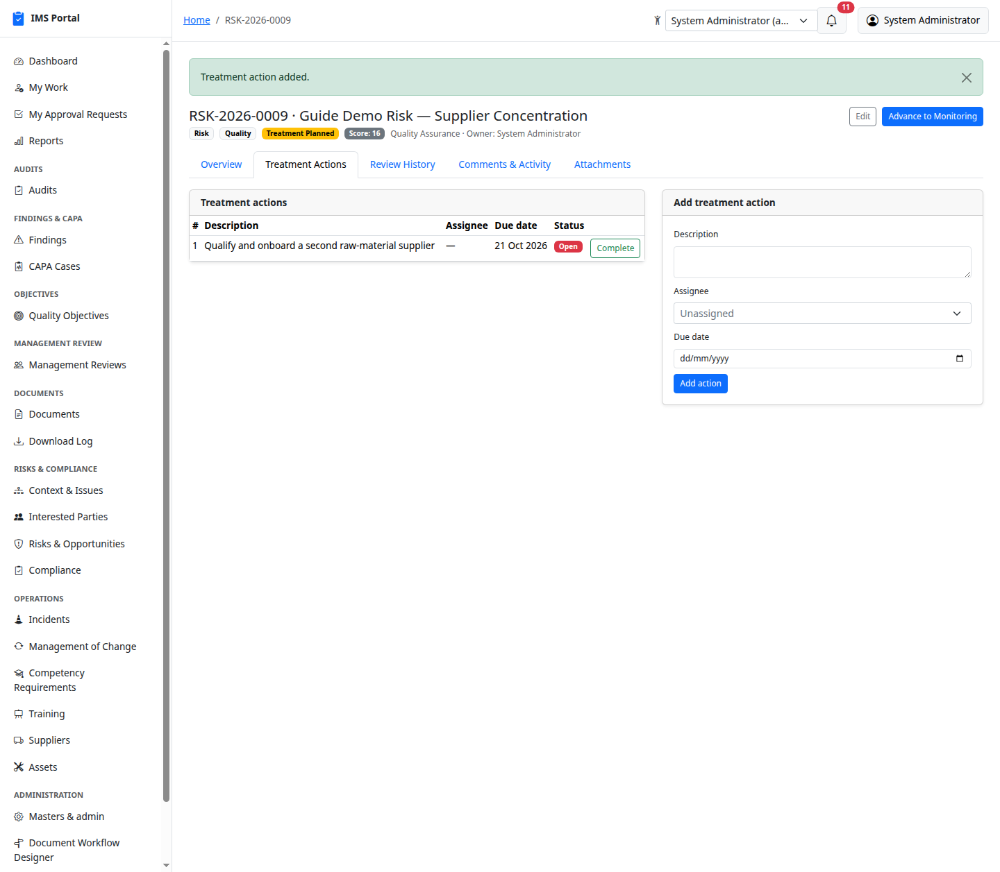
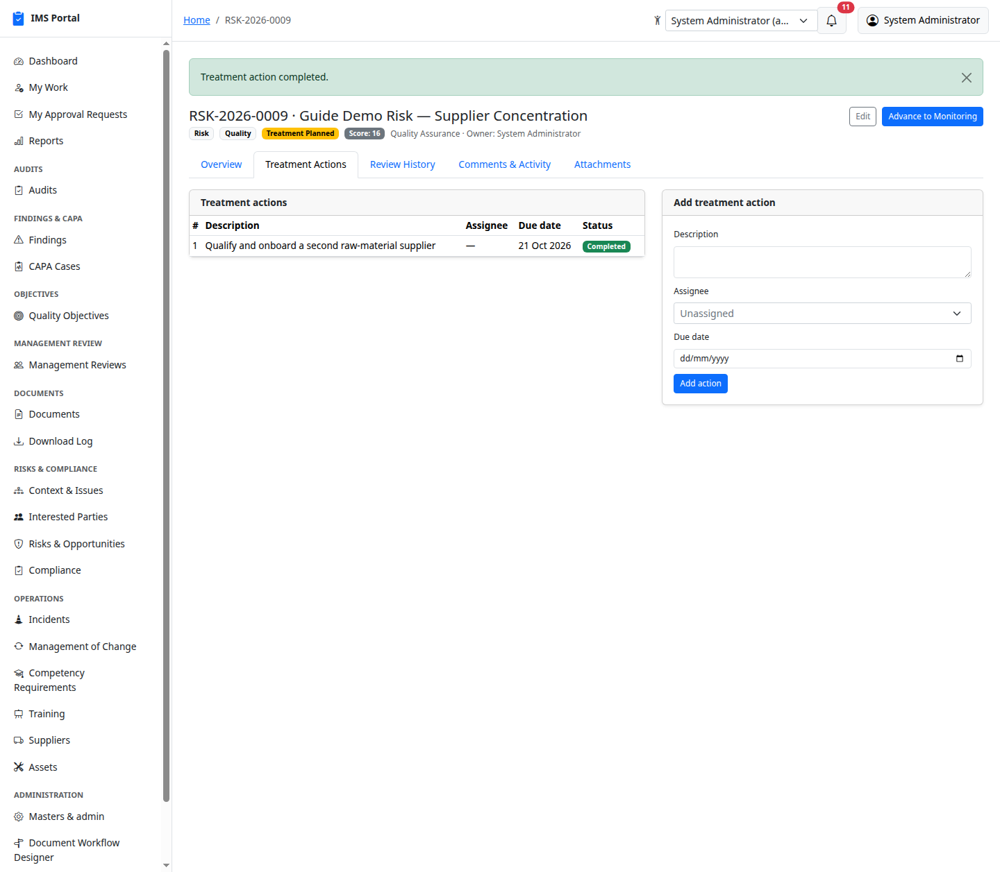
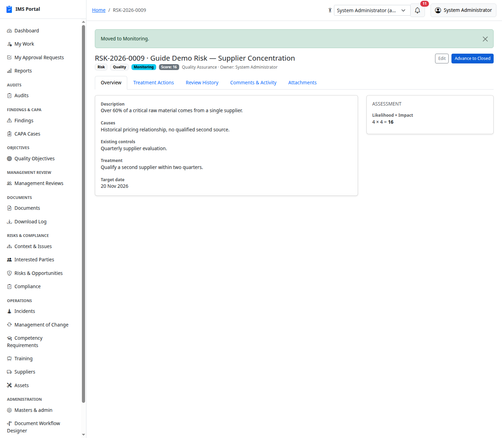
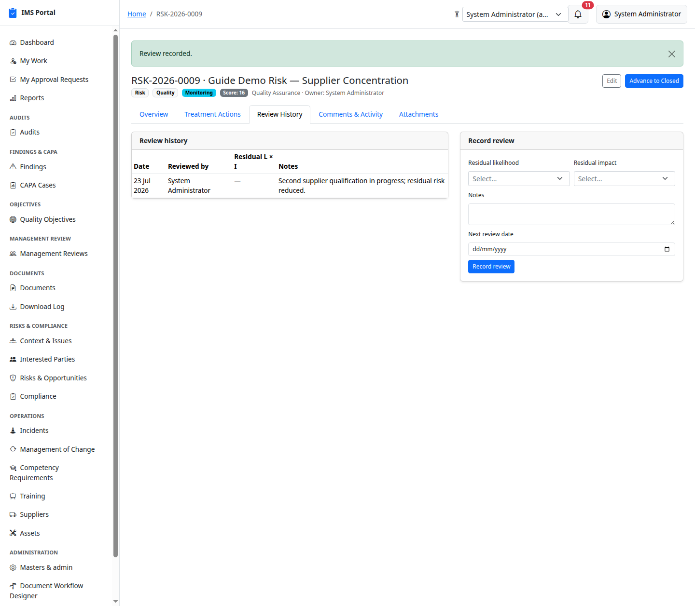
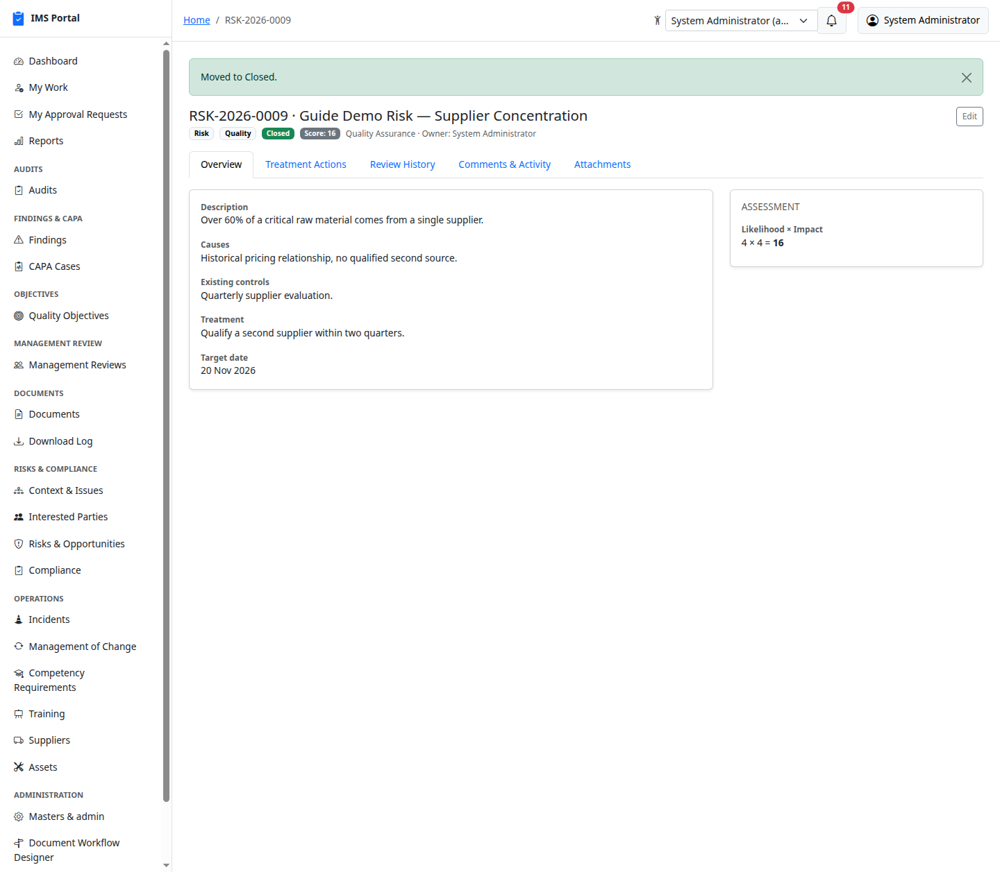

# Risks & Opportunities

Sidebar → **Risks & Compliance → Risks & Opportunities**. A single register
for both risks and opportunities, scored on a configurable likelihood ×
impact matrix (**Masters & admin → Risk matrix levels**), moving through a
fixed sequence of stages.

## List and create

**New** picks **Risk** or **Opportunity**, a domain (quality / environment
/ ohs / business), department, description, causes, existing controls,
likelihood × impact (from the configured matrix labels), owner, planned
treatment, target date, and review date:

Saving computes the score automatically and starts the record at
**Identified**:

## The lifecycle

**Identified → Assessed → Treatment Planned → Monitoring → Closed** — the
Overview tab's single **Advance to <next stage>** button always shows the
next stage by name and asks for confirmation:

## Treatment actions

Once in Treatment Planned (or later), add and track treatment actions —
description, assignee, due date — each with its own **Complete** button:

## Monitoring and review history

**Monitoring** is where the risk actually lives day-to-day — periodic
reviews record a residual likelihood × impact (re-scored against the
original), notes, and the next review date, building a full history:

**Advance to Closed** is available once treatment is complete and the
residual risk is acceptable:

The original likelihood × impact score stays visible throughout — closing
a risk doesn't lose the assessment that justified treating it.

---
Previous: [Context & Interested Parties](08-context-and-interested-parties.md) · Next: [Compliance Obligations](10-compliance-obligations.md)
