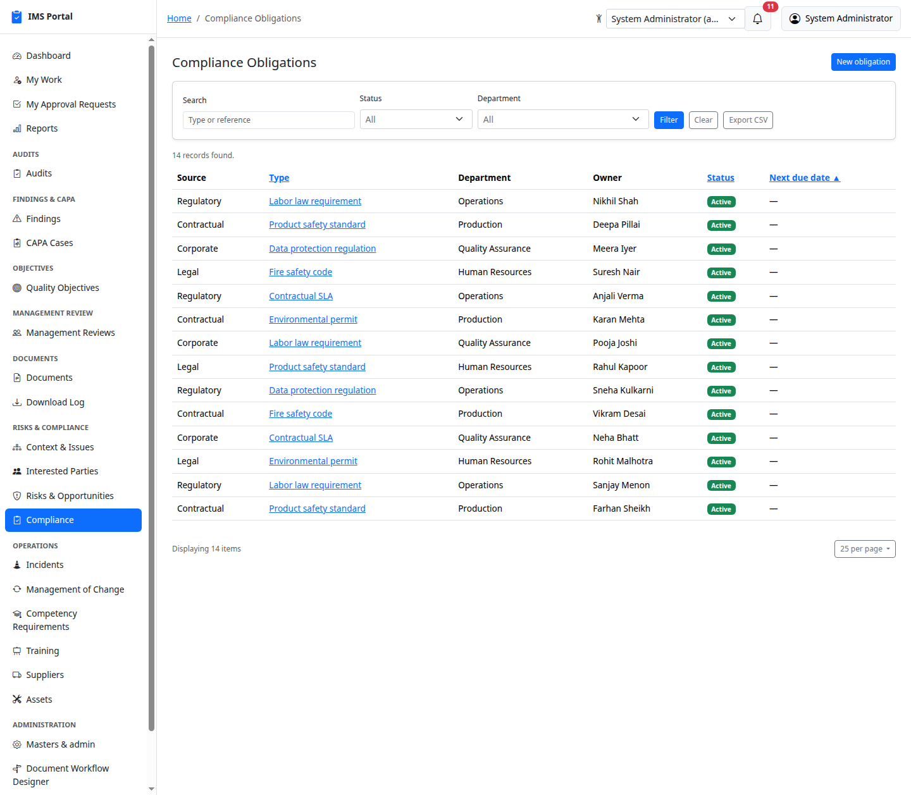
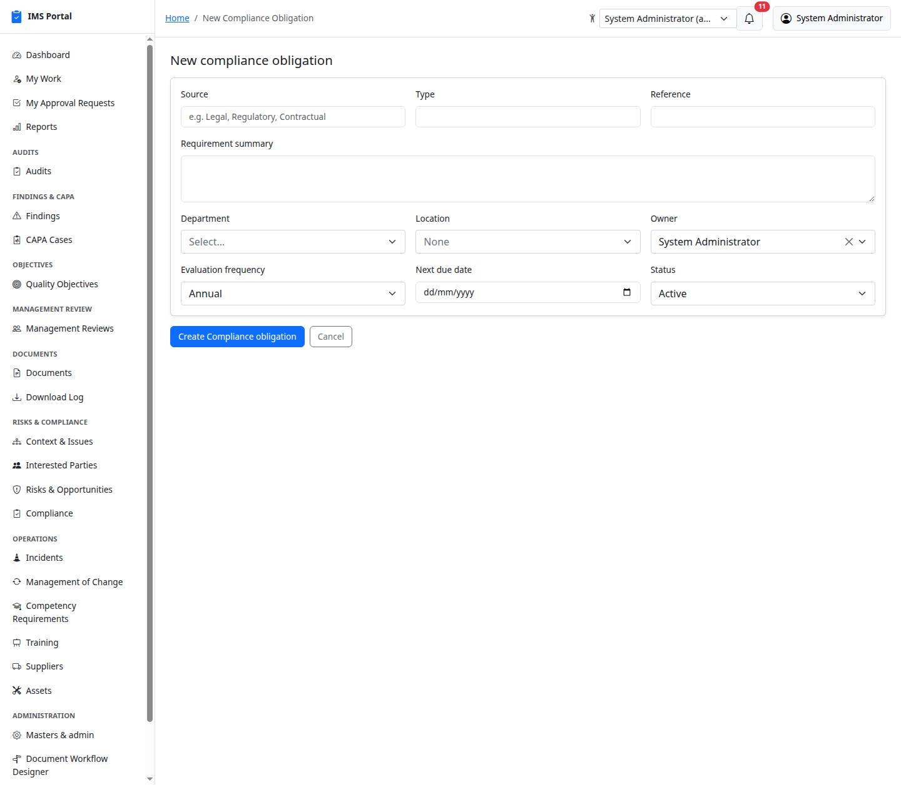
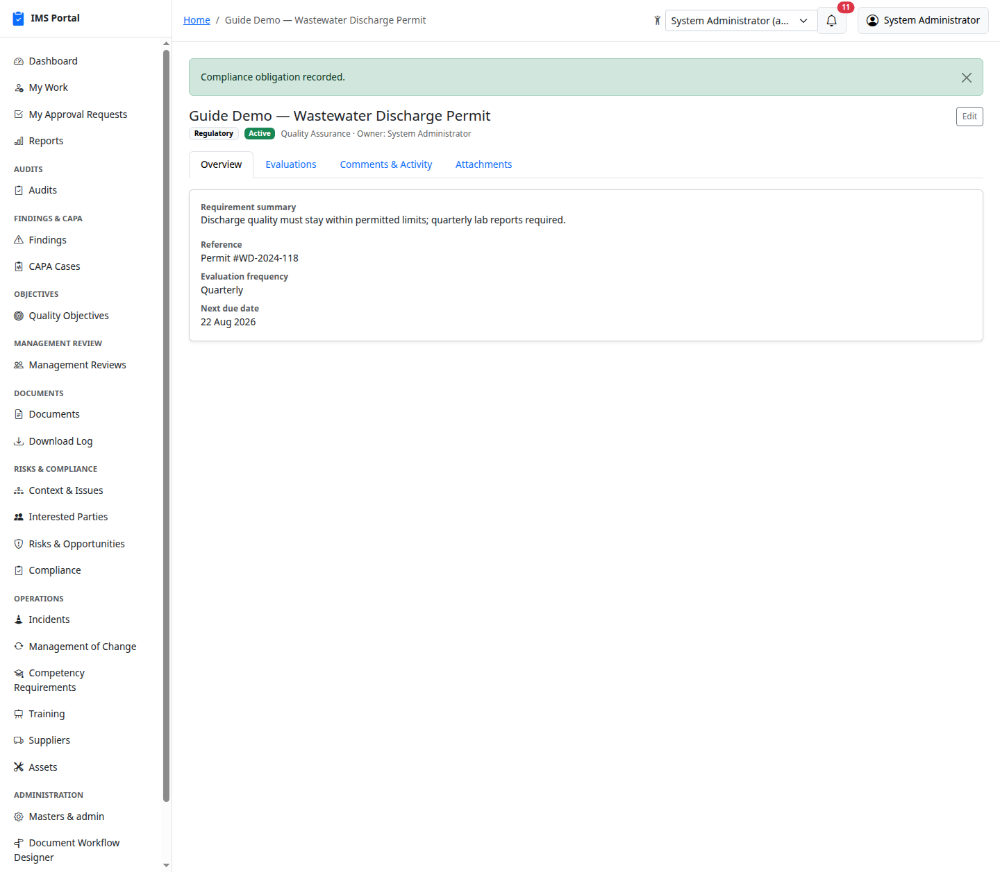
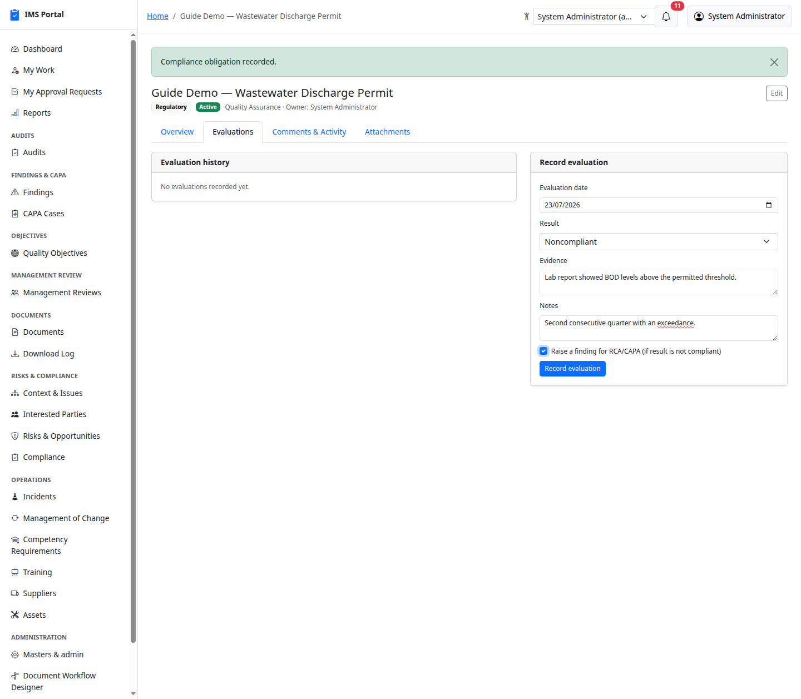
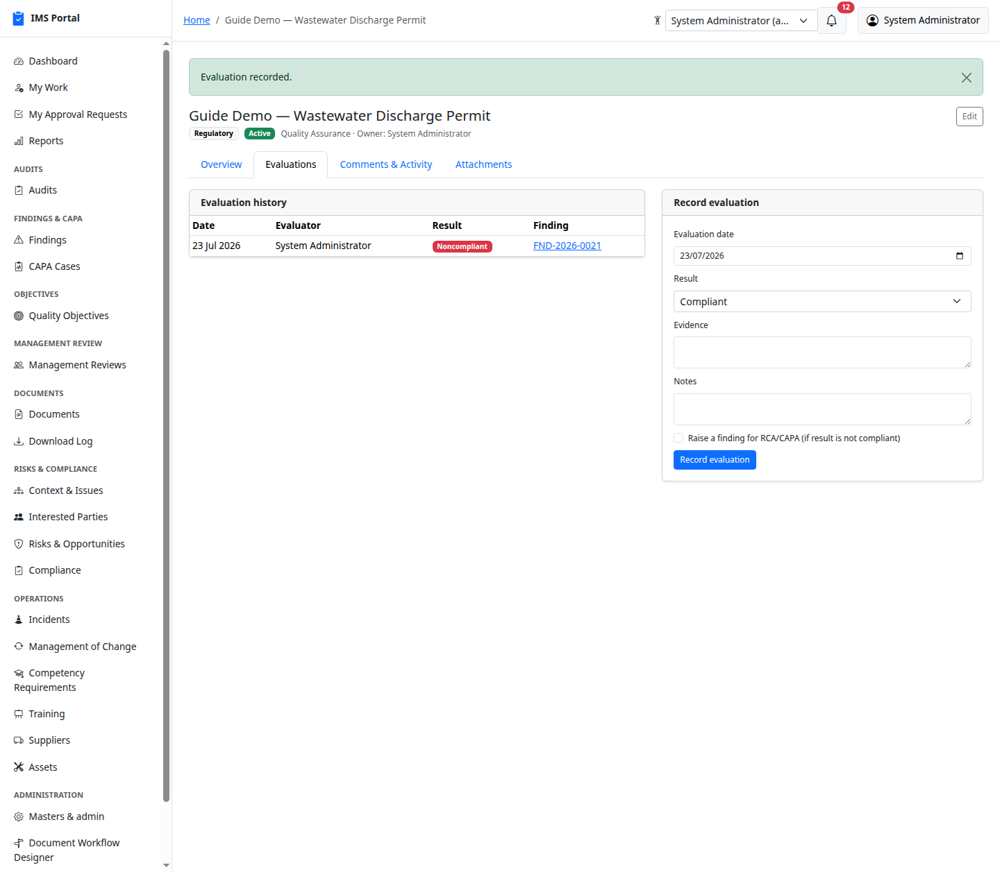

# Compliance Obligations

Sidebar → **Risks & Compliance → Compliance**. Legal, regulatory, and
contractual obligations, each on its own periodic evaluation cycle.

## List and create

**New** records the source (Legal/Regulatory/Contractual/Corporate — free
text), type, an optional external reference (permit/contract number),
requirement summary, department, location, owner, evaluation frequency,
next due date, and status:

## Recording an evaluation

The **Evaluations** tab logs each periodic check: date, result
(compliant / partially compliant / noncompliant / not applicable),
evidence, and notes:

Check **Raise a finding for RCA/CAPA** on a non-compliant result and the
evaluation automatically creates a linked [Finding](03-findings.md) —
same RCA/CAPA workflow as an audit finding, entered here instead of
through an audit:

Evaluation history builds up per obligation, each row showing its result
and, where one exists, the finding it produced. This feeds the
**Compliance Evaluation Status** report — see
[Dashboards & Reports](16-dashboards-and-reports.md).

---
Previous: [Risks & Opportunities](09-risks-and-opportunities.md) · Next: [Incidents](11-incidents.md)
