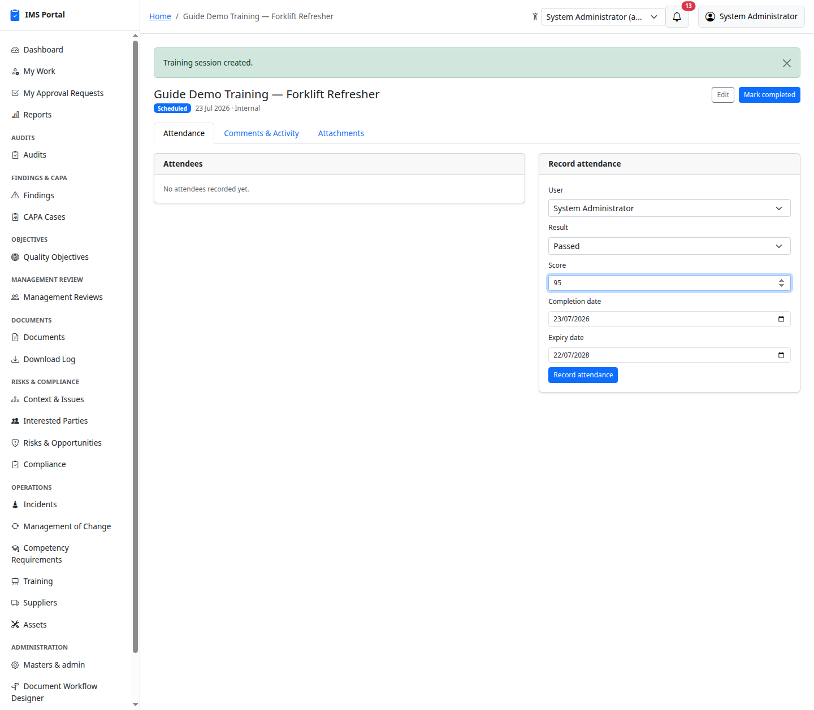
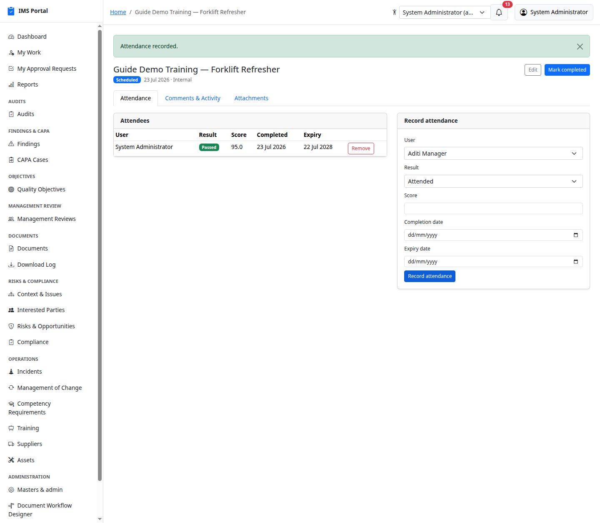
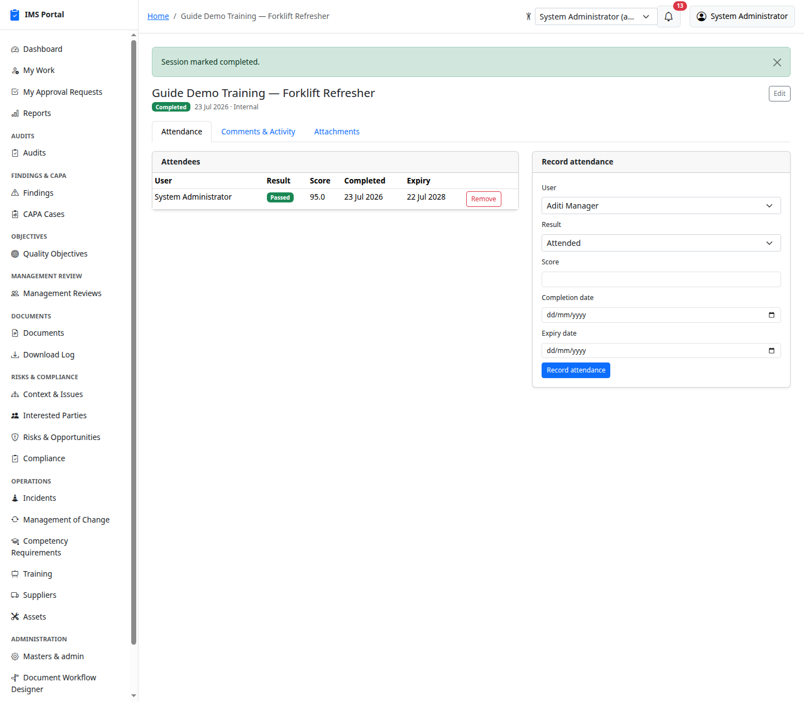

# Competency & Training

Sidebar → **Operations → Competency Requirements** and **Training**.

## Competency Requirements

The reference list of competencies the organization expects — each
optionally scoped to a role and/or department, with a required level and
a renewal period:

These are reference data (like a skills matrix), not individually
workflow-tracked — actual training against them is recorded on Training
Sessions below.

## Training Sessions

List, filter, create:

**New** captures the topic, provider, trainer, date, location, and
status:

**Record attendance** per attendee — result (attended / passed / failed /
no-show), score, completion date, and expiry date. **Expiring soon** and
**Expired** badges appear automatically once an expiry date is set:

**Mark completed** closes out the session itself once training has
happened:

Expiring/expired attendance records feed the **Training Expiry** report
and the dashboard's Operations Alerts — see
[Dashboards & Reports](16-dashboards-and-reports.md).

---
Previous: [Management of Change](12-management-of-change.md) · Next: [Suppliers](14-suppliers.md)
