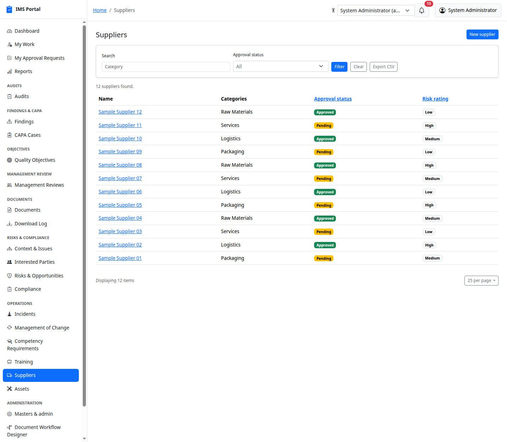
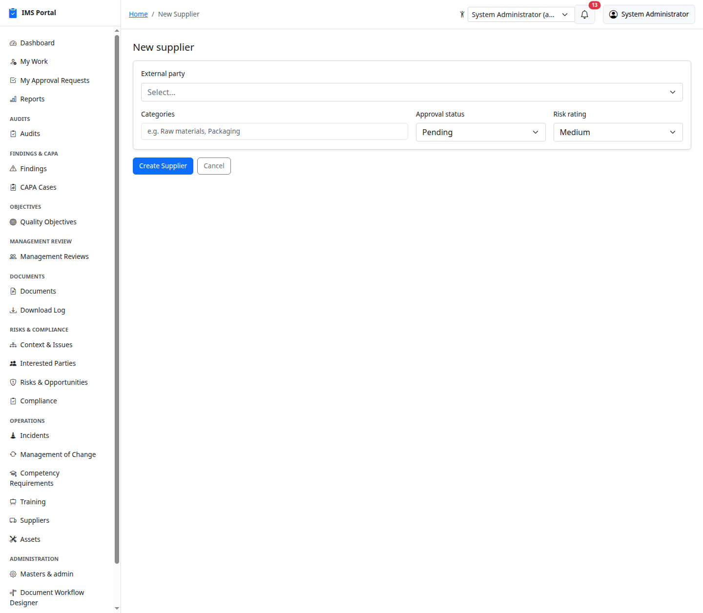
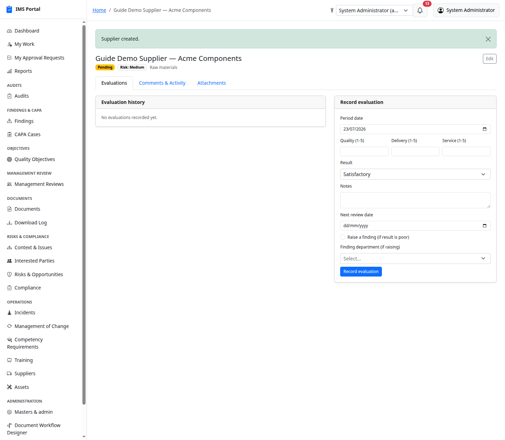
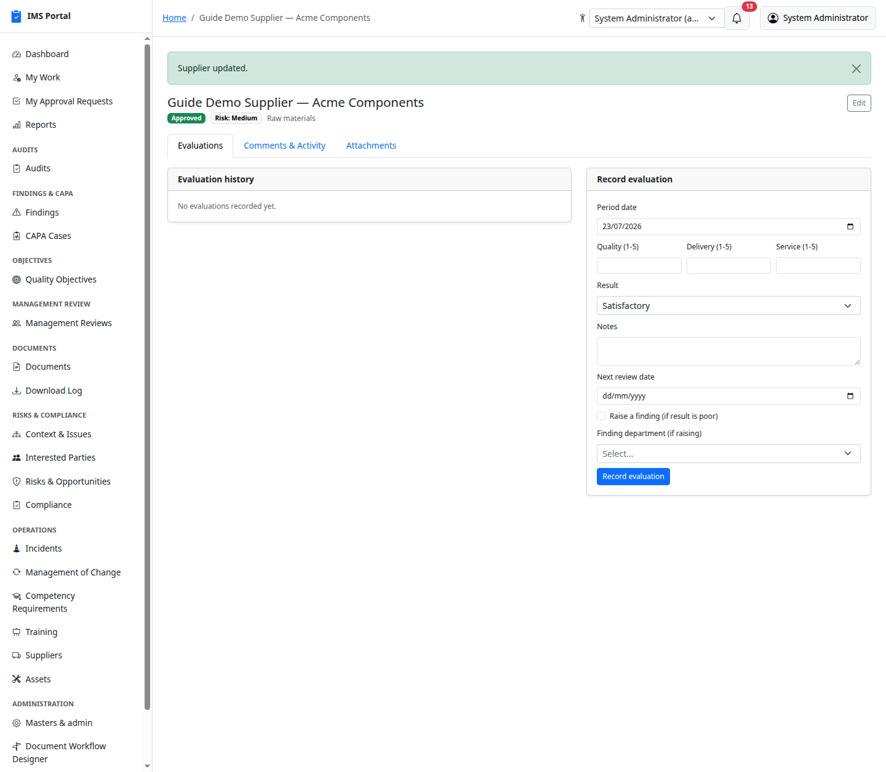
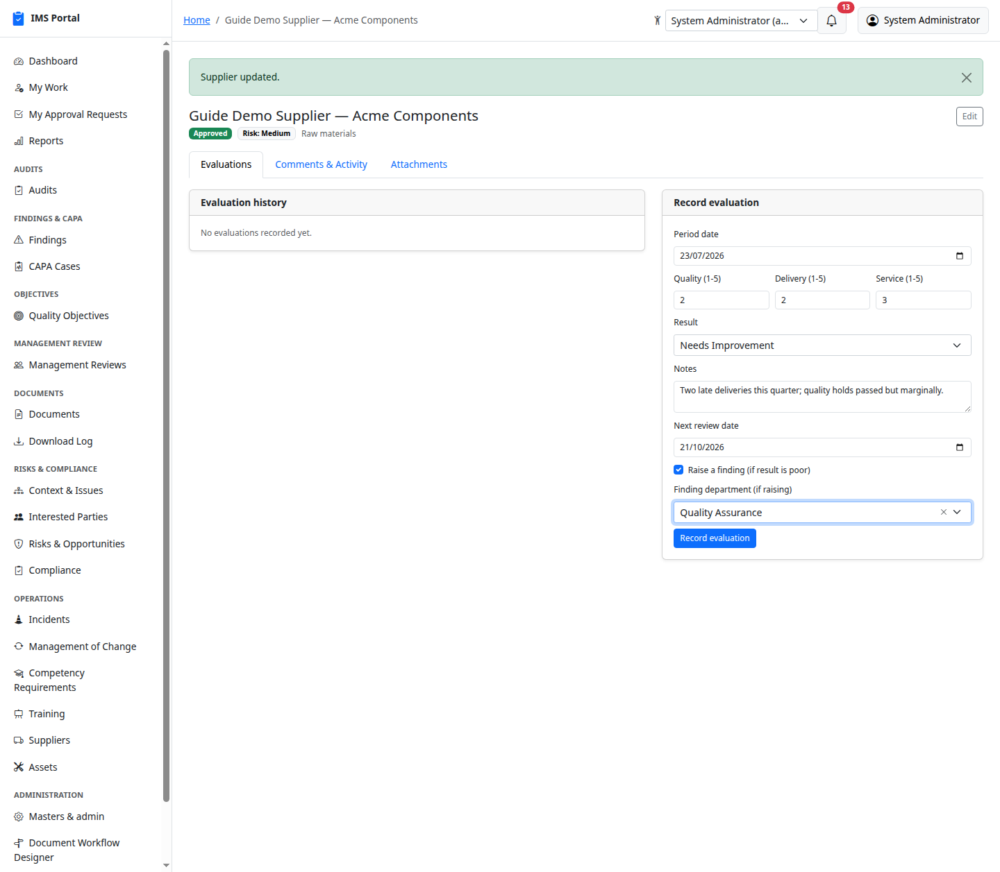
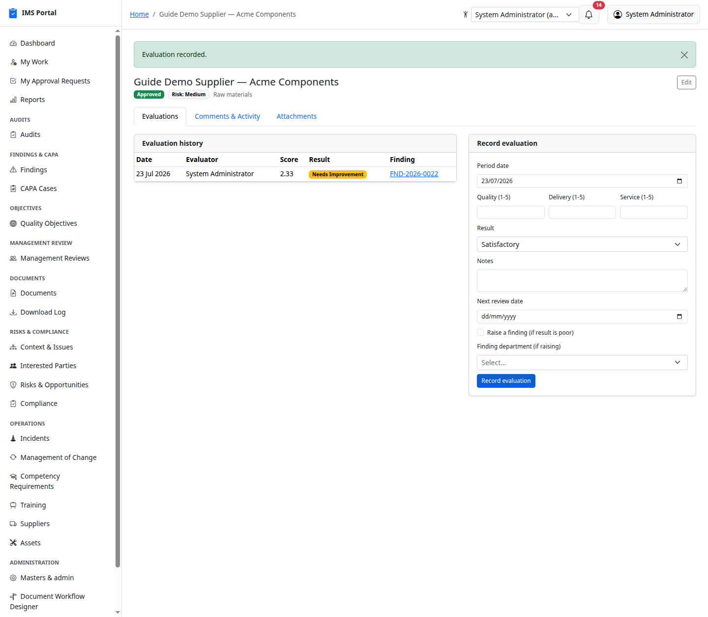
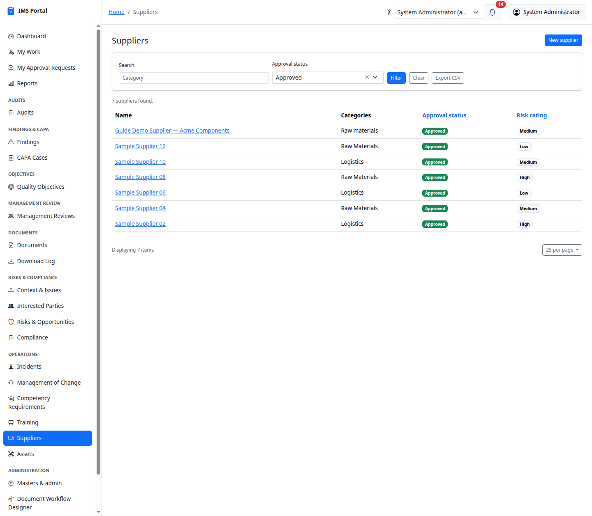

# Suppliers

Sidebar → **Operations → Suppliers**. Every supplier is backed by an
**External Party** record (Masters & admin) of type "supplier" — the
Supplier record itself adds categories, approval status, and risk rating
on top.

## List and create

**New** links to an existing supplier-type external party (create one
first in Masters & admin if it doesn't exist yet), then sets categories,
approval status, and risk rating:

Approval status and risk rating are plain fields — update them via
**Edit** as the relationship is assessed:

## Recording an evaluation

Score a supplier on quality, delivery, and service (1–5 each), pick a
result, and set the next review date:

Exactly like Compliance Obligations, checking **Raise a finding** on a
poor result auto-creates a linked [Finding](03-findings.md) for RCA/CAPA:

## Filtering

Evaluation history feeds the **Supplier Status** report — see
[Dashboards & Reports](16-dashboards-and-reports.md).

---
Previous: [Competency & Training](13-competency-and-training.md) · Next: [Assets](15-assets.md)
