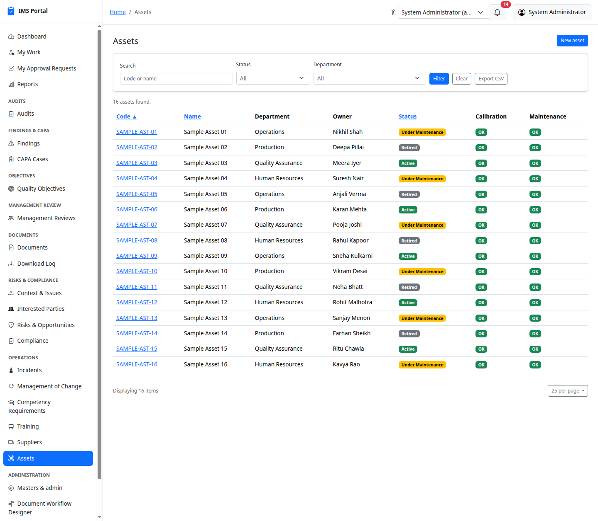
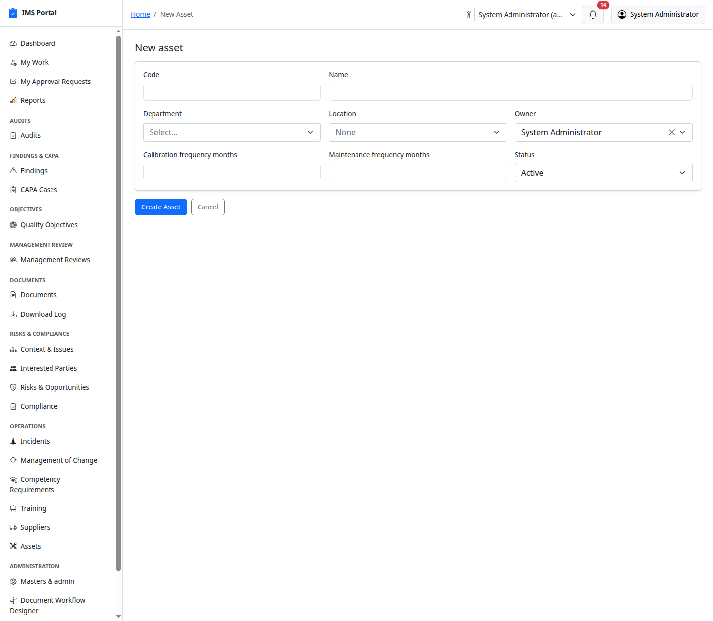
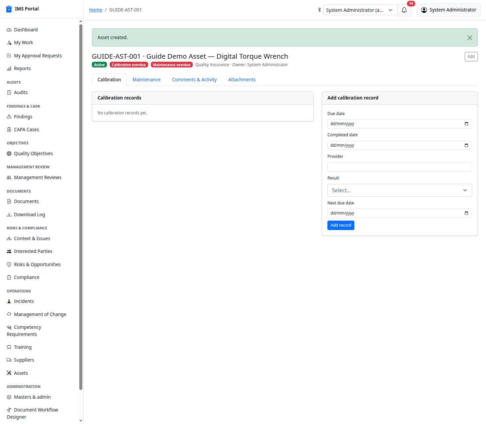
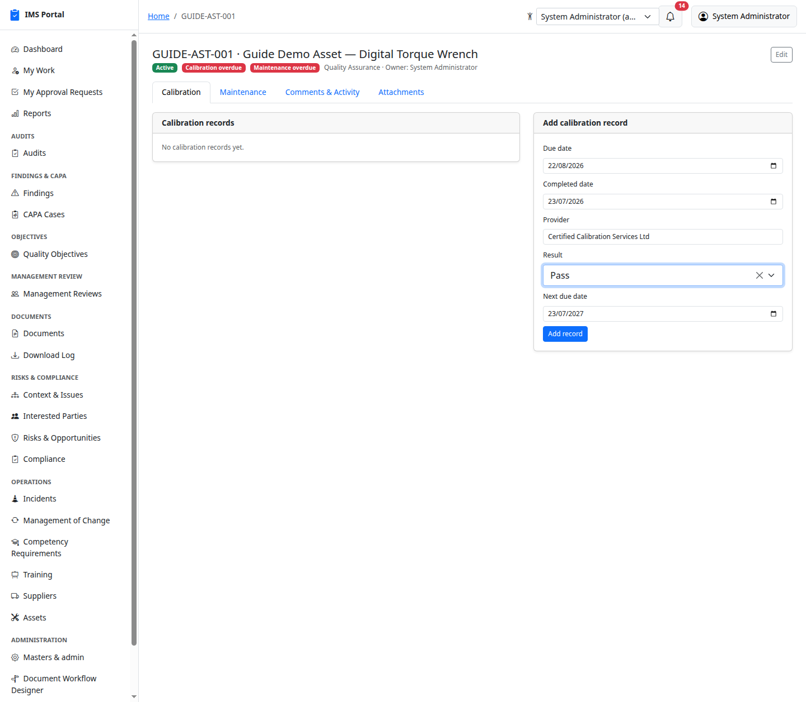
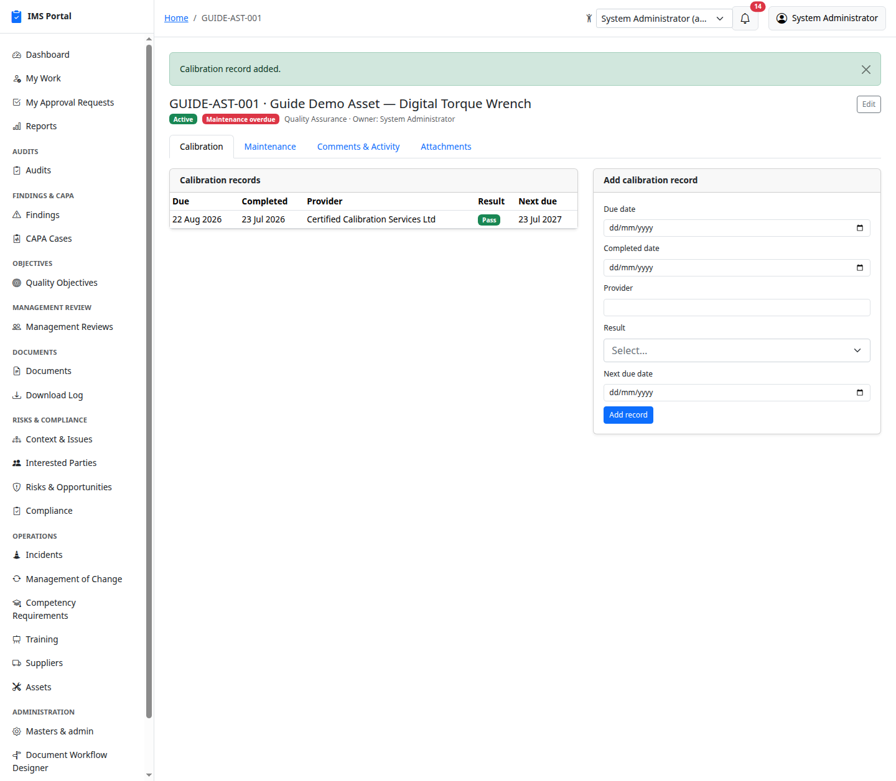
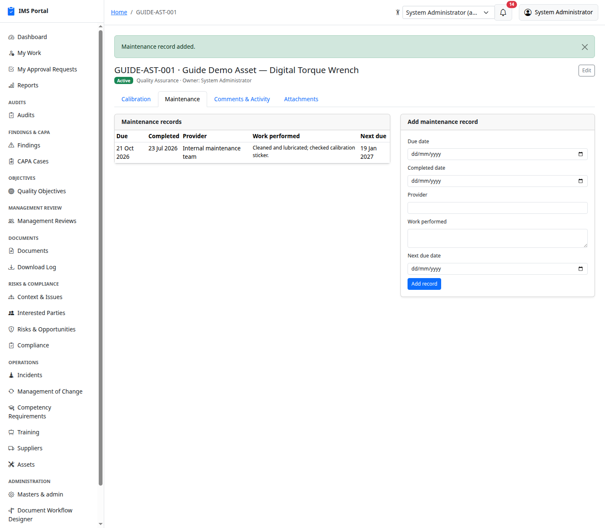
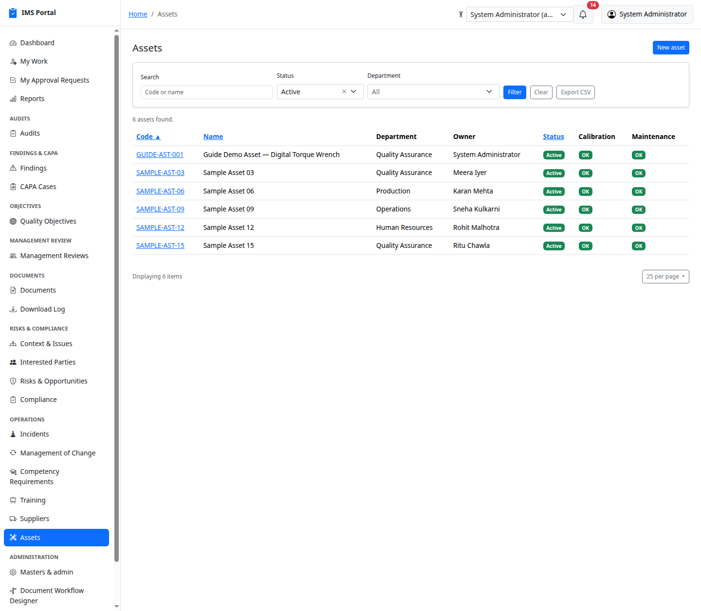

# Assets

Sidebar → **Operations → Assets** (routes live under `/physical_assets`).
Equipment requiring calibration and/or maintenance tracking.

## List and create

**New** sets a unique code, name, department, location, owner,
calibration/maintenance frequency (months), and status
(active/under maintenance/retired):

**Calibration overdue** / **Maintenance overdue** badges appear
automatically on the header once a due date has passed.

## Calibration and maintenance records

Add a calibration record — due date, completed date, provider, pass/fail
result, and next due date:

Maintenance records follow the identical pattern on their own tab, with a
free-text **work performed** field instead of a pass/fail result:

Assets with an approaching or passed due date roll up into the
**Calibration Due** report and the dashboard's Operations Alerts — see
[Dashboards & Reports](16-dashboards-and-reports.md).

## Statutory examination by a competent person

Factories Act §§28 (hoists and lifts), 29 (lifting machines, chains, ropes and
tackle), 31 (pressure plant) and 40 (building stability).

A statutory examination is **not a maintenance visit**, and the register keeps
them apart. Maintenance keeps equipment working; a statutory examination is a
**competent person** certifying it is safe to keep using, and it is what a
labour inspector asks for by name.

Set an **examination category** on the asset — hoist or lift, lifting machine
or tackle, pressure plant, structure, or extraction plant — and the interval in
months. The Act's own intervals are six months for §28 and twelve for §29, but
the **state Factory Rules govern**, so record the interval that actually
applies. Safe working load and design pressure are first-class fields, because
they are what an examination is conducted *against*.

A **Statutory Examination** tab then appears, recording per examination: the
competent person's name, qualification and agency (they are frequently external,
so the name is text and the user link optional), the statutory reference, the
acceptance criteria, the certificate number, and a verdict.

The verdict is **fit**, **fit with conditions**, or **unfit** — three values, not
a boolean. A competent person routinely passes equipment subject to a reduced
safe working load or a shortened interval, and collapsing that into "pass" loses
the condition that makes it safe. `fit_with_conditions` requires the conditions
to be written down and does **not** bar use; the conditions govern.

### It blocks work

This is the part that makes the register a control rather than a report. An
asset whose examination is **overdue**, or which was declared **unfit**, is
refused by [Permit to Work](33-permit-to-work.md): naming it on a permit means
the permit cannot be submitted until the equipment has been examined and found
fit.

Equipment that needs an examination and has **never had one is overdue**, not
pending — the burden is on the record. Link the permit's equipment to the asset
register to get this; a permit naming equipment only in free text still works,
because refusing those would block every permit at a site that has not finished
building its register.

**Reports → Statutory Examinations Due** is the inspector-facing register,
sorted worst-first, showing which equipment is currently barred from use.

## Filtering

---
Previous: [Suppliers](14-suppliers.md) · Next: [Dashboards & Reports](16-dashboards-and-reports.md)
