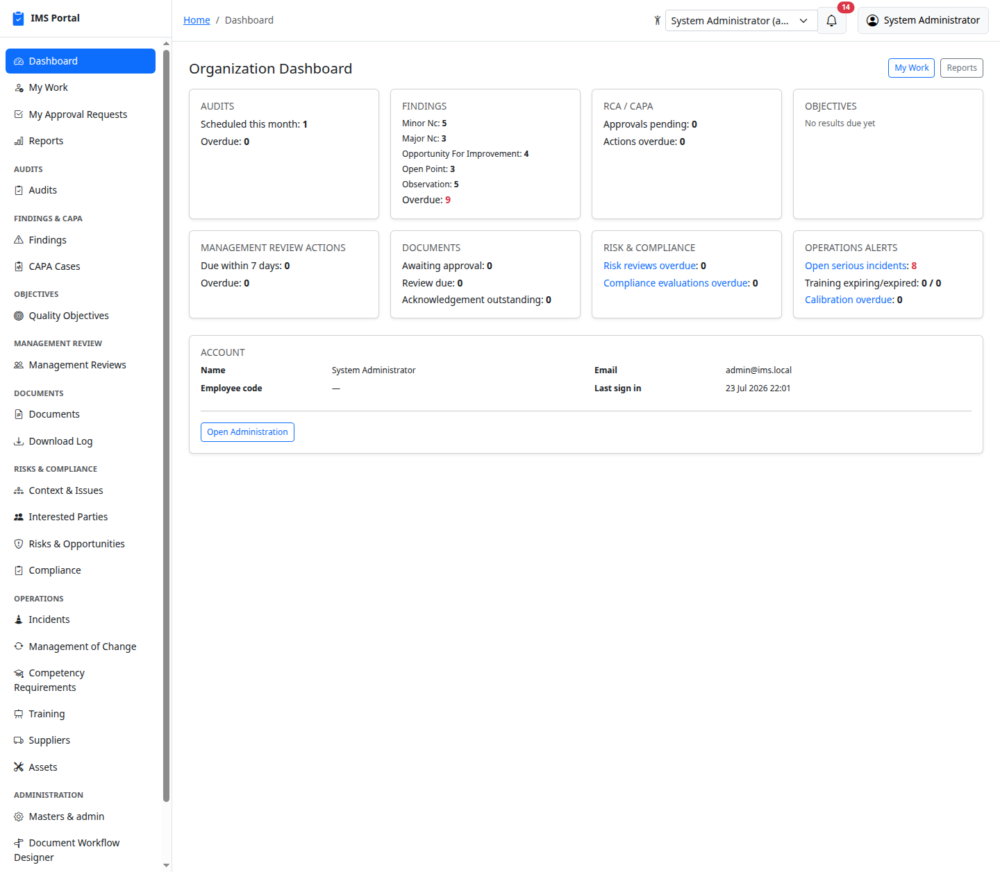
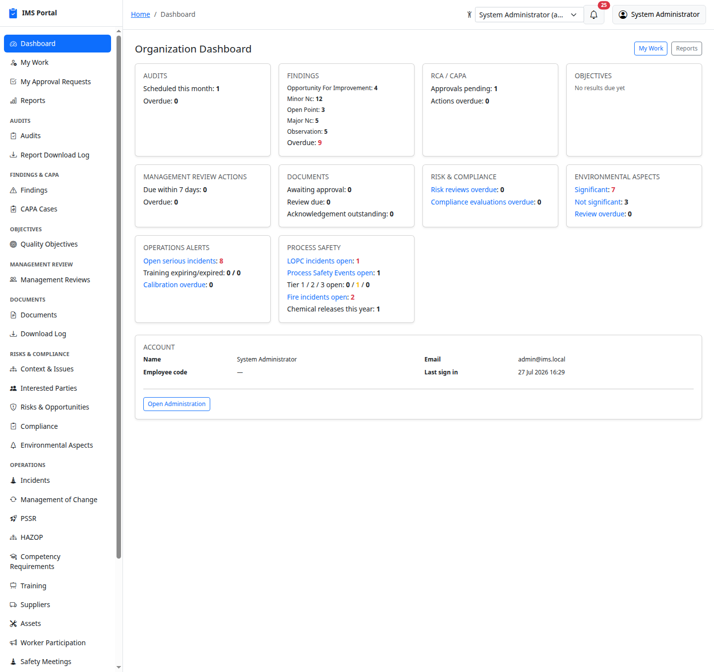
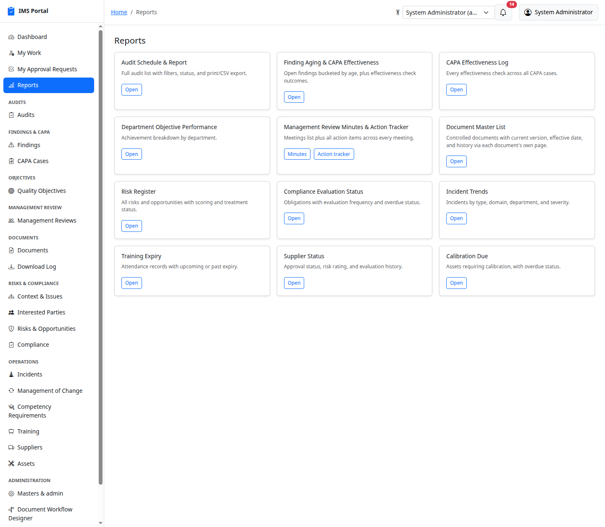
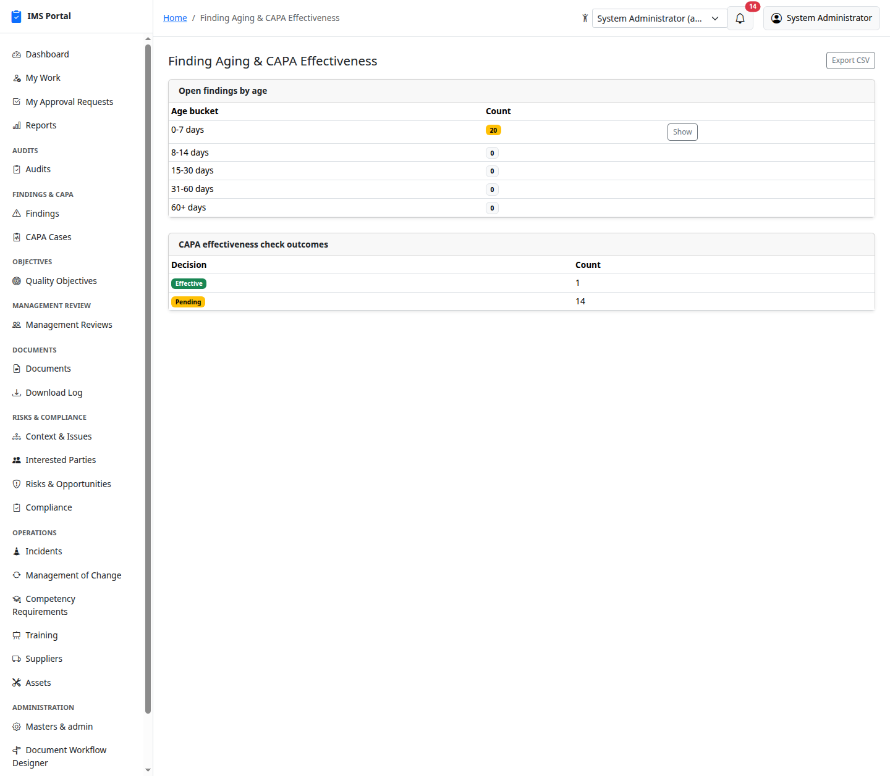
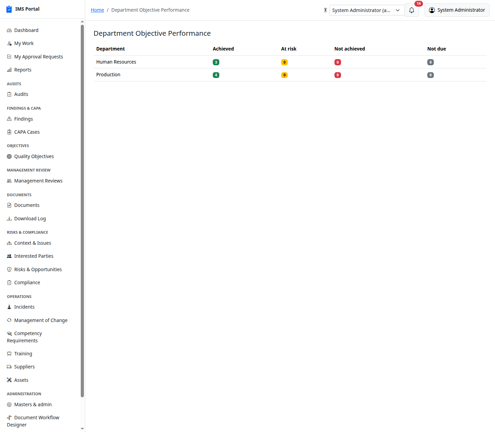
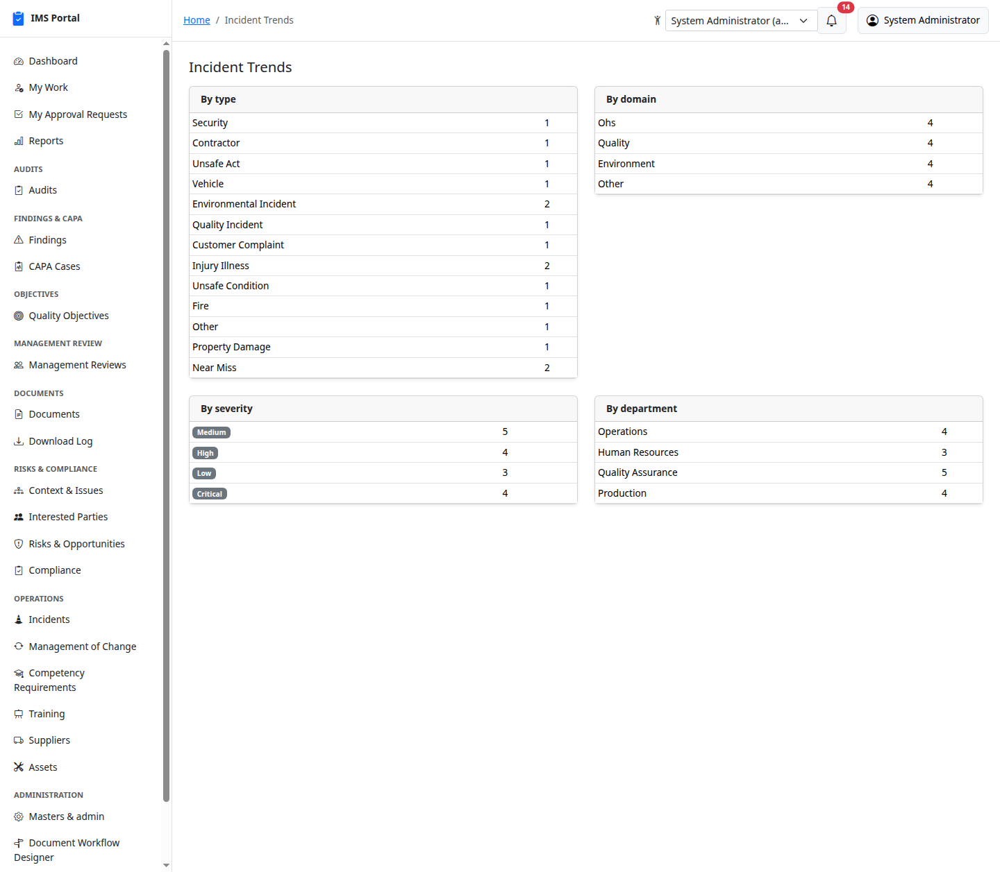
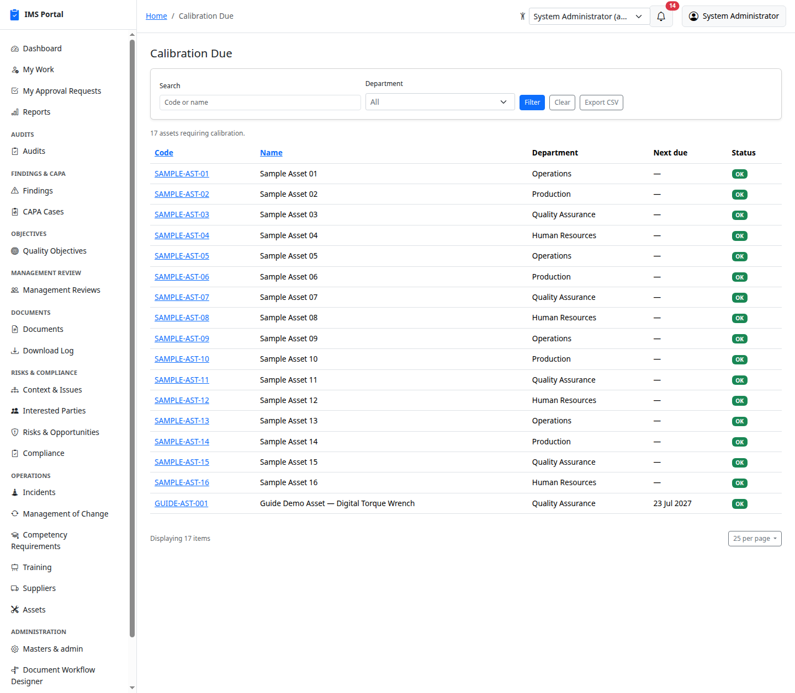

# Dashboards & Reports

## Organization Dashboard

The landing page after sign-in (sidebar → **Dashboard**) — every module's
current numbers in one screen: audits scheduled/overdue, findings by
kind, RCA/CAPA approvals pending, objectives, management review actions,
documents awaiting approval/review/acknowledgement, risk/compliance
overdue counts, and operational alerts (serious incidents, training
expiring, calibration overdue):

Every number here is already filtered to what you are allowed to see, and
in a multi-site organization that includes the site boundary — a Plant 1
user's dashboard counts Plant 1 only. A corporate user on **All sites**
sees the organization total; picking a plant in the topbar site switcher
re-scopes every card, chart, report and CSV export on this page at once,
with no per-report filter to set. See [Sites](31-sites.md).

Everything shown is scoped through `accessible_by(current_ability)` —
what you see reflects only what you're authorized to see, same as every
list in the app.

A **Process Safety** card (visible to anyone who can read incidents)
tracks open LOPC incidents, Process Safety Events, PSE Tier 1/2/3 counts,
Fire incidents, and chemical releases recorded this year — each number
links straight to the incident list pre-filtered to match. See
[Incidents](11-incidents.md#process-safety-lopc) for how these are
classified:

An **OHC** card (visible to anyone who can read employee medical
profiles) shows PME overdue profiles, vaccinations expiring soon /
overdue, and (for those who can also read pharmacy inventory) items
below reorder level and batches expiring/expired — see
[OHC / Employee Health Records](28-ohc-employee-health-records.md#dashboard).

## My Work

Covered in [Getting Started](00-getting-started.md#my-work--your-personal-queue)
— your own cross-module queue of assigned/owned items.

## Reports

Sidebar → **Reports**. One card per cross-module report, each opening a
focused, printable page with its own **Export CSV**:

- **Audit Schedule & Report** — the full audit list with filters and
  print/CSV export (same as [Audits](02-audits.md)' own index).
- **Finding Aging & CAPA Effectiveness** — open findings bucketed by age
  (0-7 / 8-14 / 15-30 / 31-60 / 60+ days) with a drill-down **Show**, plus
  CAPA effectiveness check outcomes:

  

- **Department Objective Performance** — achievement breakdown by
  department:

  

- **Management Review Minutes & Action Tracker** — meetings list plus
  every action item across every meeting.
- **Document Master List** — controlled documents with current version,
  effective date, and history via each document's own page.
- **Risk Register** — every risk/opportunity with scoring and treatment
  status.
- **Compliance Evaluation Status** — obligations with evaluation
  frequency and overdue status.
- **Incident Trends** — incidents by type, domain, department, and
  severity:

  

- **Training Expiry** — attendance records with upcoming or past expiry.
- **Supplier Status** — approval status, risk rating, and evaluation
  history.
- **Calibration Due** — assets requiring calibration, with overdue
  status:

  

- **BBS Coverage & Trends** — observations by programme/department/result,
  actions by status, top contributing factors, open high-potential
  observations, and active stop-work orders — see
  [Safety Observations & BBS](24-safety-observations-and-bbs.md#coverage--trends-report)
  for the full walkthrough.
- **OHC Examinations Due** — employee medical profiles by their latest
  periodic exam's next due date, with an Overdue badge — see
  [OHC / Employee Health Records](28-ohc-employee-health-records.md#overdue-tracking).
- **OHC Vaccinations Due** — recorded vaccinations by next dose due date,
  with Overdue/Expiring Soon badges — see
  [OHC / Employee Health Records](28-ohc-employee-health-records.md#vaccination-due-tracking).
- **Pharmacy Stock Alerts** — items below reorder level, and batches
  expiring soon or expired — see
  [OHC / Employee Health Records](28-ohc-employee-health-records.md#pharmacy-reports).
- **Pharmacy Consumption** — dispensed quantity by item over a date range
  you choose — see
  [OHC / Employee Health Records](28-ohc-employee-health-records.md#pharmacy-reports).
- **First Aid Summary** — first aid and emergency cases by nature and
  outcome over a date range, with average response time and ambulance
  count — see
  [OHC / Employee Health Records](28-ohc-employee-health-records.md#first-aid-reports).
- **First Aid Kit Inspections Due** — first aid boxes overdue for
  inspection or due within 30 days — see
  [OHC / Employee Health Records](28-ohc-employee-health-records.md#first-aid-reports).
- **Surveillance Due** — open hazard exposures whose surveillance
  examination is overdue or due within 60 days — see
  [OHC / Employee Health Records](28-ohc-employee-health-records.md#surveillance-reports).
- **Contractor Medical Compliance** — gate-pass status across every
  engaged contractor worker, by contractor firm — see
  [OHC / Employee Health Records](28-ohc-employee-health-records.md#contractor-reports).
- **Health Campaign Summary** — campaign participation, coverage against
  target, and outcomes over a date range — see
  [OHC / Employee Health Records](28-ohc-employee-health-records.md#campaign-reports).
- **Medical Examination Register** — the statutory PME register per
  employee, with a printable PDF — see
  [OHC / Employee Health Records](28-ohc-employee-health-records.md#medical-examination-register).
- **Emergency Preparedness** — response plans by scenario type and
  status, drill coverage and effectiveness over a date range, and the
  plans overdue for a drill or a plan review — see
  [Emergency Preparedness & Response](29-emergency-preparedness.md#reminders-report-and-dashboard).

Every report and every module index supports **Export CSV** for
offline/spreadsheet use, and every printable page respects the same
authorization scope as its interactive counterpart — there's no
report-only backdoor to data you couldn't otherwise see.

---
Previous: [Assets](15-assets.md) · Next: [How the Access Control Matrix works](17-access-control-matrix.md)
