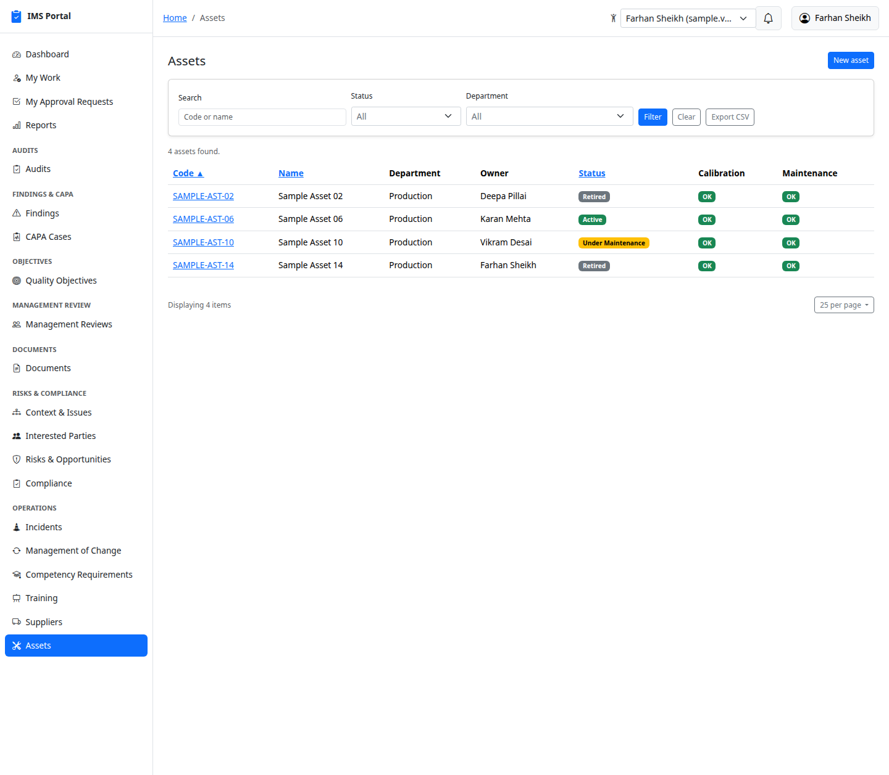
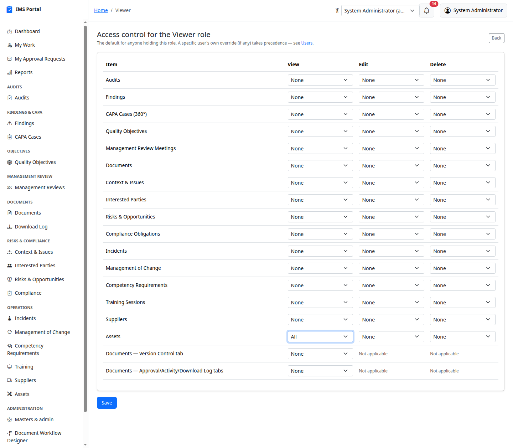
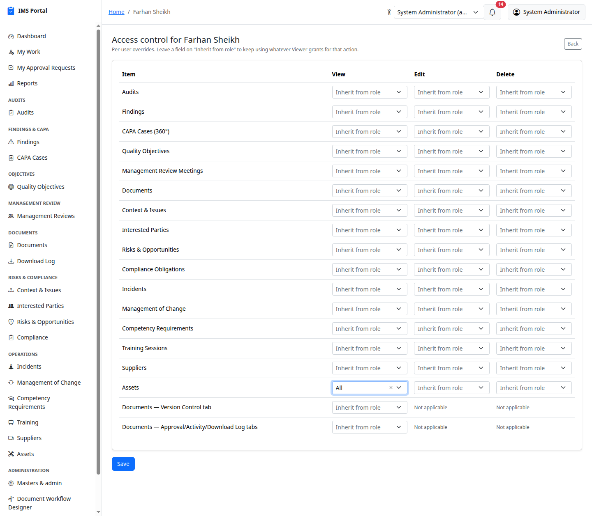
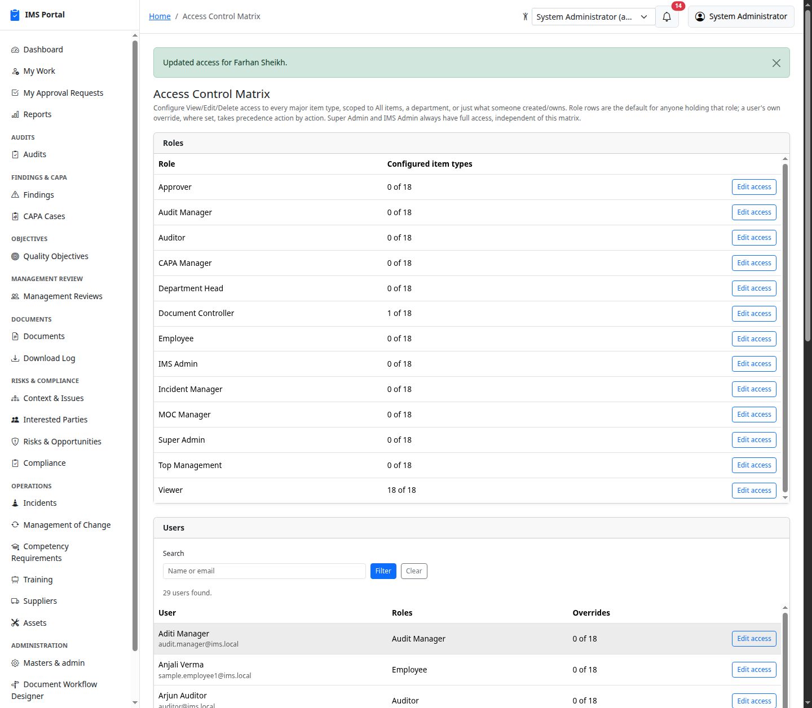
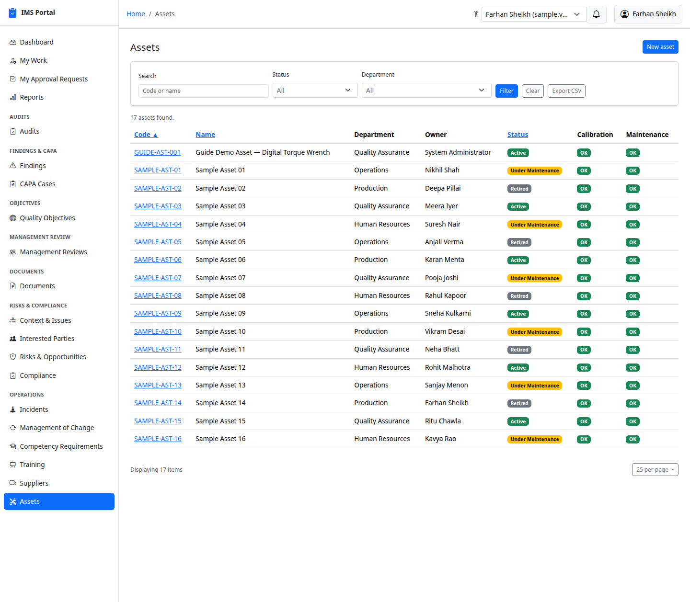

# How the Access Control Matrix works

Every module in this guide already has its own baked-in access rules —
you own it, you head the department, you're the assigned reviewer, and so
on. The **Access Control Matrix** (Masters & admin → Access Control
Matrix) is a second, *optional* layer on top of those rules for the cases
code doesn't already cover: "let the Viewer role see every asset, company
-wide" or "let this one auditor into approval history without promoting
them." It's admin-configurable, so that kind of grant is a form submission,
not a deploy.

This page is a deep dive into how it actually resolves a grant. For the
screens themselves, see [Masters & Admin](01-masters-and-admin.md#access-control-matrix).
For how this layer composes with every module's own built-in rules — a
full reference covering both, with a module-by-module table and worked
composition examples — see [`docs/access-control.md`](../access-control.md).

## The mental model: it only ever adds

The single most important rule: **the matrix never takes anything away.**
Every ability in the app — the built-in ones and the matrix's own — is a
grant, and grants only ever combine by addition. Setting a matrix row to
**None** does not revoke access a model's own bespoke rules already give
someone; it simply means the matrix itself isn't adding anything extra for
that resource. There is no way to use this screen to lock someone out of
something they could otherwise see.

That's why the worked example below reads the way it does: before any
matrix row exists, a Viewer already sees their own department's Assets
(the app's ordinary department-based rule); the matrix is what widens that
to every department, for a whole role or for one specific person.

### The one thing that does take away: sites

If your organization runs more than one plant, the **site** boundary sits
underneath all of this and it *is* restrictive — that is its whole job. A
matrix row set to **All** means "all of it **at the sites this person can
reach**", never "all of it everywhere".

So the two layers answer different questions, and both have to say yes:

> **What may I do?** — built-in rules OR matrix rows (only ever adds).
> **Whose records are these?** — the site boundary (only ever narrows).

Granting a Plant 1 user an **All** row for Findings does not let them see
Plant 2's findings, and there is no matrix setting that will. Cross-site
access is a separate, deliberate per-user field — **Site access level** on
the user record. See [Sites](31-sites.md).

## Role rows vs. user rows

Every row in the matrix belongs to **exactly one** of:

- A **Role** — the default for everyone holding that role.
- A **User** — a per-person override, editable action-by-action.

A user's own setting always wins over their role's, but only for the
actions it actually sets. On a user's page every field starts on
**Inherit from role**, meaning "no opinion — use whatever my role(s)
grant for this one action." You can override just Delete for one person
on one resource type and leave View and Edit inherited; nothing forces
all three to move together.

If someone holds two roles with different settings for the same resource,
the **more permissive one wins** (see [Resolution order](#resolution-order-precisely)
below) — same principle: additive, never restrictive.

## The four scopes

Each of the three columns — **View / Edit / Delete** — is set
independently to one of:

| Scope | Meaning |
|---|---|
| **None** | The matrix grants nothing extra for this action. (Not a lockout — see above.) |
| **Own** | Records this person created or owns. |
| **Department** | Records belonging to any department they're a member of. |
| **All** | Every record of this type, company-wide, regardless of department or ownership. |

**Own** and **Department** are only offered where the underlying model
actually has a column the matrix knows how to scope by — a few models
(Training Sessions, Suppliers) have no owner or department field, so
those two options simply don't appear for them; you'll only ever see
**None** and **All**.

## Resolution order, precisely

For a given user, resource type, and action (say: "Karan Mehta", "Asset",
"view"), the effective scope is computed as:

1. **Does Karan have his own override row for Asset, with a non-nil View
   value?** If yes, that value wins outright — done.
2. **Otherwise, look at every role Karan holds.** Collect the View value
   from each role's Asset row, if it has one. Take the single most
   permissive value across all of them (`all` beats `department` beats
   `own` beats `none`).
3. **No role has a rule for Asset at all?** The matrix contributes
   nothing — falls through to whatever the model's own ability rules
   already grant.

This is exactly what `AccessControlRules::Resolver#scope_for` does, and it
loads every rule for that user once up front, so checking all eighteen
matrix rows for a page costs two queries total, not two per row.

## Worked example: widening a role, then overriding one person

The **Viewer** role in this app's sample data has no bespoke code-level
abilities of its own — everything a Viewer sees, they see either through
the app's ordinary "your own department" rules or through the matrix.
That makes it a clean, real illustration of what the matrix actually adds.

**Before:** Farhan Sheikh (Viewer role, Production department) opens
Assets and sees exactly the four assets in his own department — the
app's normal department-scoped rule, nothing matrix-related yet:

**Grant the Viewer role company-wide View on Assets.** Masters & admin →
Access Control Matrix → **Viewer** → **Edit access** → set the Assets row's
View column to **All** → **Save**:

**After:** reload as Farhan — now 17 assets across every department, not
just Production. Nothing about his role, his department membership, or
his account changed; only the matrix row did:

**Now make it personal, not role-wide.** Suppose that company-wide view
should really only apply to Farhan, not every Viewer. Put the role's
Assets row back to **None** (removing the blanket grant), then open
**Farhan Sheikh**'s own row from the matrix's **Users** list and set
*his* Assets → View to **All** — everyone else with the Viewer role loses
the company-wide view; Farhan personally keeps it:

Saving a user's matrix redirects back to the index, which now shows the
override in the **Overrides** column of the Users list:

Farhan still sees all 17 assets — this time from his own override, not
from the role:

That's the whole mechanism: a role row sets the default for a whole
group; a user row carves out one person's exception, action by action,
without touching the role or anyone else holding it.

## Removing a grant

- **On a role's page**, every field always has a real value (there's no
  "inherit" option — a role has nothing above it to inherit from), so
  "removing" a grant means explicitly setting it back to **None**.
- **On a user's page**, setting every field for a resource back to
  **Inherit from role** and saving deletes that row entirely, rather than
  leaving a dead all-inherited row behind — that's what makes "no
  override" actually mean "no row exists," not "a row that happens to
  say nothing."

## Non-model rows: matrix-driven feature toggles

Most rows govern a real record type end-to-end — View/Edit/Delete on the
whole thing. Two rows are different: they don't correspond to an
ActiveRecord model at all, and only their **View** column does anything
(Edit/Delete show **Not applicable**, since there's nothing on a tab to
edit or delete):

- **Documents — Version Control tab** — shows or hides the Version
  Control tab on a document's page. Ships with one seeded default (the
  **Document Controller** role gets **View: All**), but from here it's
  an ordinary matrix row like any other.
- **Documents — Approval/Activity/Download Log tabs** — widens who sees
  those three tabs *beyond* whoever the Admin Department/Admin All
  document tier already shows them to. Ships with **no** default row,
  since the tier-based grant already covers the normal case — use this
  one to add a specific role or specific person without changing their
  document tier.

Internally, these resolve through the exact same
`AccessControlRules::Resolver#scope_for` call as every real-model row —
the only difference is what happens with the result. An ordinary row
feeds `grant_matrix_scope`, which turns a scope into a generic
`can <action>, SomeModel[, condition]`. A non-model row is read directly
by `Abilities::AccessControlMatrix#apply_synthetic_matrix_abilities` and
turned into one named ability instead (`:read_version_history` /
`:read_document_admin_tabs`), because "View: Department" wouldn't mean
anything for a tab that isn't attached to a department column. See
[Documents](07-documents.md#version-control-and-other-tab-visibility) for
these two in action.

This is a general pattern, not a Documents-only special case — any future
feature/tab-level toggle can register itself the same way (`synthetic:
true`, `actions: %i[view]`, no department/own condition) without changing
the matrix UI, the resolver, or the controller at all.

## ims_admin and Super Admin

**Super Admin** bypasses all of this — `can :manage, :all` — before any
ability module, including the matrix, ever runs.

**IMS Admin** gets an equivalent blanket grant, but scoped to exactly the
resources this matrix knows about (`can :manage, SomeModel` for every
real, non-synthetic row) rather than truly everything — so an IMS Admin
still goes through the ordinary matrix resolution for the two synthetic,
tab-level rows, same as everyone else.

Neither role is narrowed by an explicit **None** row that happens to
exist for them, consistent with "the matrix only ever adds."

---
Previous: [Dashboards & Reports](16-dashboards-and-reports.md) · Next: [Environmental Aspects & Impacts](18-environmental-aspects.md)
