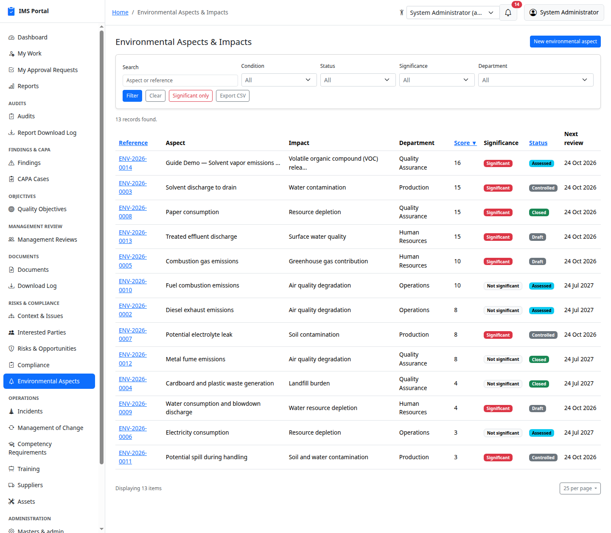
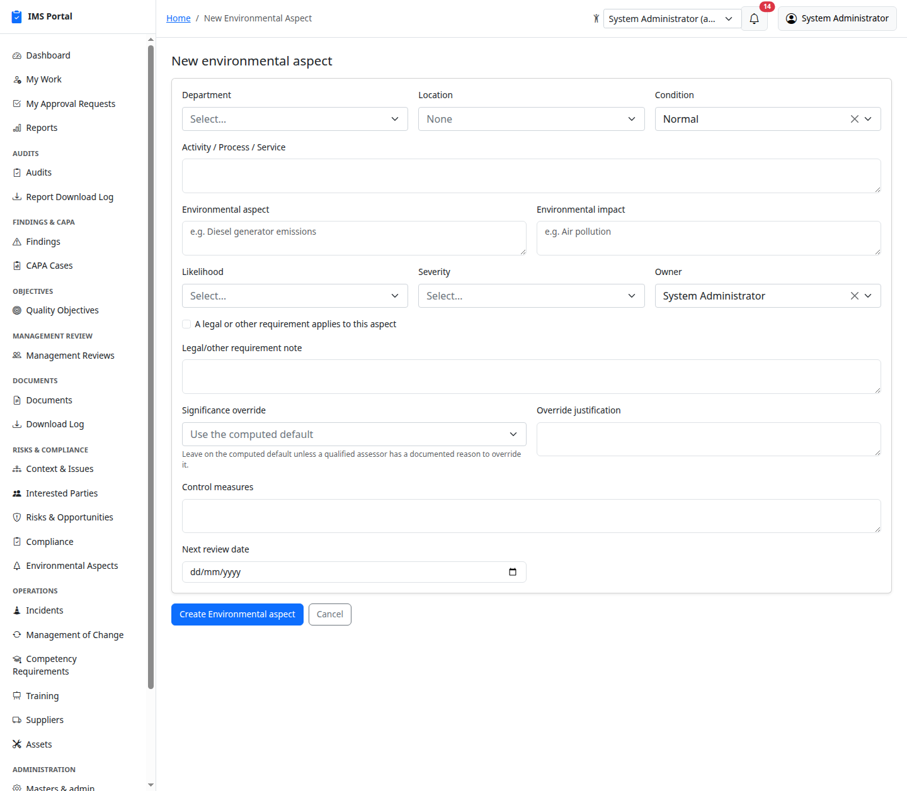
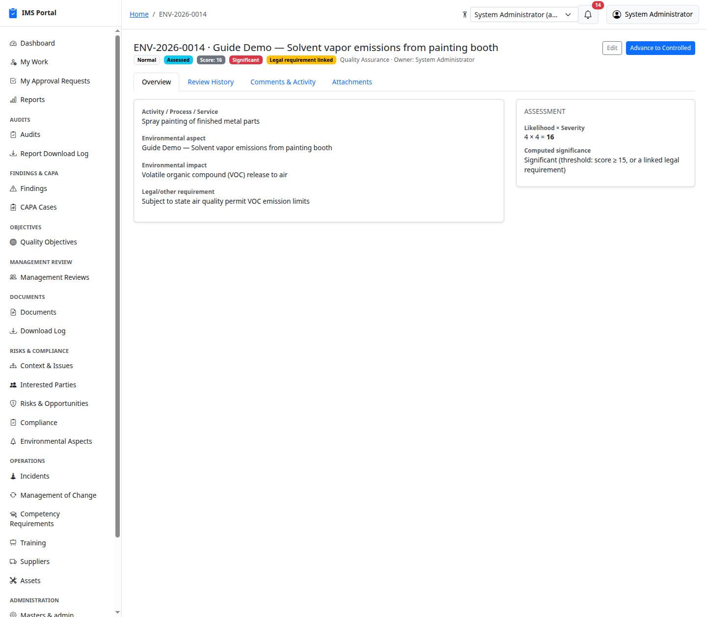
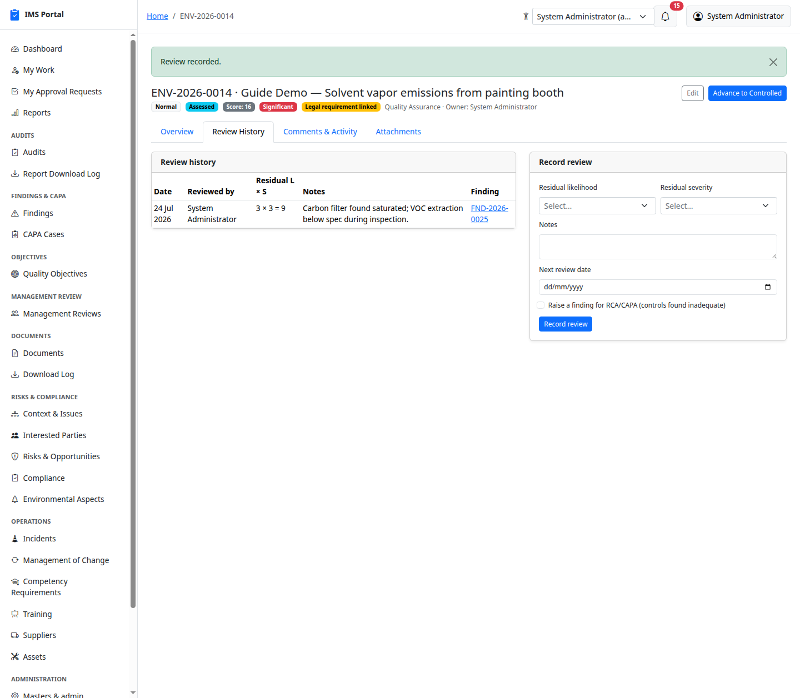
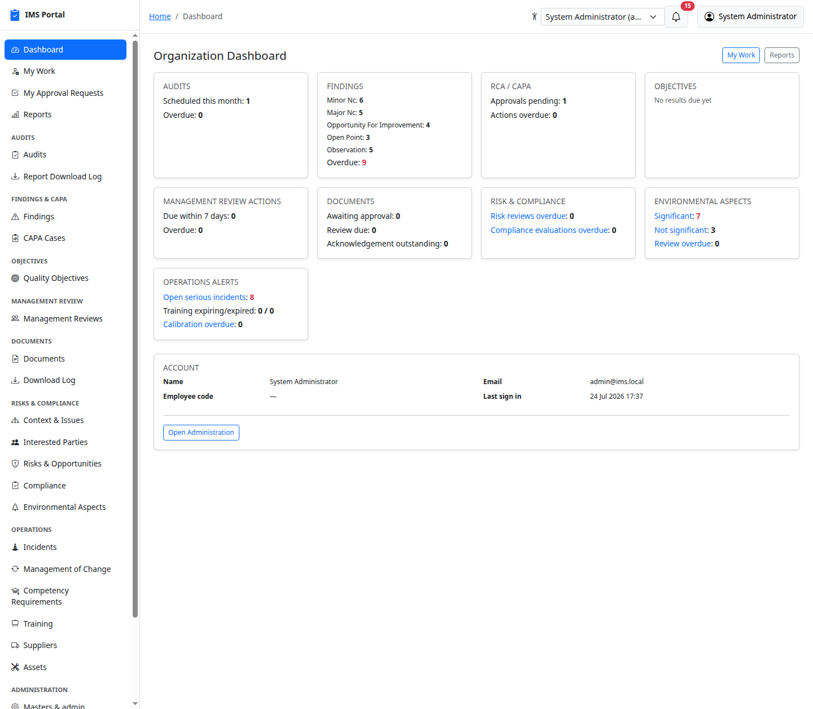

# Environmental Aspects & Impacts

Sidebar → **Risks & Compliance → Environmental Aspects**. The ISO
14001 §6.1.2 register: what an activity, product, or service does to the
environment, scored the same way as [Risks & Opportunities](09-risks-and-opportunities.md)
(same configurable likelihood/severity matrix — **Masters & admin → Risk
matrix levels**), and evaluated for **significance** — the determination
that drives whether an aspect needs formal control.

## List and filter

Every column an ISO 14001 auditor actually asks for is right on the
index — score, significance, status, next review — with a one-click
**Significant only** filter alongside the full search/filter set:

## Recording an aspect

**New environmental aspect** asks for the department/location, the
operating condition (**Normal / Abnormal / Emergency** — standard ISO
14001 practice, since an aspect can behave very differently during a
start-up or an emergency than it does day-to-day), the activity/process,
the aspect and its impact in plain language, likelihood × severity from
the same configured matrix Risks & Opportunities uses, an owner, and
whether a legal or other requirement applies:

## Significance: computed, but always overridable

Saving computes the score and a default significance determination —
**significant if the score is 15 or higher (out of 25), or if a legal/
other requirement is linked, regardless of score.** Legal applicability
forces significance on its own because a low likelihood×severity score
never overrides a genuine compliance obligation.

A qualified assessor can override that computed default in either
direction from the Edit form — but only with a recorded justification;
the override and its reason stay visible on the record, right alongside
the computed default, never silently replacing it:

## The lifecycle

**Draft → Assessed → Controlled → Closed** — one **Advance** button,
always named for the next stage. Moving to **Controlled** requires control
measures to be recorded first; moving to **Closed** requires at least one
review to already be on file — you can't close out an aspect nobody ever
checked on.

## Periodic review, and raising a finding when controls fall short

ISO 14001 expects aspects to be periodically re-evaluated. **Record
review** captures a residual likelihood × severity (re-scored the same
way as the original), notes, and the next review date. For a
**significant** aspect specifically, an extra checkbox appears: **Raise a
finding for RCA/CAPA** — tick it when a review finds the existing
controls inadequate, and a real Finding is created and linked back to
that review, same as a noncompliant Compliance Evaluation or a poor
Supplier Evaluation already does elsewhere in this app:

The checkbox only appears for significant aspects — reviewing a
non-significant one still builds review history, it just doesn't offer to
raise a finding from it.

## Dashboard: the auditor's-perspective breakdown

The organization dashboard carries its own **Environmental Aspects**
card — significant vs. not significant, and how many are overdue for
review — real counts, not a sample, and each figure links straight into
the filtered register:

---
Previous: [How the Access Control Matrix works](17-access-control-matrix.md) · Next: [Worker Participation](19-worker-participation.md)
