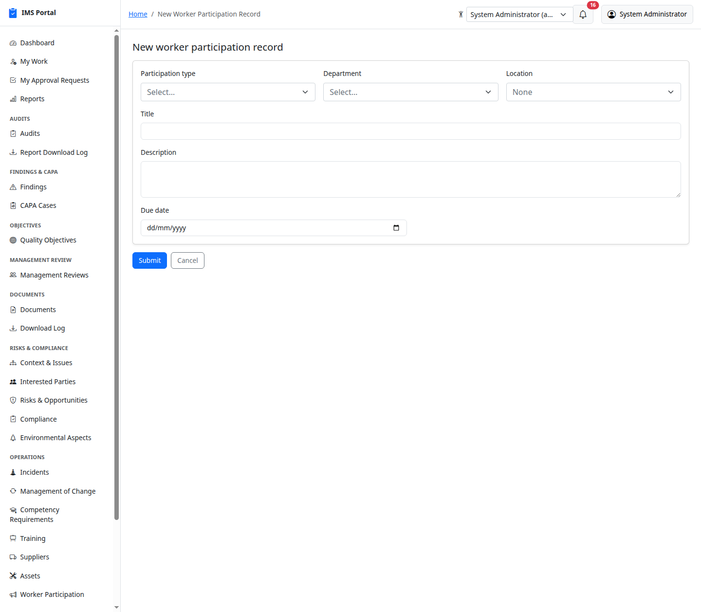
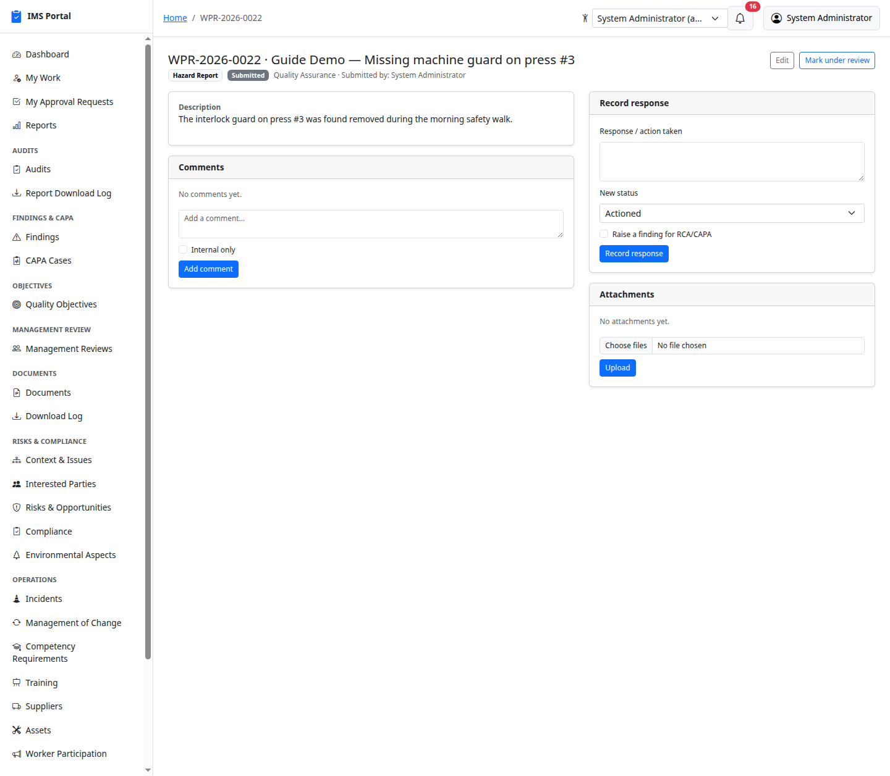
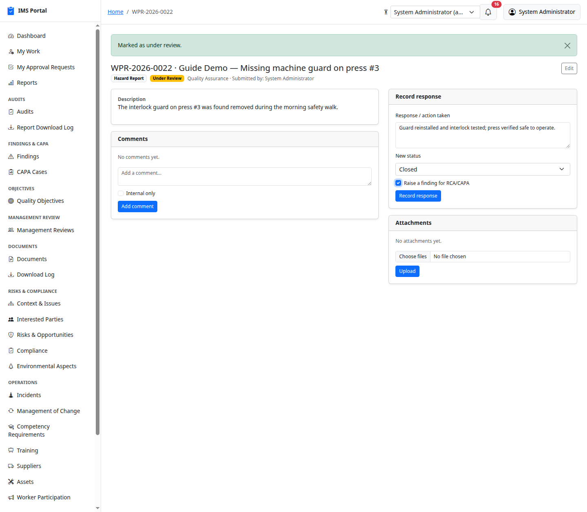
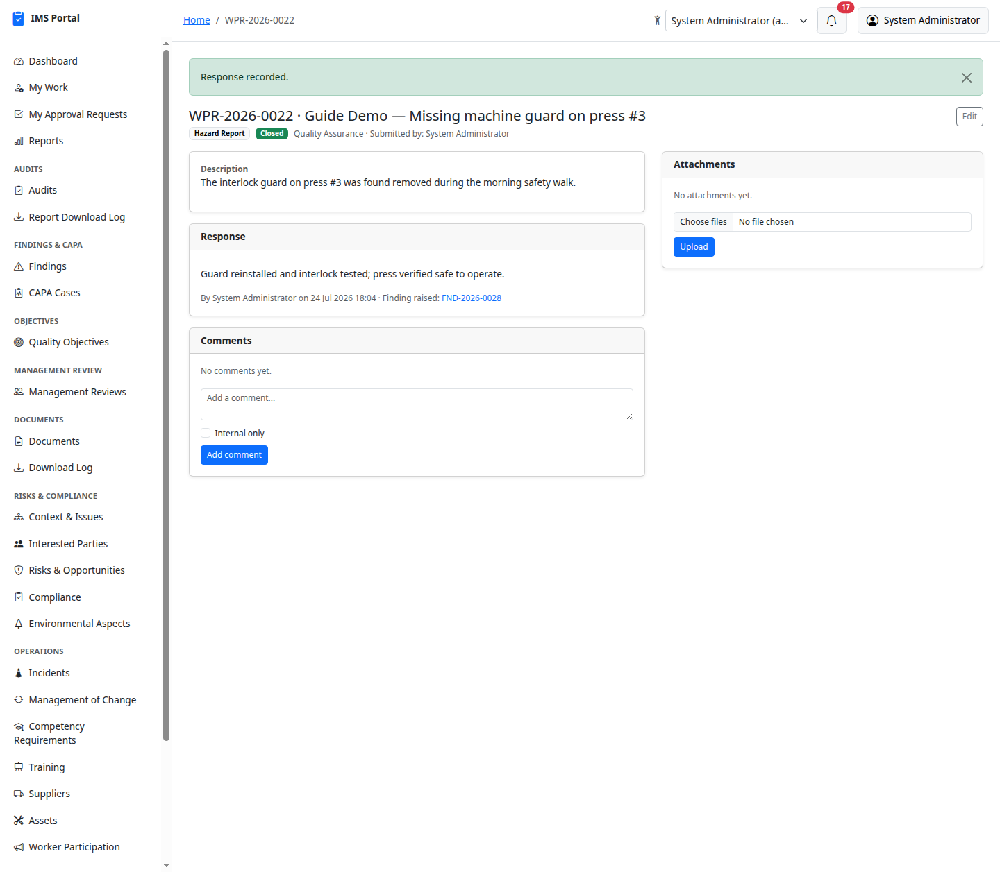
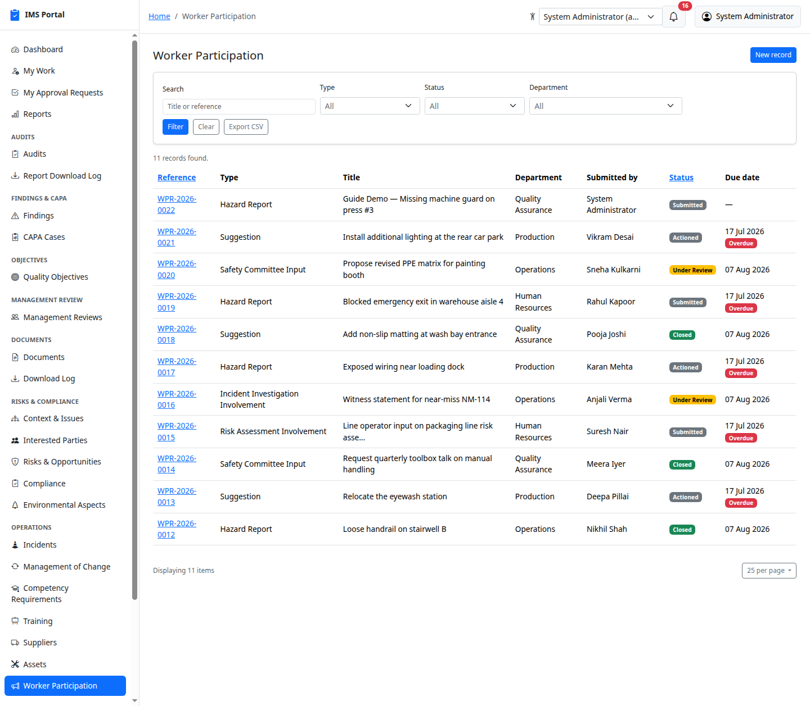

# Worker Participation

Sidebar → **Operations → Worker Participation**. The ISO 45001 §5.4 log
of individual consultation and participation events — hazard reports,
suggestions, safety committee input, involvement in a risk assessment or
an incident investigation. Distinct from a scheduled **Safety Meeting**
(the meeting event itself): this is the record of one person's input,
whether or not it was raised at a meeting.

## Submitting one

**Any signed-in user** can submit a record — no special role needed,
since consultation only works if everyone can participate. Pick a type,
department, title, and description:

Saving generates a reference number and always stays visible to the
person who submitted it, regardless of their department, so they can
follow what happened to it:

## Review and response

**Mark under review** is a one-click status flip once someone starts
looking at it. **Record response** captures the actual outcome — what was
found, what was done — and moves the record to **Actioned** or **Closed**:

For a **Hazard Report** specifically, an extra checkbox appears: **Raise
a finding for RCA/CAPA**. Tick it when the response confirms a genuine
hazard that warrants a formal nonconformity, and a real Finding is
created and linked back to the record — the same mechanism a
noncompliant Compliance Evaluation or a significant Environmental Aspect
review already uses:

The checkbox only appears for hazard reports — a suggestion or a
safety-committee note still gets a full response, it just doesn't offer
to raise a finding from it.

## List and filter

Search by title/reference, and filter by type, status, or department —
same search/filter/CSV pattern as everywhere else in the app:

---
Previous: [Environmental Aspects & Impacts](18-environmental-aspects.md) · Next: [Safety Meetings](20-safety-meetings.md)
