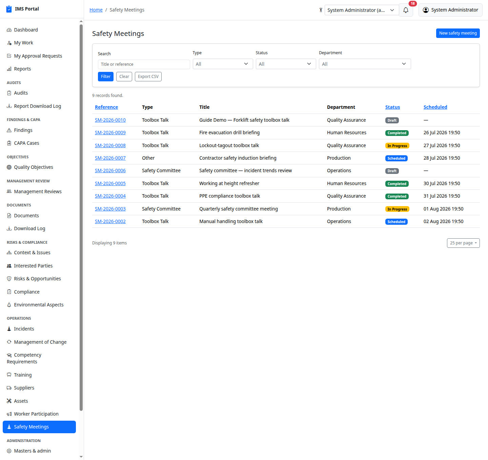
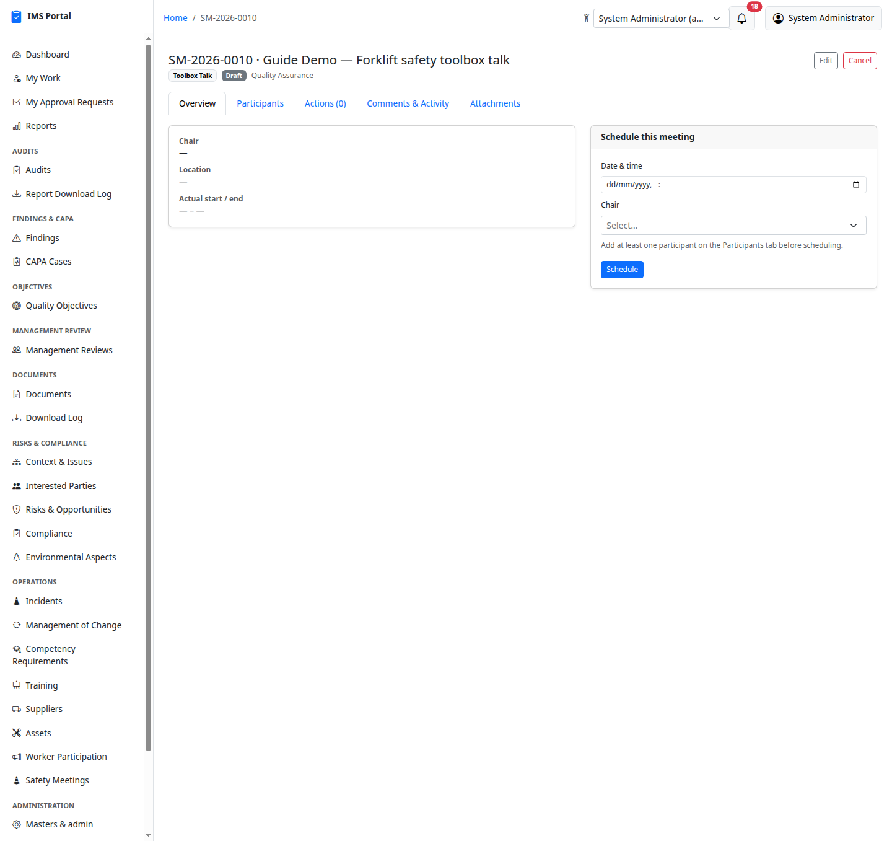
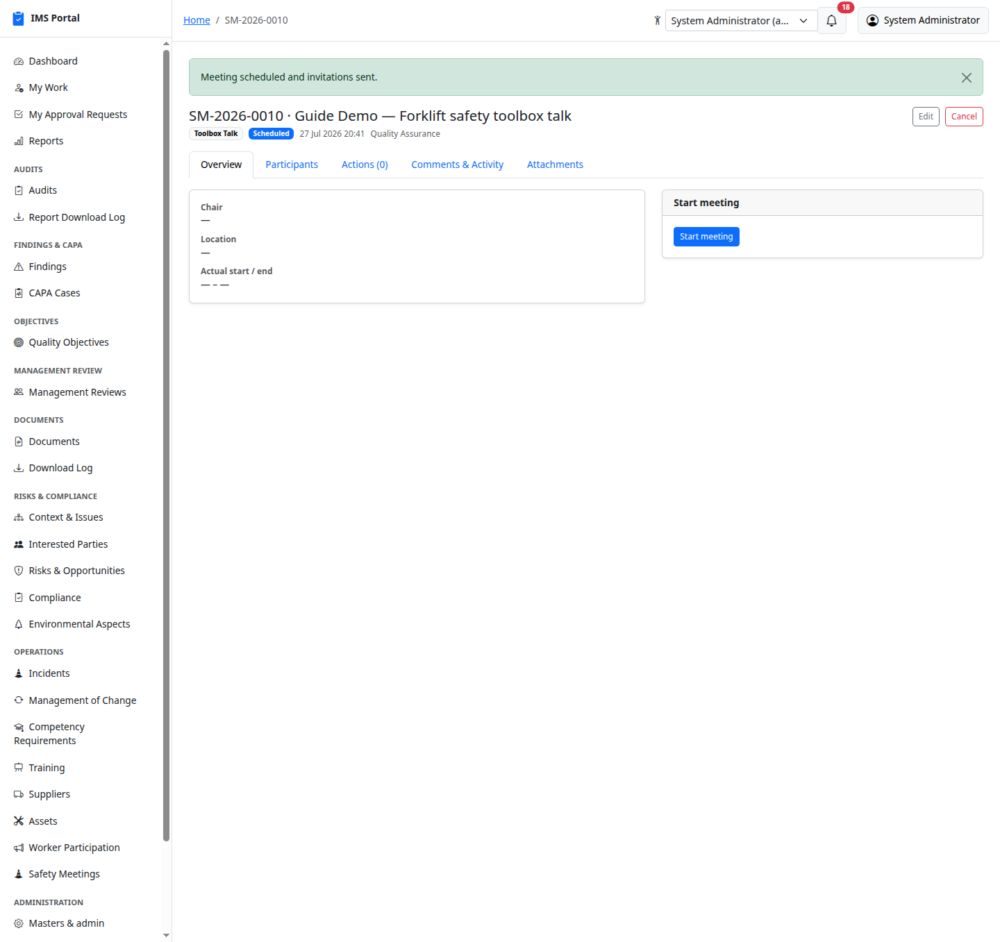
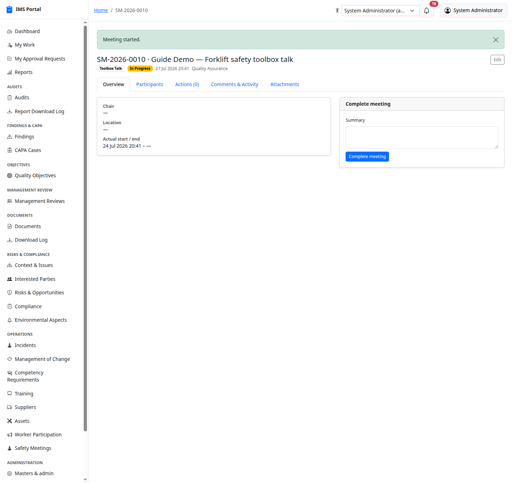
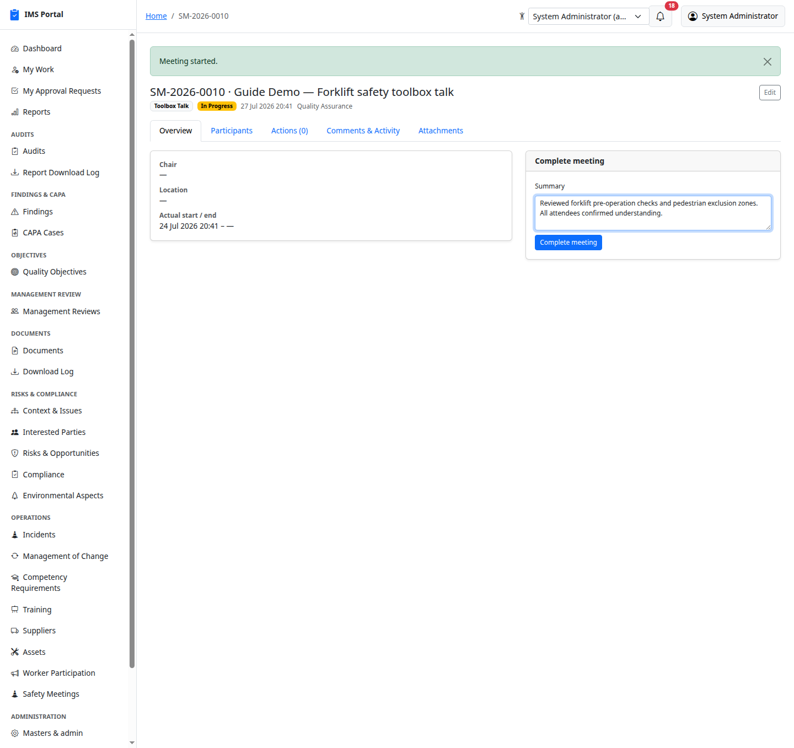
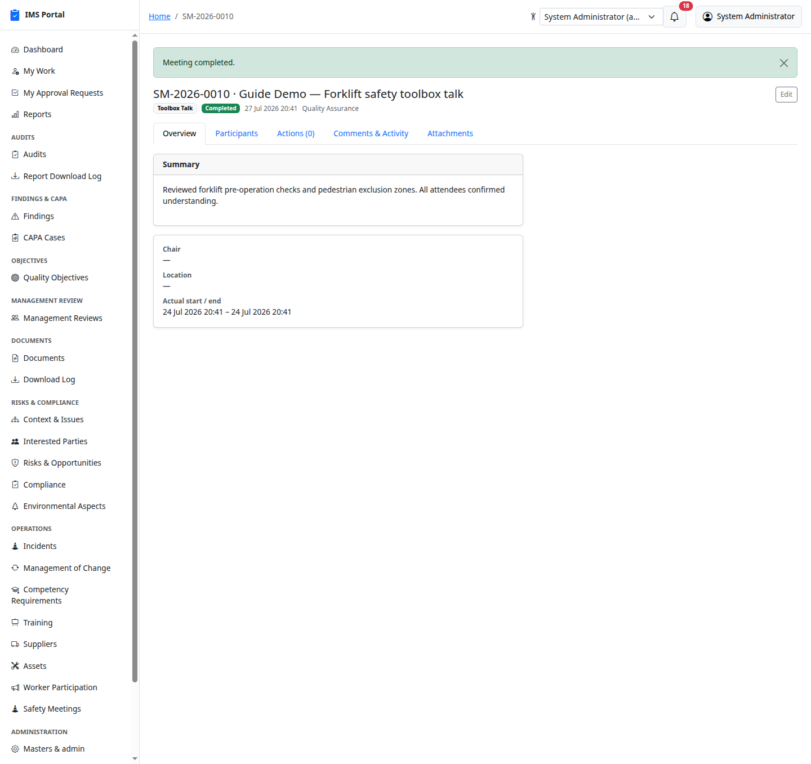
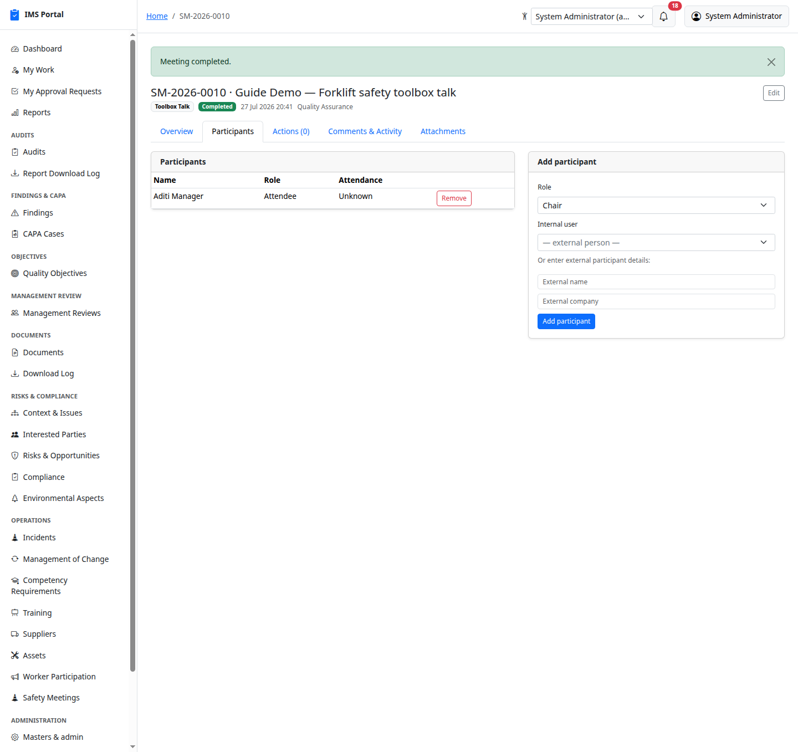

# Safety Meetings

Sidebar → **Operations → Safety Meetings**. Scheduled safety meeting
*events* — toolbox talks, safety committee meetings — a deliberately
lighter counterpart to [Management Reviews](06-management-reviews.md):
no clause-mapped agenda catalog, no formal minutes-approval workflow.
A toolbox talk just needs to be scheduled, run, and summarized.

## List and create

**New safety meeting** picks a type (Toolbox Talk / Safety Committee /
Other), department, location, title, and chair:

## The lifecycle: Draft → Scheduled → In Progress → Completed

Add participants on the **Participants** tab first — internal users or
external guests — then **Schedule** with a date/time. Scheduling emails
every internal participant immediately, the same notification pipeline
Management Review Meetings use:

**Start meeting** is a single click once it's time to begin:

**Complete meeting** captures a summary of what was covered:

A Draft or Scheduled meeting can be **Cancelled** with a reason instead,
right up until it starts.

## Participants and actions

Internal participants and external guests both show up with role and
attendance status:

The **Actions** tab tracks simple follow-ups from the meeting —
description, assignee, due date — each with its own **Mark complete**
button, independent of the meeting's own status.

---
Previous: [Worker Participation](19-worker-participation.md) · Next: [Award & Reward](21-award-and-reward.md)
