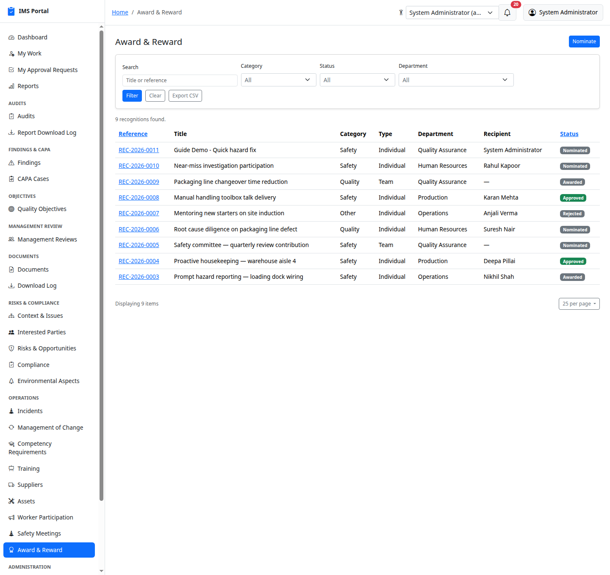
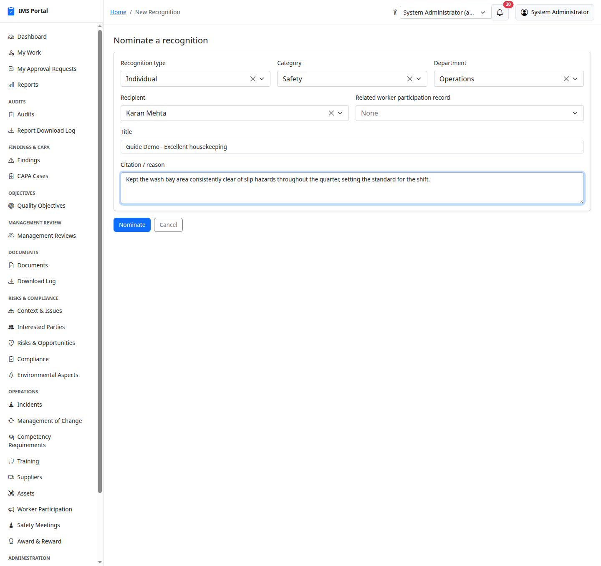
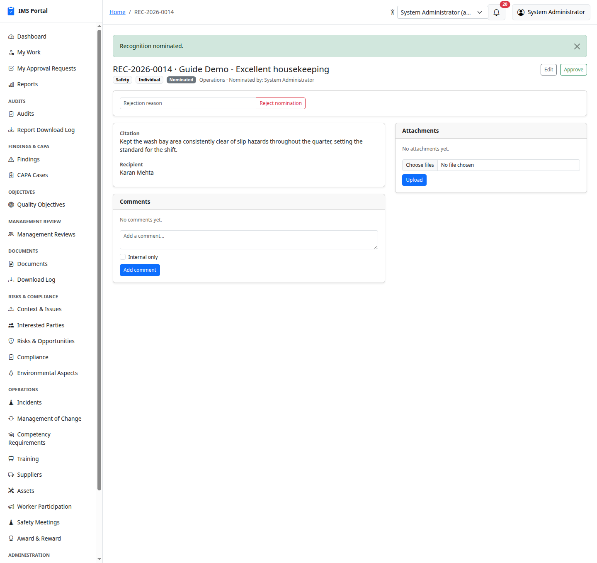
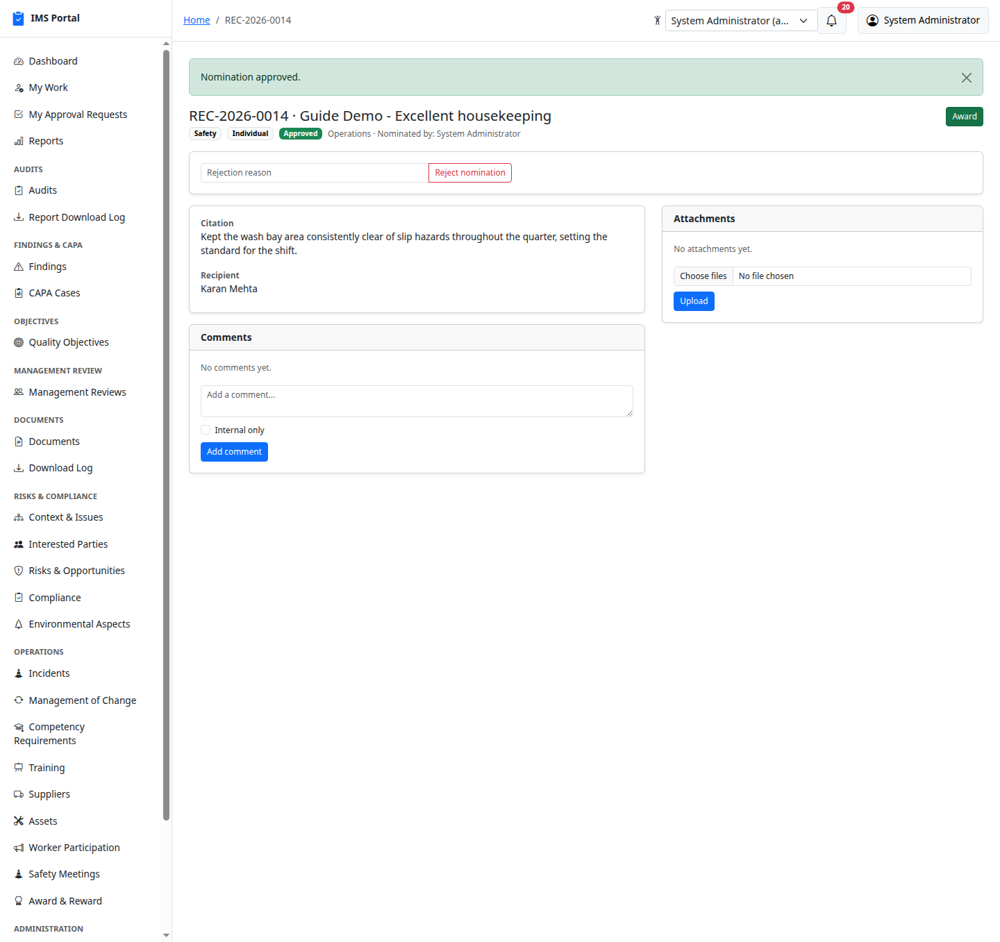
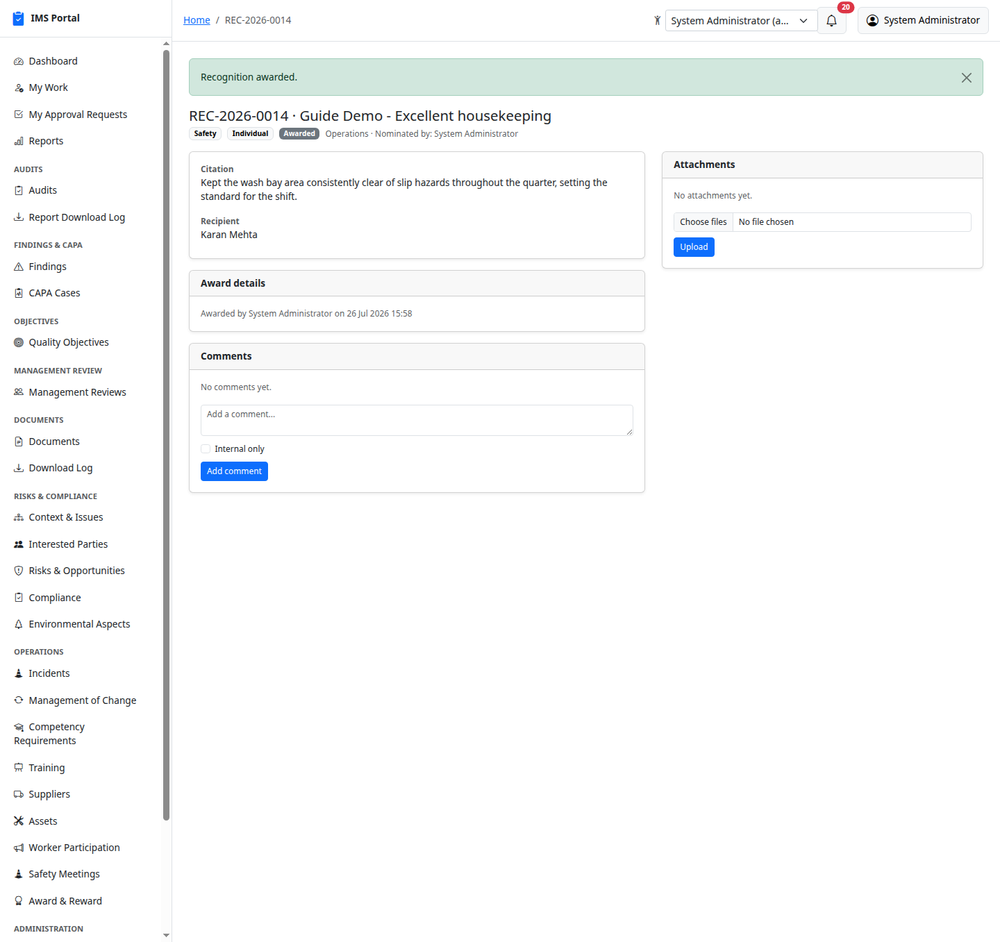

# Award & Reward

Sidebar → **Operations → Award & Reward**. A recognition/reward program
for good safety behavior — primarily safety-driven, but a `category` of
Safety / Quality / Other keeps it from being artificially narrow. An
individual award goes to one named recipient; a team award recognizes a
whole department with no single recipient. Nominate → Approve → Award,
with an optional link back to the [Worker Participation](19-worker-participation.md)
record that prompted it (e.g. "awarded for the hazard report that led to
this fix").

## List and nominate

Any signed-in user can nominate a colleague. **New recognition** picks a
type (Individual / Team), category, department, recipient (required for
an individual award, left as "None (team award)" for a team award), an
optional related worker participation record, a title, and a citation
explaining why:

## The lifecycle: Nominated → Approved → Awarded

A department head or manager reviews the nomination:

**Approve** moves it forward; a nominated or approved recognition can
instead be **Rejected** with a required reason, recorded on the citation —
that's the end of the line for it.

**Award** stamps who awarded it and when, and — for an individual award —
sends the recipient a real notification and email, the same
`Notifications::Create` pipeline every other module in this app uses. A
team award has no single recipient, so no notification is sent:

An awarded or rejected recognition is terminal — no further transitions
are offered.

---
Previous: [Safety Meetings](20-safety-meetings.md) · Back to [Getting Started](00-getting-started.md)
