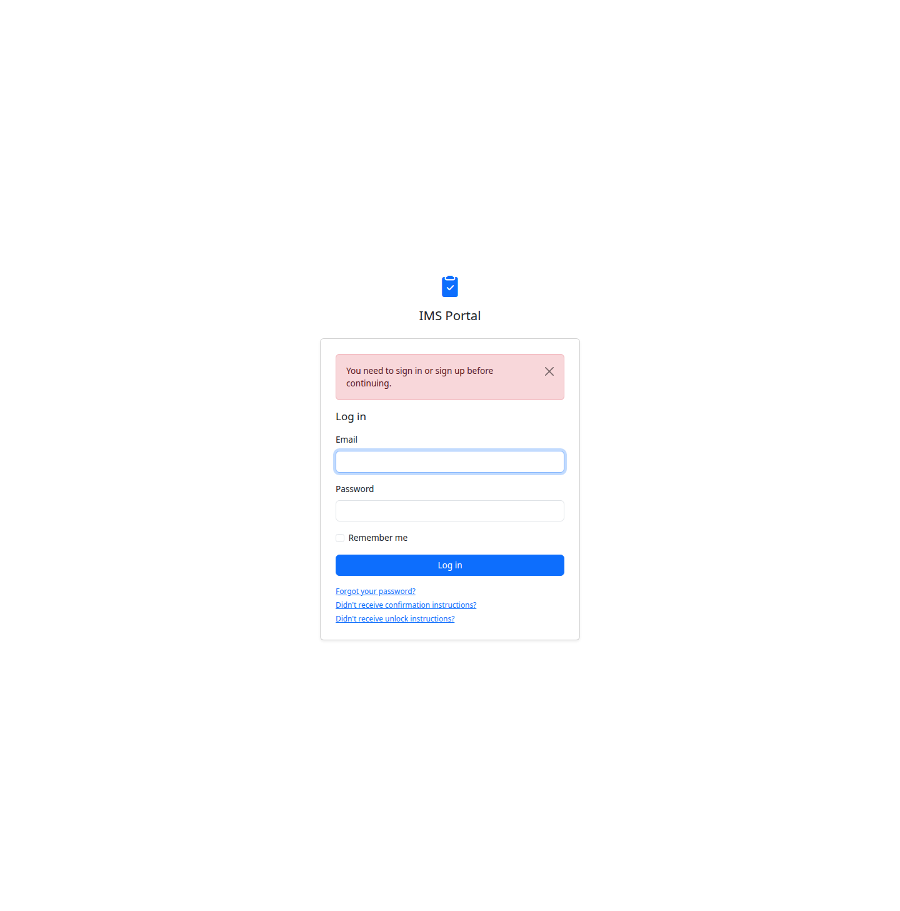
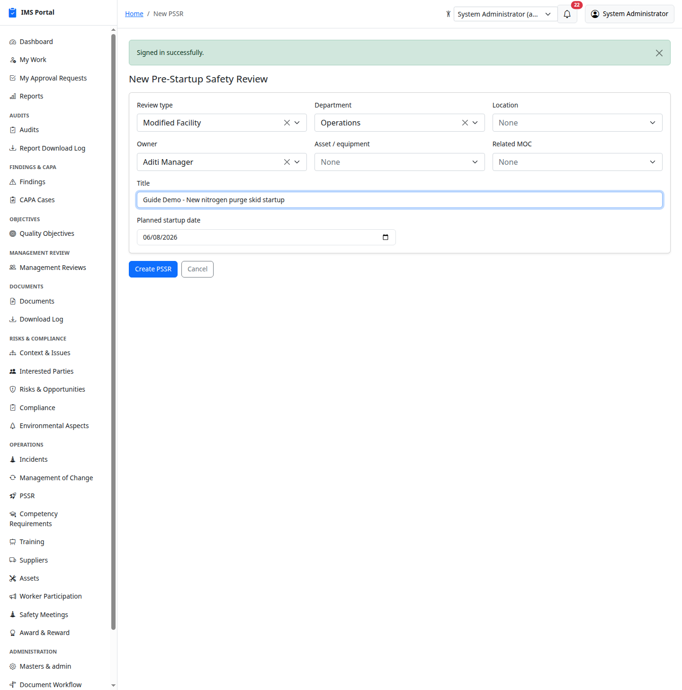
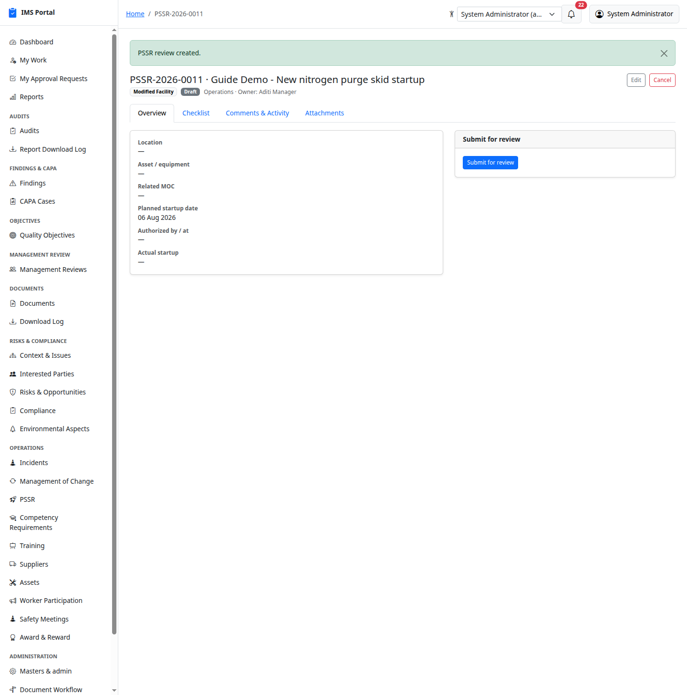
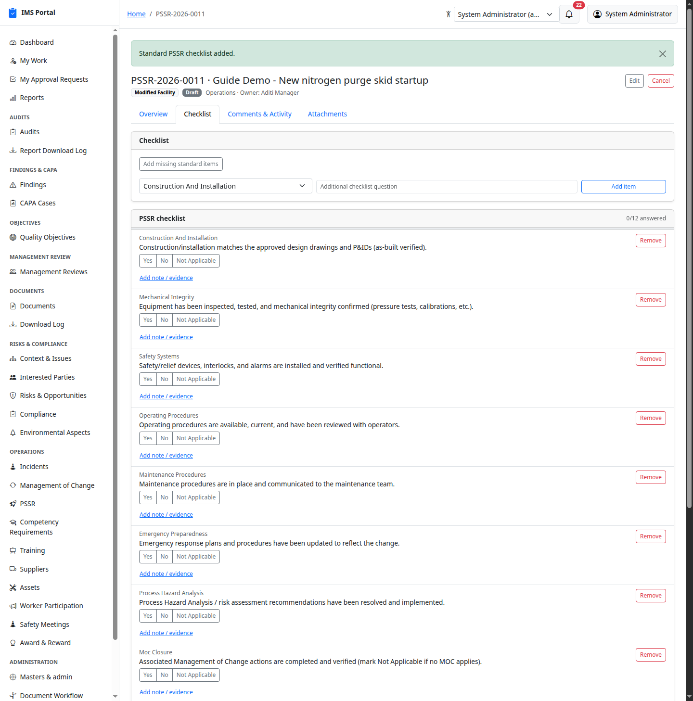
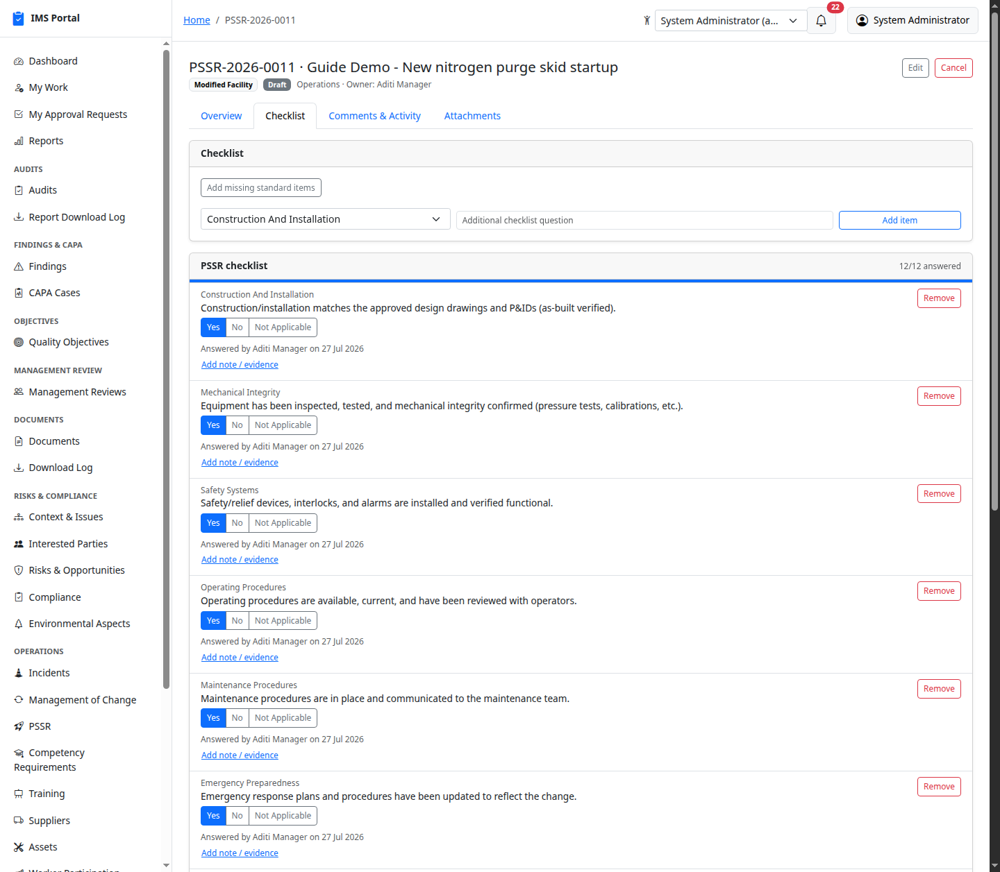
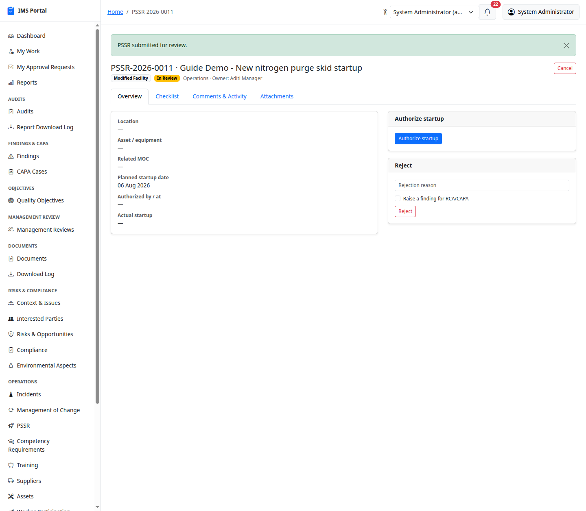
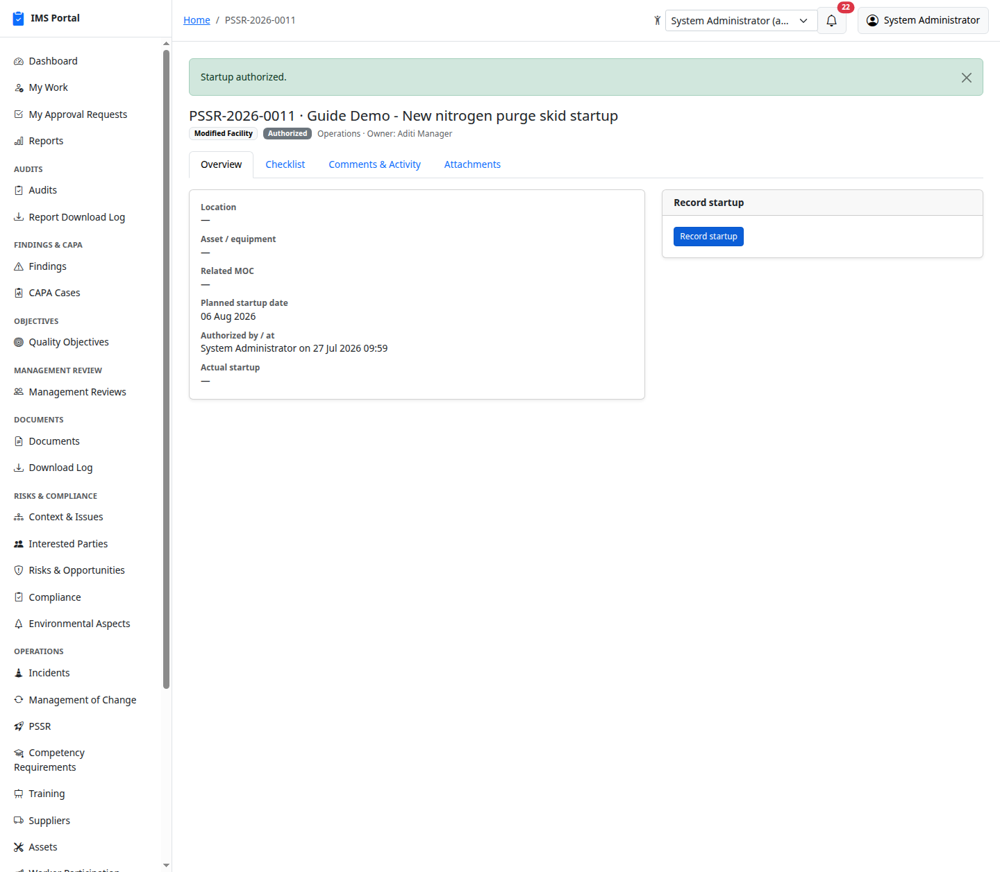
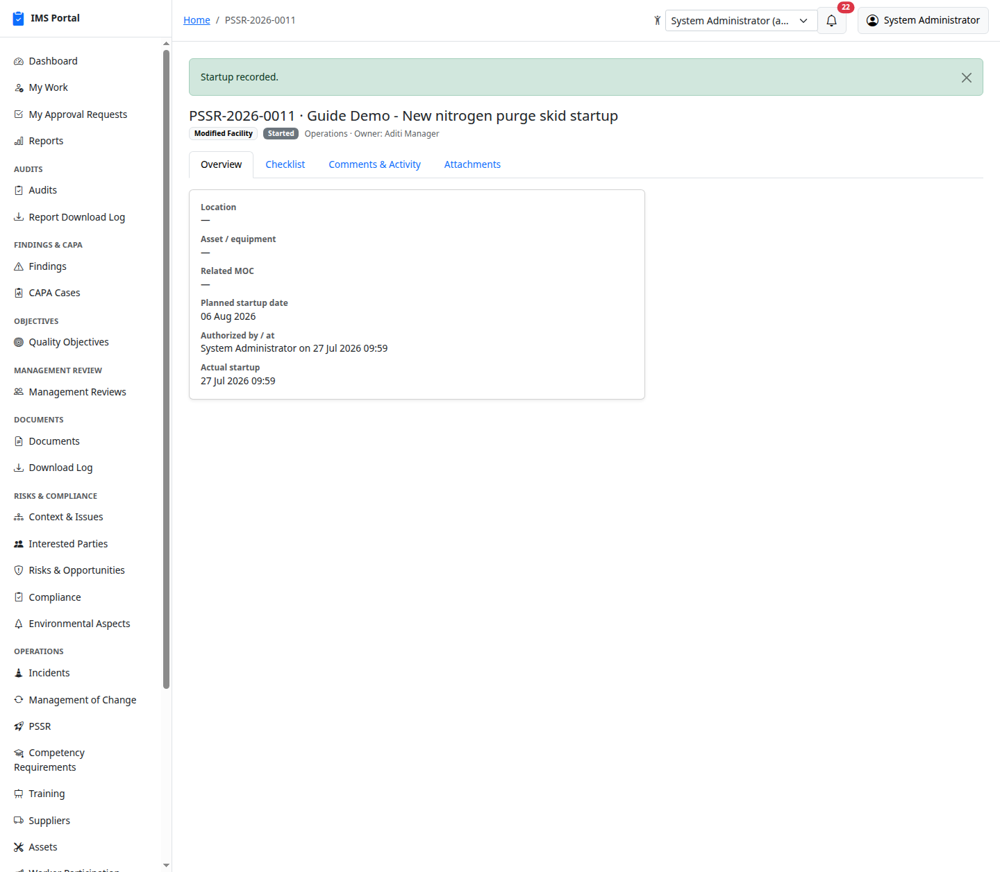

# PSSR (Pre-Startup Safety Review)

Sidebar → **Operations → PSSR**. A structured walkdown/checklist run
before starting up a new or modified process, facility, or piece of
equipment (OSHA PSM 1910.119(i) / ISO 45001 practice) — confirming
construction matches design, safety systems work, procedures and
training are in place, and any prior hazard-analysis or
[Management of Change](12-management-of-change.md) actions are closed
out, before someone is authorized to actually start it up.

## List and create

**New PSSR** picks a review type (New Facility / Modified Facility /
Post-Turnaround / Post-Maintenance / Other), department, owner, an
optional asset/equipment, an optional related MOC, a title, and a
planned startup date:

## The checklist

The **Checklist** tab starts empty — **Populate standard checklist**
adds the 12 standard PSSR domains in one action (construction/
installation, mechanical integrity, safety systems, operating
procedures, maintenance procedures, emergency preparedness, process
hazard analysis, MOC closure, training, environmental compliance,
housekeeping/site readiness, and communication). Clicking it again only
fills in any missing categories — it's safe to click more than once.
Site-specific questions can be added ad hoc alongside the standard set:

Each item is answered Yes / No / Not Applicable, with an optional note
and evidence attachments:

## The lifecycle: Draft → In Review → Authorized → Started

**Submit for review** moves a draft into review. From there, **Authorize
startup** is only available once every checklist item has a response —
attempting it earlier shows a reminder instead of the button being
silently disabled, so the requirement is always visible:

A reviewer can instead **Reject** the PSSR with a required reason,
optionally raising a Finding for formal RCA/CAPA when the walkdown found
a genuine safety gap — the same opt-in mechanism used by
[Worker Participation](19-worker-participation.md)'s hazard-report
responses.

**Authorize startup** stamps who authorized it and when, and sends the
review owner a real notification and email — the same
`Notifications::Create` pipeline every other module in this app uses:

**Record startup** logs the actual startup time once it happens:

A Draft or In Review PSSR can also be **Cancelled** with a reason.
Started, Rejected, and Cancelled are terminal — no further transitions
are offered.

---
Previous: [Award & Reward](21-award-and-reward.md) · Next: [HAZOP](23-hazop.md)
