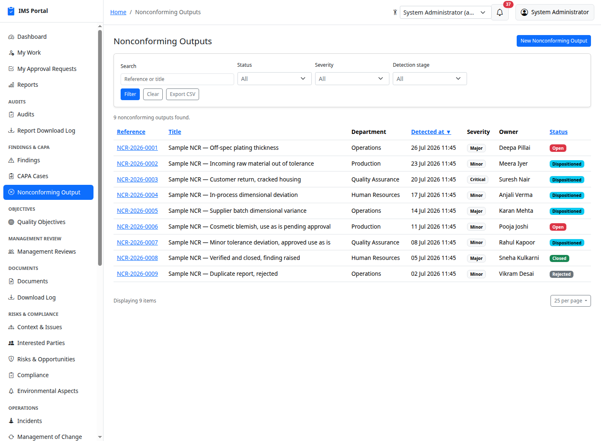
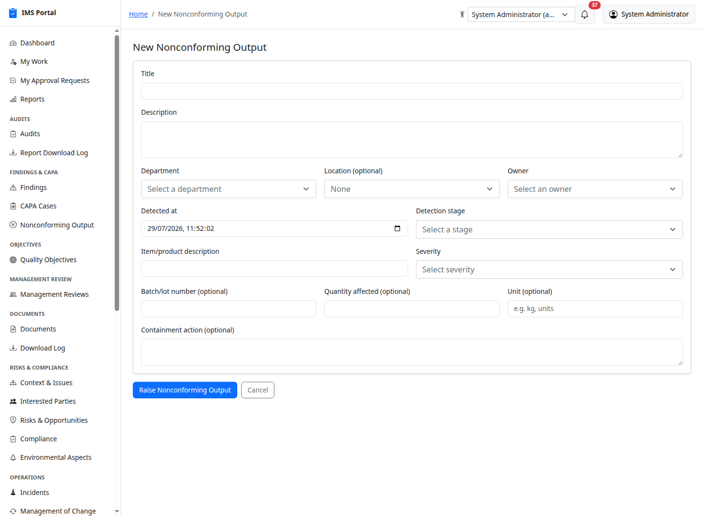
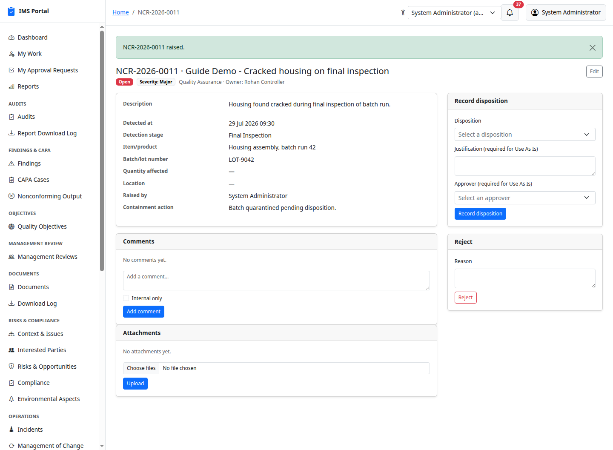
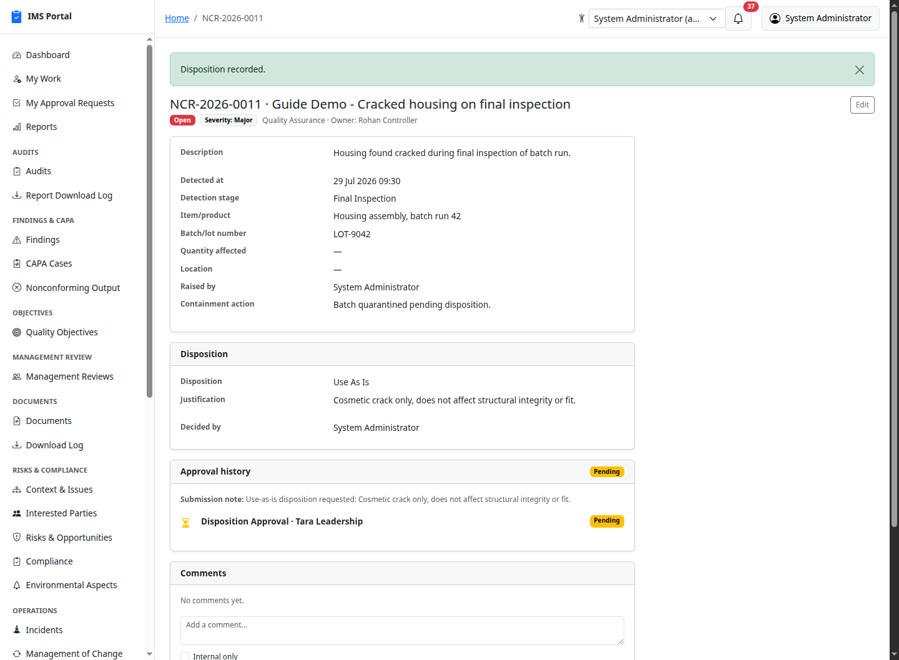
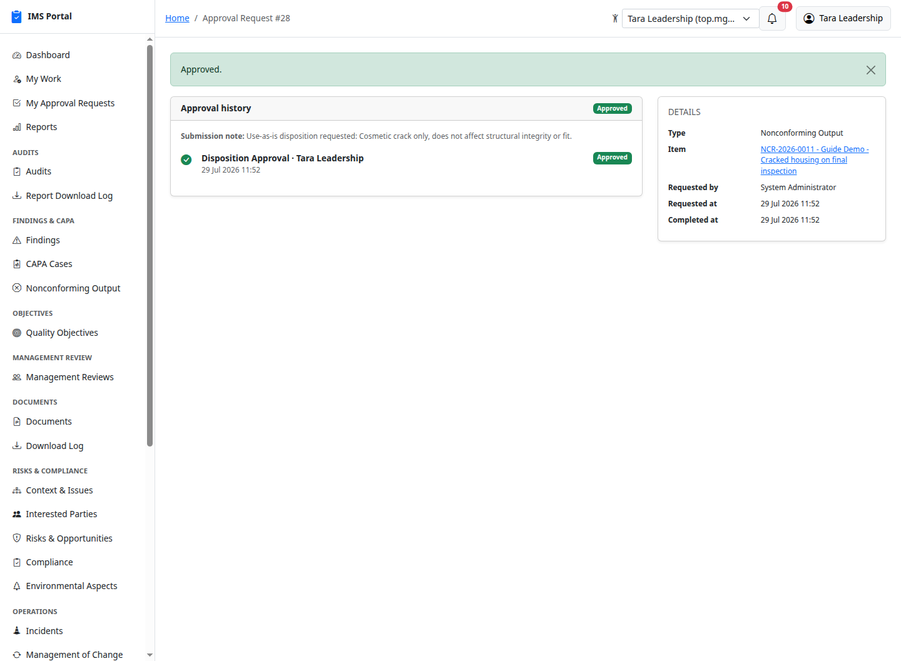
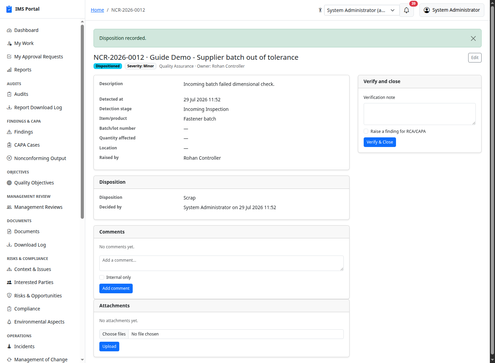
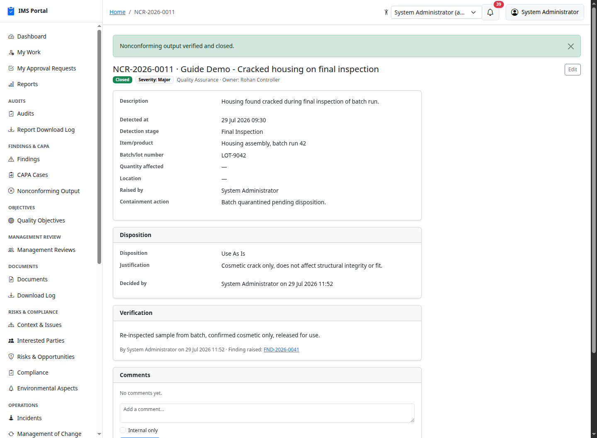
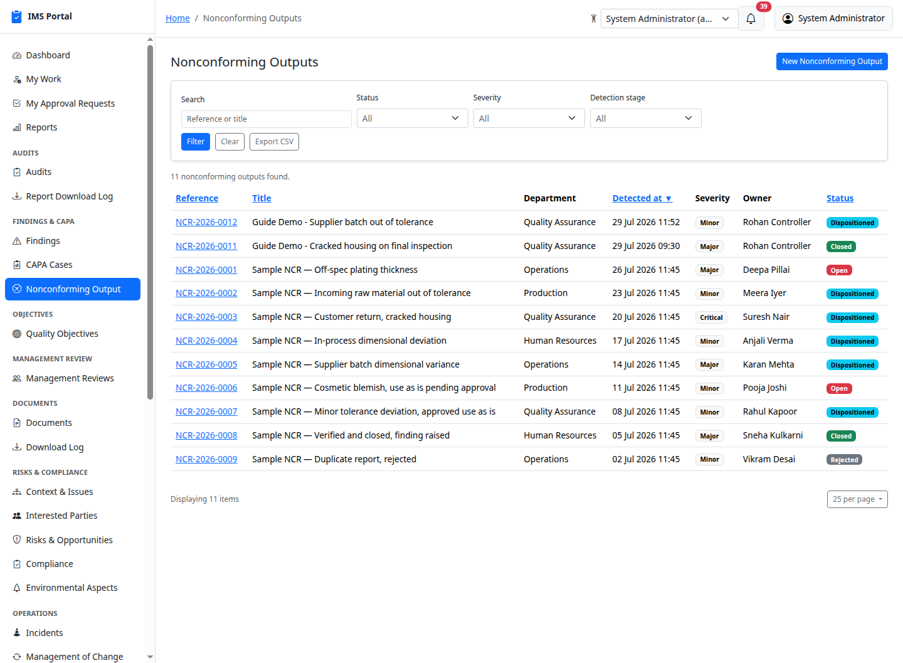

# Nonconforming Output

Sidebar → **Findings & CAPA → Nonconforming Output**. ISO 9001:2015 §8.7
"Control of nonconforming outputs" — a specific batch or item that failed
inspection, and what was done about it: containment, disposition, and
verification. This is distinct from a [Finding](03-findings.md), which
tracks a process-level nonconformity with root cause analysis and CAPA — a
Nonconforming Output can optionally raise a Finding on closure, but most
records never need to.

## Raising a record

**New Nonconforming Output** captures the department, owner, when and at
what stage it was detected (Incoming Inspection, In-Process, Final
Inspection, Customer Return, Internal Audit, Other), the item/batch
description, an optional batch/lot number and quantity, a severity, and an
optional containment action already taken:

Raising it notifies the owner by email and in-app notification, and the
record starts **Open**:

## Disposition

Once containment is in hand, the owner (or anyone who can manage the
record) records a **disposition**: Rework, Regrade, Scrap, Return to
Supplier, or Repair apply immediately — none of these concede the
nonconformity, they correct it. **Use As Is** is different: it's a
concession, and requires a justification and a named approver before it
takes effect. Submitting it keeps the record **Open** until the approver
decides:

The approver acts on it from their own **My Approval Requests** queue or
the approval history panel shown here — the same generic approval engine
used throughout this app (see
[Findings](03-findings.md#comments-and-attachments) for how approval
history renders). Approving moves the record to **Dispositioned**;
rejecting clears the disposition and returns it to **Open** for
redisposition:

A non-approval disposition — Scrap, Rework, Regrade, Return to Supplier,
Repair — applies the moment it's recorded, with no approval step:

## Verification and closure

Once dispositioned, **Verify & Close** records a verification note and
closes the record — confirming the disposition was actually carried out
(the rework was done, the scrap was destroyed, the repair holds). Checking
**Raise a finding for RCA/CAPA** optionally raises a linked
[Finding](03-findings.md) for formal root cause analysis, the same opt-in
mechanism BBS, PSSR, HAZOP, and Worker Participation already use — never
automatic:

## Rejecting a report

While still **Open**, a record can be **Rejected** with a reason instead of
being dispositioned — for a duplicate report or one raised in error. A
rejected record is terminal; there's no path back from Rejected.

## Who can see what

A department head can manage their own department's records; a plain
department member can see them but not edit them; the owner and the person
who raised it can always read and update their own record, regardless of
department. `capa_manager`, `top_management`, and `ims_admin` manage every
record org-wide — the closest existing "quality process owner" role fit,
since this app has no dedicated quality-manager role. Like every other
module, a super admin can turn **Nonconforming Output** off entirely from
Masters & admin → Module flags.

---
Previous: [Safety Observations & BBS](24-safety-observations-and-bbs.md) ·
Next: [Customer Satisfaction](26-customer-satisfaction.md)
