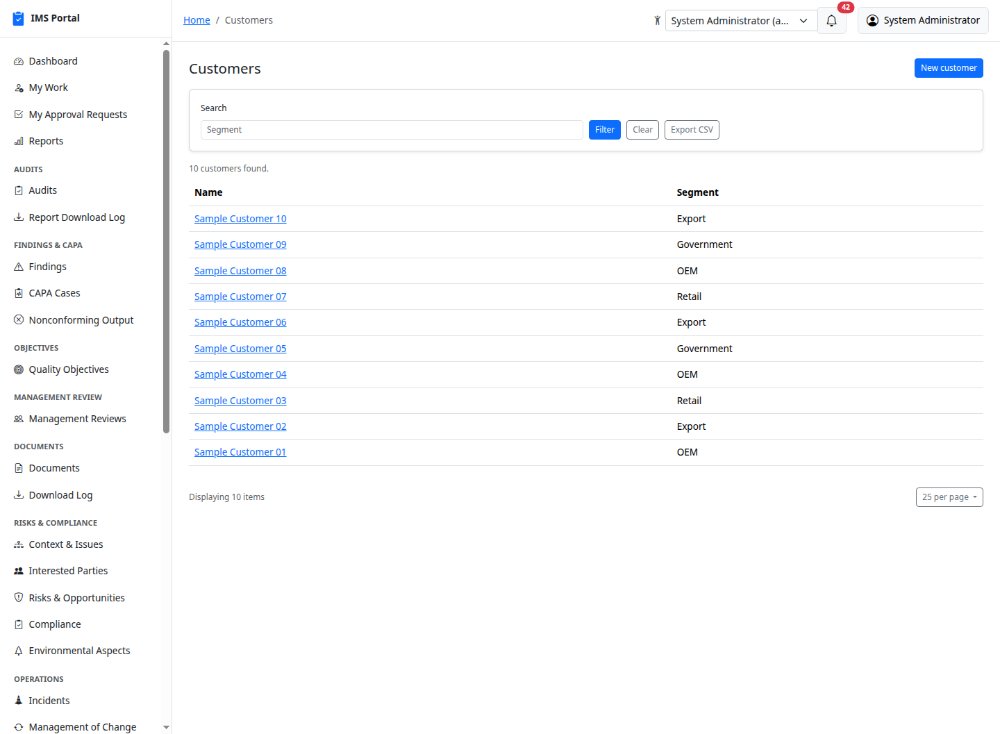
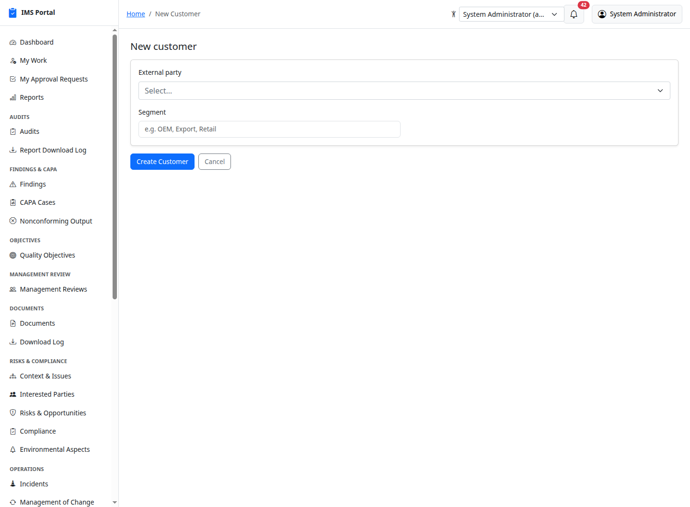
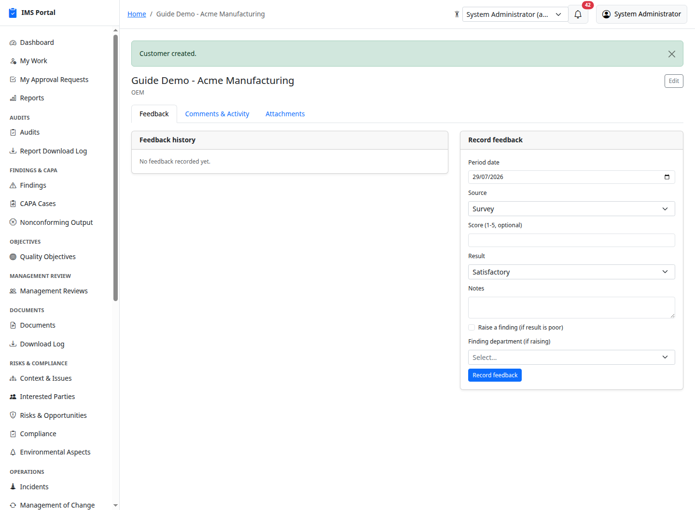
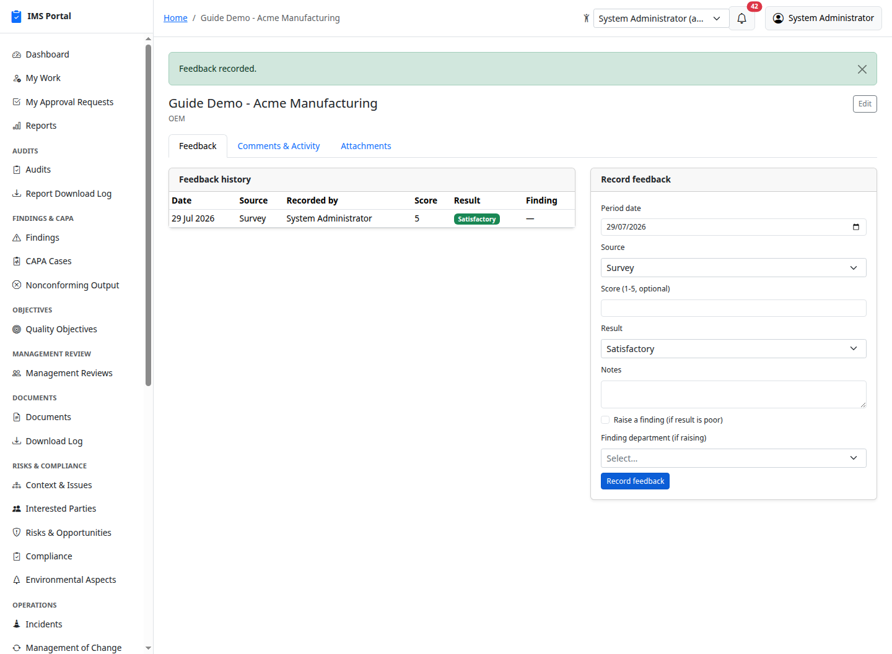
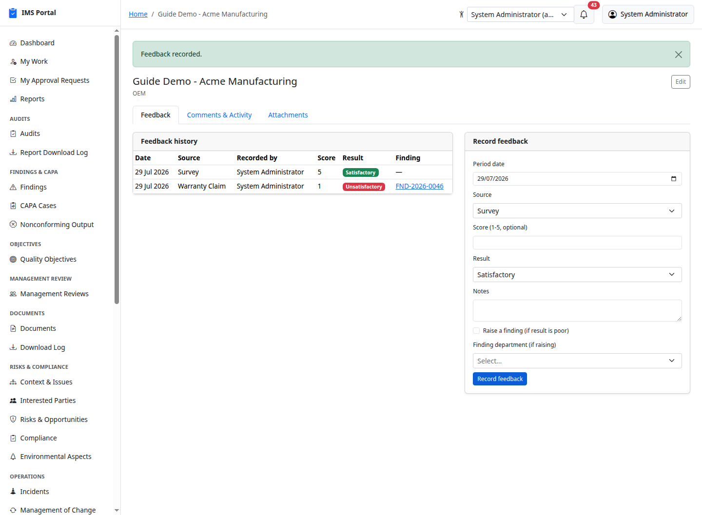
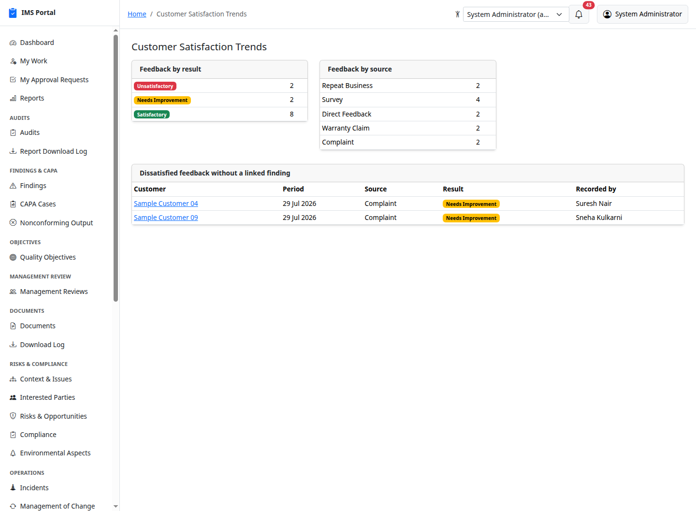

# Customer Satisfaction

Sidebar → **Operations → Customer Satisfaction**. ISO 9001:2015 §9.1.2:
monitoring customer perceptions of how well their needs and expectations
are met. Every customer is backed by an **External Party** record (Masters
& admin) of type "customer" — the `Customer` record itself adds an
optional segment on top. This is the routine feedback/survey log the
standard asks for — surveys, delivered-product feedback, repeat business,
warranty claims — not a duplicate of [Incidents](11-incidents.md)'s
customer-complaint investigation workflow; a serious complaint that
already went through Incident investigation can simply be referenced from
a feedback record instead of re-entered.

## List and create

**New customer** links to an existing customer-type external party
(create one first in Masters & admin if it doesn't exist yet) and an
optional segment (e.g. OEM, Export, Retail):

## Recording feedback

Pick a source (Survey, Direct Feedback, Repeat Business, Complaint,
Warranty Claim, Other), an optional 1–5 score, a result, and notes:

Exactly like Suppliers and Compliance Obligations, checking **Raise a
finding** on a poor result (Needs Improvement/Unsatisfactory) auto-creates
a linked [Finding](03-findings.md) for RCA/CAPA:

## Customer Satisfaction Trends report

[Reports](16-dashboards-and-reports.md) → **Customer Satisfaction
Trends**: feedback by result, feedback by source, and an actionable list
of dissatisfied feedback that has no Finding yet raised — the same
"actionable list, not just an aggregate" convention the BBS Coverage &
Trends report already established:

## Who can see what

Every signed-in user can read a customer and its feedback history — a
customer relationship isn't owned by one department the way a shop-floor
record is. Only `ims_admin` and `top_management` can create/edit customers
and record feedback. Like every other module, a super admin can turn
**Customer Satisfaction** off entirely from Masters & admin → Module flags.

---
Previous: [Nonconforming Output](25-nonconforming-output.md) · Back to [Getting Started](00-getting-started.md)
