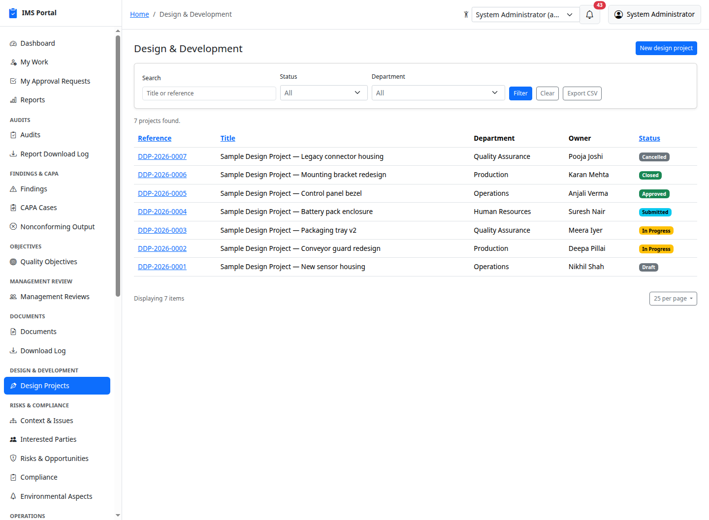
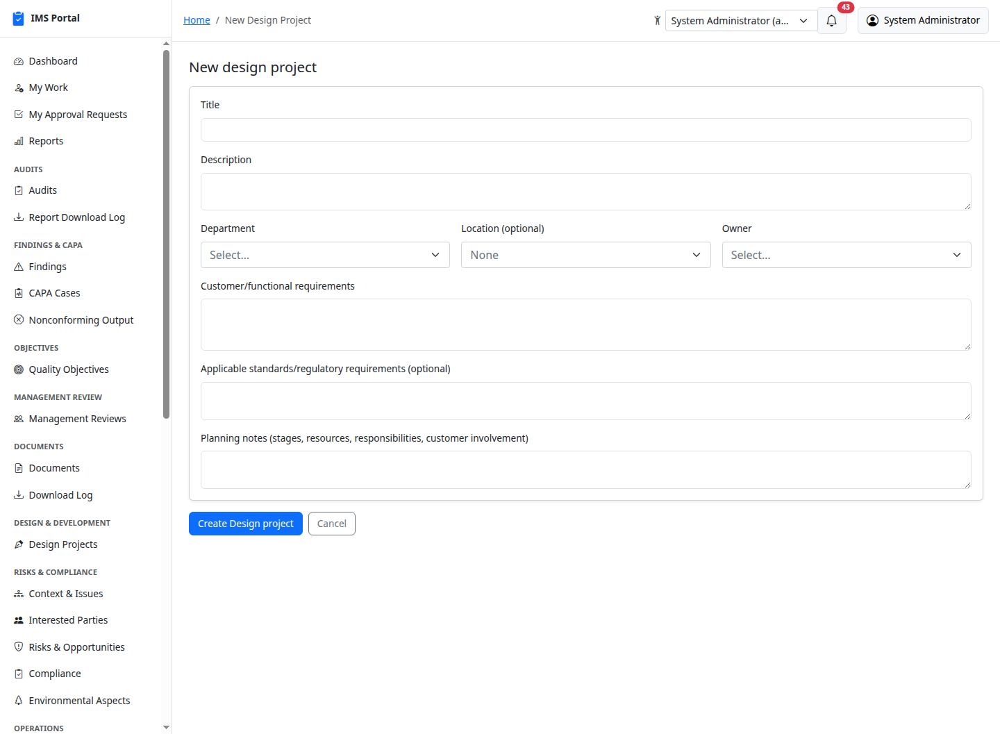
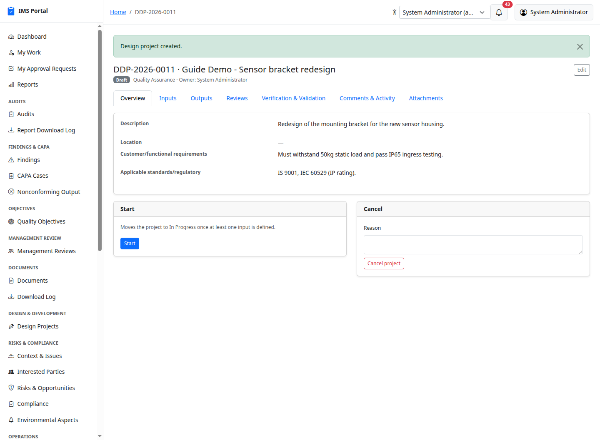
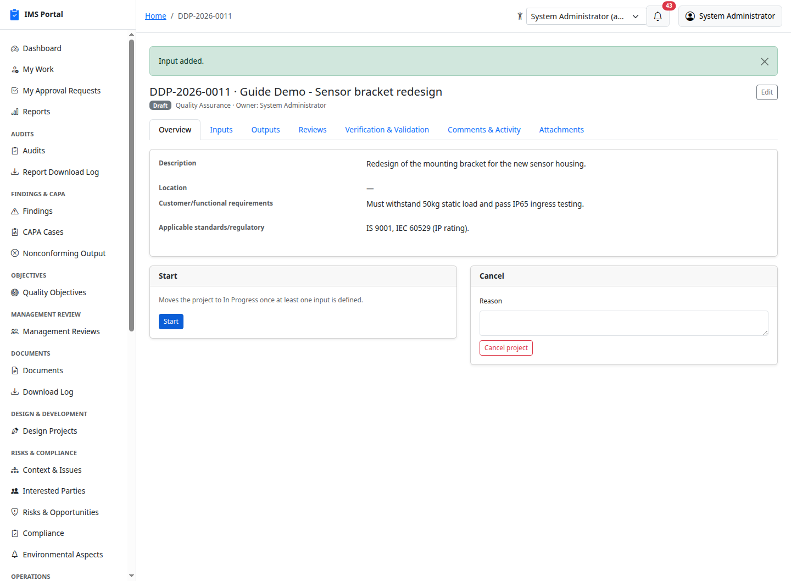
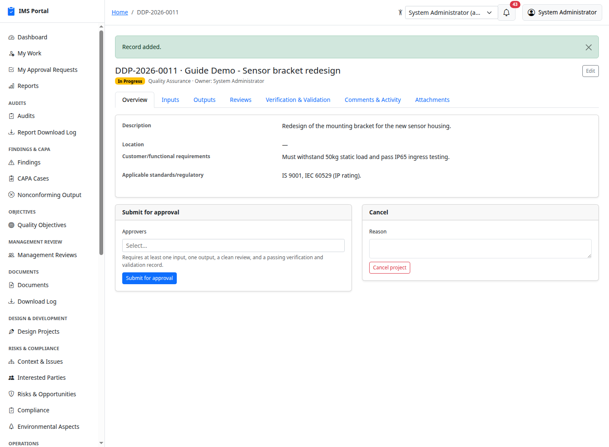
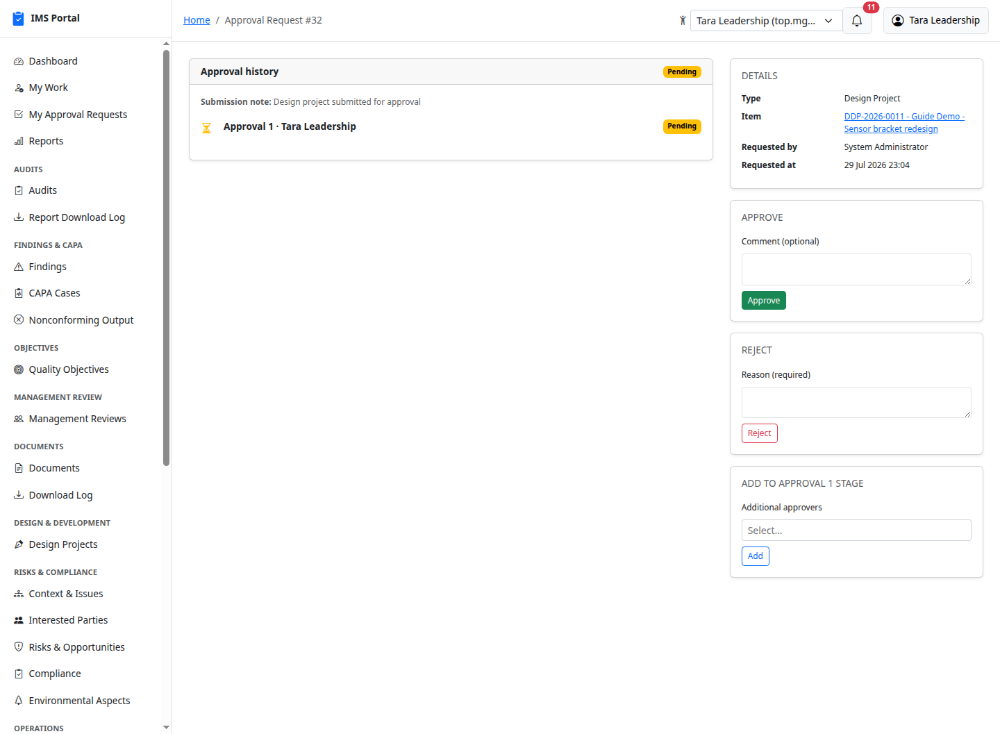
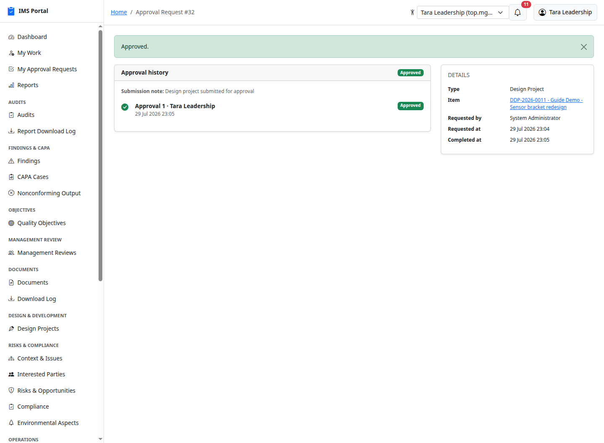
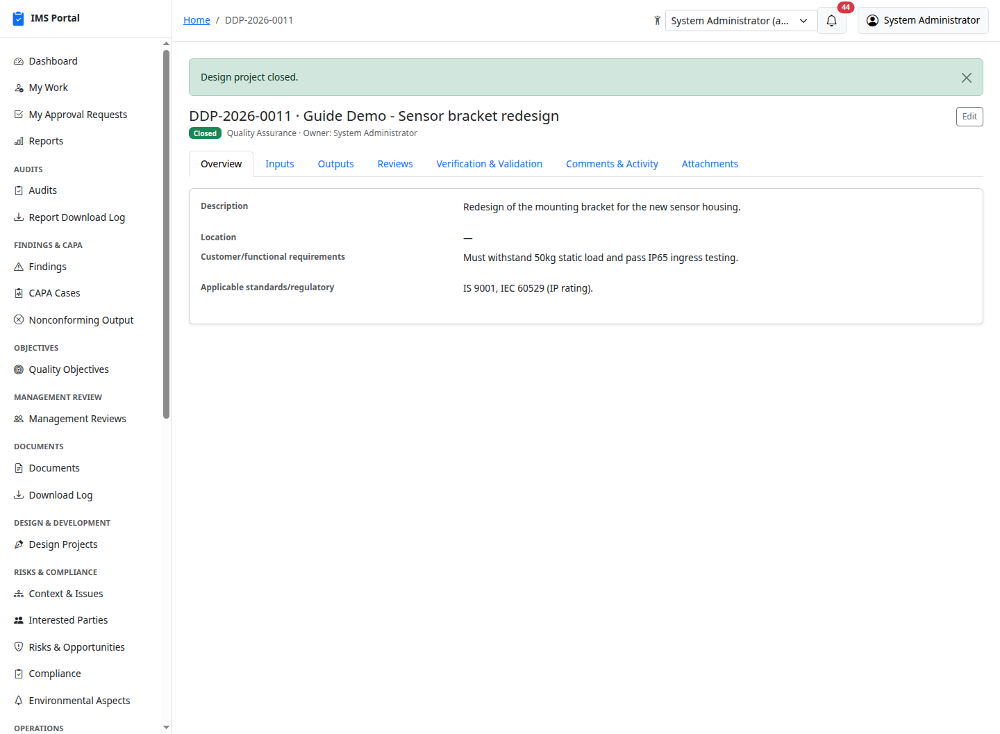
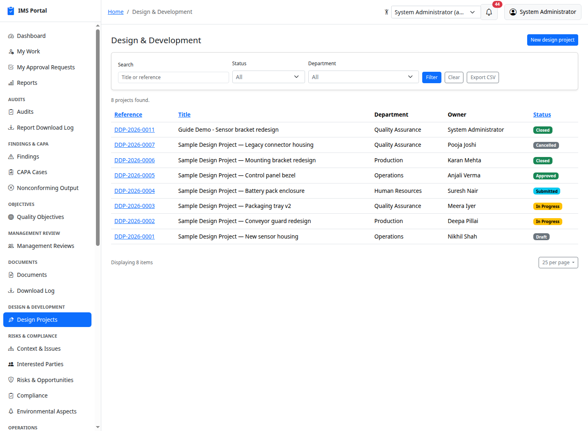

# Design & Development

Sidebar → **Design & Development → Design Projects**. ISO 9001:2015 §8.3:
planning, inputs, controls (review/verification/validation), outputs, and
approval for a design and development project. Unlike a change raised on
an existing product or process — that stays an
[MOC request](12-management-of-change.md) — this module is for building
something new: inputs, outputs, review, verification, and validation all
live as records on the project itself, addable throughout while the
project is in progress, since real design work iterates between them
rather than moving through a rigid sequence.

## Creating a project

**New design project** captures the department, owner, the customer/
functional requirements the design must meet, and optionally applicable
standards/regulatory requirements and planning notes (stages, resources,
responsibilities, customer involvement):

A new project starts **Draft**:

## Inputs, then starting the project

The **Inputs** tab records each requirement the design must satisfy — a
requirement statement and a category (Functional, Performance, Regulatory,
Previous Similar Work, Other):

Once at least one input exists, **Start** moves the project to **In
Progress**, opening up the Outputs, Reviews, and Verification & Validation
tabs:

## Outputs

The **Outputs** tab records what the design actually produces — a
description, optionally linked back to the specific input it addresses for
traceability, and optionally linked to the controlled
[Document](07-documents.md) that is the deliverable itself (a drawing,
spec, or BOM):

## Reviews, verification, and validation

The **Reviews** tab records a design review — a reviewer, a date, and
whether any issues were identified. The **Verification & Validation** tab
records both verification (does the output meet the input?) and validation
(does the result meet the intended use?) as the same kind of record, each
with a method (Test, Inspection, Analysis, Demonstration) and a result
(Pass, Fail, Conditional Pass):

## Submitting for approval

Once the project is In Progress, the Overview tab shows a **Submit for
approval** panel. It requires at least one input, one output, a review
with no outstanding issues, and a passing verification and validation
record — the same design-control gate ISO 9001 §8.3.4 asks for:

The approver acts on it from their own **My Approval Requests** queue or
the approval history panel on the project — the same generic approval
engine used throughout this app:

Approving moves the project to **Approved**; rejecting sends it back to
**In Progress** so the team can address the review comments and resubmit:

## Closing or cancelling

Once approved, **Close** marks the design formally released. While still
Draft or In Progress, **Cancel** (with a required reason) ends the project
without an approval decision:

## Design changes

A change to an already-released design is not raised here — it's raised as
an [MOC request](12-management-of-change.md) referencing the project, the
same assess → approve → implement → verify workflow every other change in
this app already goes through, rather than a second, duplicate change
mechanism.

## Who can see what

A department head can manage their own department's projects; a plain
department member can see them but not edit them; the owner can always
read and update their own project regardless of department, and that
extends to every child record (inputs, outputs, reviews, verification/
validation) on it. `capa_manager`, `top_management`, and `ims_admin`
manage every project org-wide — the closest existing "quality process
owner" role fit, since this app has no dedicated design/engineering
manager role. Like every other module, a super admin can turn **Design &
Development** off entirely from Masters & admin → Module flags.

---
Previous: [Customer Satisfaction](26-customer-satisfaction.md) · Back to [Getting Started](00-getting-started.md)
