# OHC / Employee Health Records

Sidebar → **OHC / Employee Health** (its own sidebar section — previously
folded into Operations, split out once the module grew past two links).
This is a larger planned Occupational Health Center platform being built
as a sequence of slices — this chapter covers what's built so far: an
**Employee Medical Master** profile per employee, **OPD/Clinic visit**
records, basic **fitness management**, **Pre-Employment and Periodic
Medical Examinations** with structured test results, auto-scheduled due
dates, and fitness certificates, **Vaccination & Immunisation** tracking,
an Organization Dashboard card, **Pharmacy & Inventory** — medicine
stock, batch tracking, and dispensing — **Emergency & First Aid** (the
first aid case register with emergency response tracking, and first aid
kit inspections), **occupational health surveillance** (hazard exposure
programs, exposure timelines and test trends), **contractor medical
management** (contractor workers, medical clearances and gate-pass
compliance), and now **health campaigns** plus **statutory examination
reminders and the Medical Examination Register**. Laboratory/diagnostics
integration is the one piece deliberately left out — see
[architecture.md](../../architecture.md) §11.19 for the full roadmap.

**This is a confidential module.** Only the OHC doctor and org-wide admin
roles can create or edit a record; safety leadership can read but not
edit; an employee can only ever see their own profile and visit history.
Critically, a department head gets **no special access** here despite
managing that department everywhere else in this app — a genuine
deviation from every other module, because a manager should never see
their reports' medical findings.

## Creating a medical profile

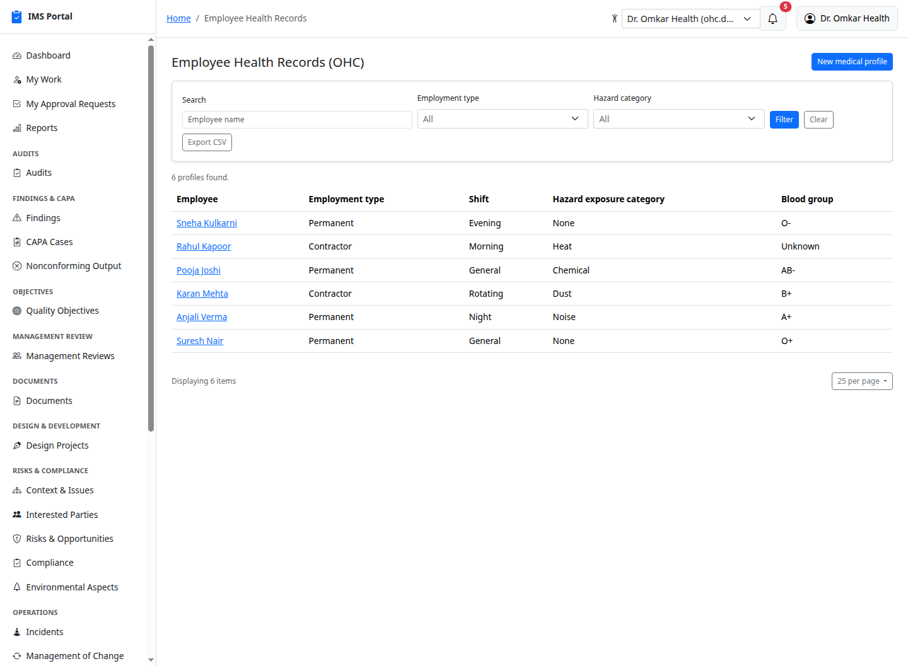

**New medical profile** links an employee to their medical master record
— employment type, shift, a primary hazard exposure category, blood
group, and emergency contact details:

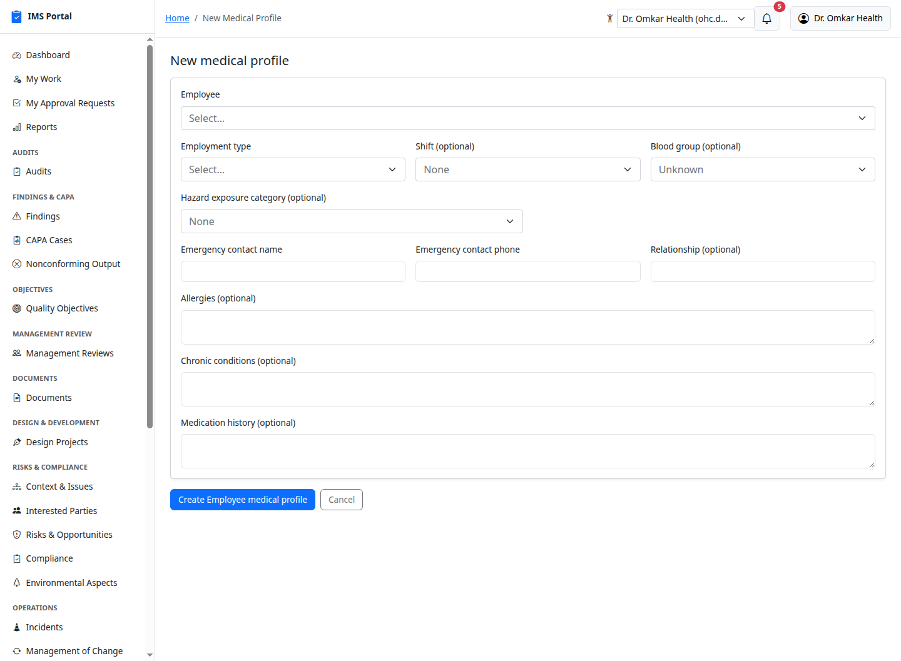

## Recording a visit

The **Visit History** tab records each OPD consultation — walk-in or
appointment, symptoms, vitals, diagnosis, treatment, prescription, and
optionally a **fitness result**: Fit, Fit With Restrictions, Temporarily
Unfit, or Permanently Unfit. Fit With Restrictions and Temporarily Unfit
both require restriction details. Checking **Notify supervisor** sends the
employee's department head a notification of the fitness outcome — the
one deliberate crack in this module's otherwise doctor/admin-only
visibility, and only ever the fact that a fitness decision was made, not
the underlying clinical notes:

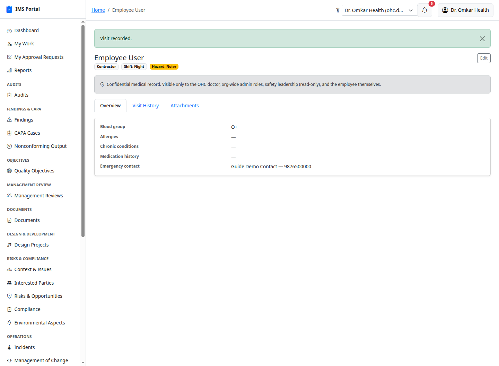

## Examination requirements

Sidebar → **Operations → OHC Examination Requirements**. A requirement
maps a hazard exposure category to how often a Periodic Medical
Examination (PME) is due, and which structured tests it should include —
"None" doubles as the baseline requirement that applies to everyone
regardless of hazard. A Pre-Employment requirement (no frequency, since
it's a one-time gate rather than recurring) can be configured the same
way:

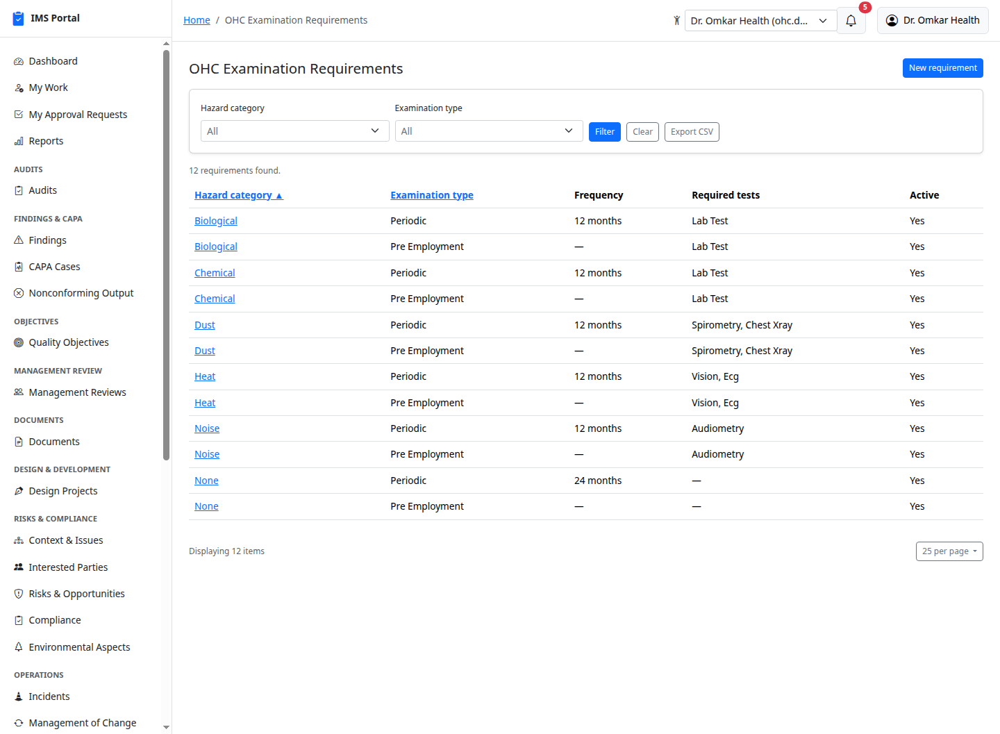
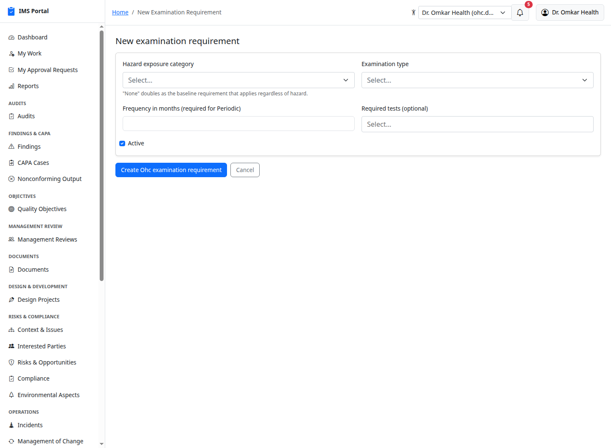

## Recording an examination

The **Examinations** tab records a Pre-Employment or Periodic exam, with
up to four structured test results (Spirometry, Audiometry, Vision, ECG,
Chest X-ray, Lab Test, or Other — each with a Normal/Abnormal/Borderline
result and a free-text value) and an overall fitness decision:

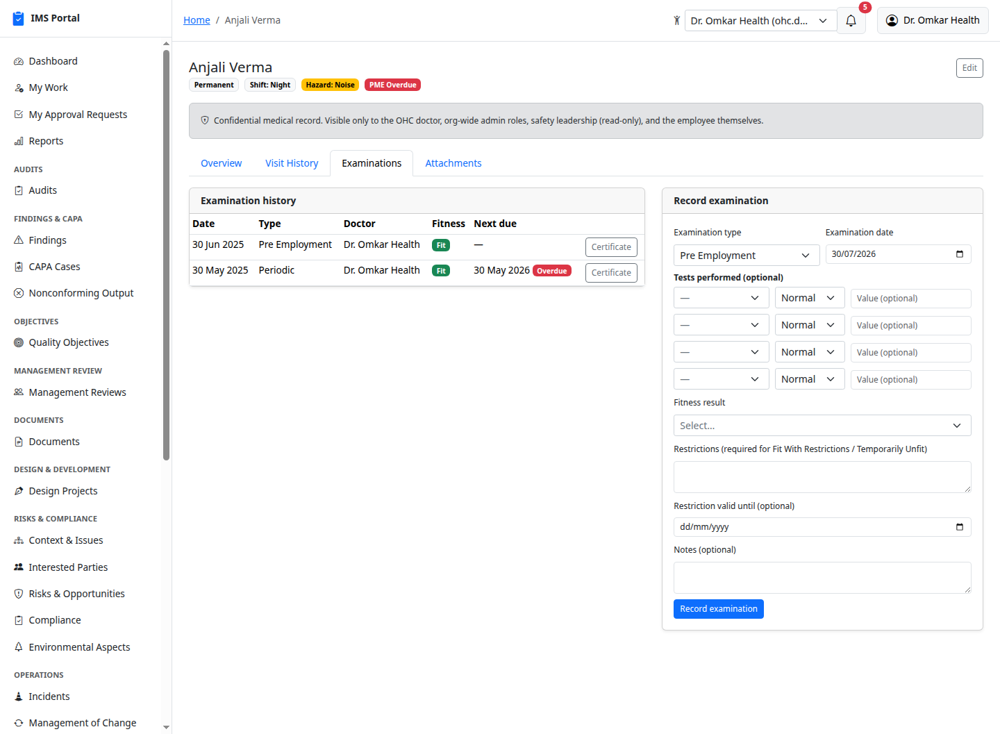

Recording a **Periodic** exam auto-schedules the next one: if an active
requirement exists for the employee's hazard exposure category, the next
due date is computed from the exam date and stored on the record — this
is "auto-scheduling" in the sense of computing when the next exam is due,
not a background job that creates future exam records on its own:

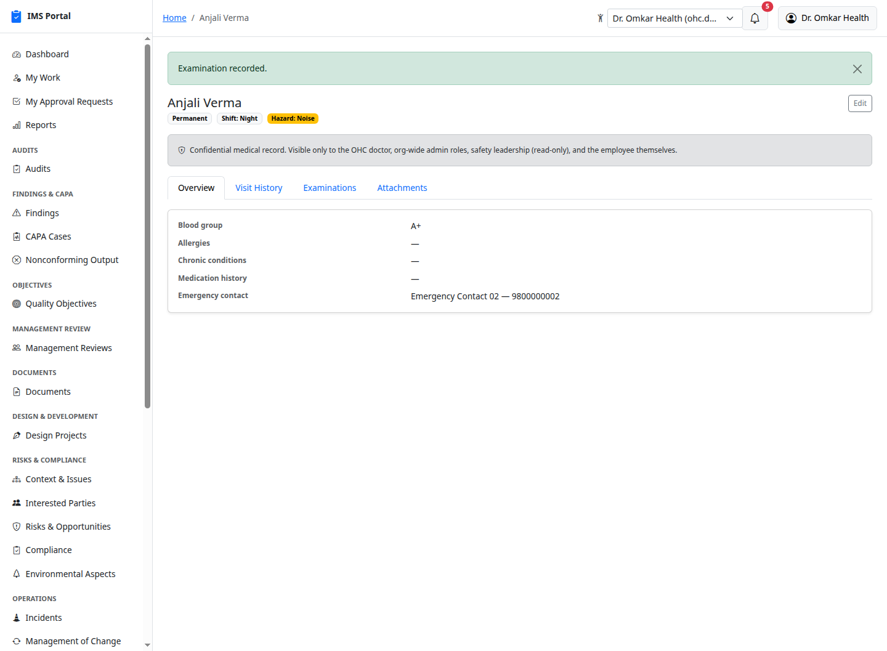

Every examination has a **Download certificate** link — a one-page
fitness certificate (PDF) with the employee, exam, and test details plus
the fitness decision.

## Overdue tracking

[Reports](16-dashboards-and-reports.md) → **OHC Examinations Due** lists
every employee medical profile by their latest periodic exam's next due
date, with an Overdue badge once it's passed — the same "computed from an
actual record, never a manually toggled flag" convention
[Assets](15-assets.md)'s own calibration-due tracking already uses.
Recording a fresh periodic exam resolves the overdue status immediately,
the same way a new calibration record clears an overdue asset:

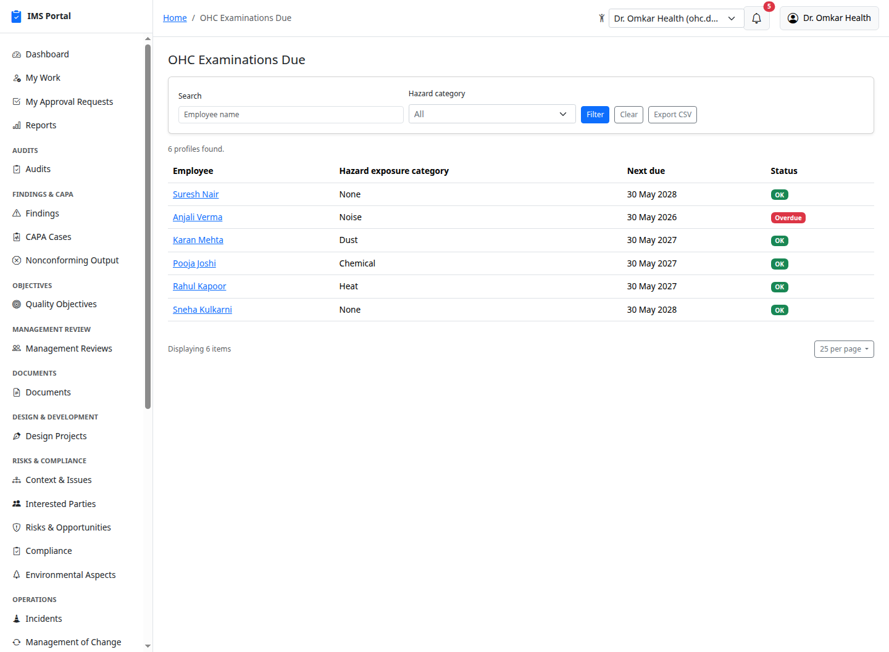

## Recording a vaccination

The **Vaccinations** tab records each dose administered — vaccine name,
dose number, administered date, batch number, the vaccine's own printed
expiry date, and (entered directly by the doctor, since there's no
separate vaccination schedule master) a **next dose due date** to drive
booster reminders. Overdue and Expiring Soon badges appear on the history
list the same way they do on Training's own expiry tracking:

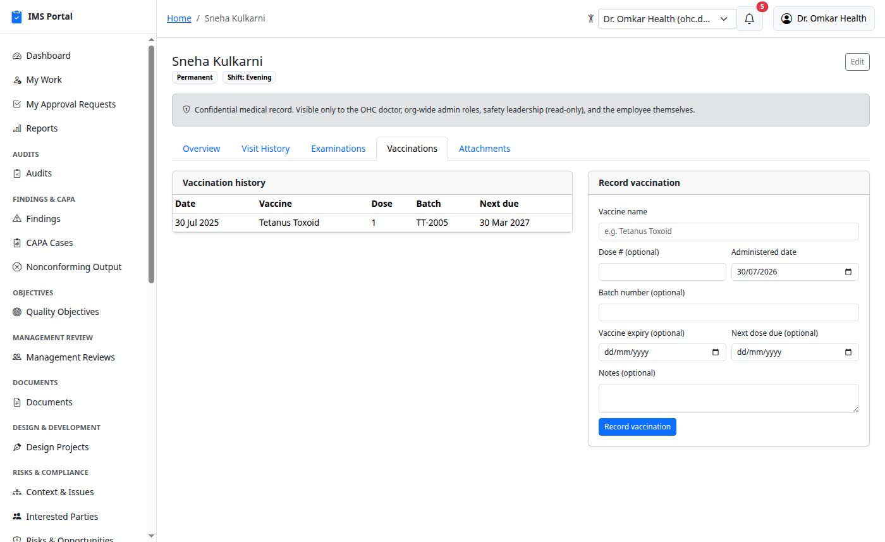

## Vaccination due tracking

[Reports](16-dashboards-and-reports.md) → **OHC Vaccinations Due** lists
every recorded vaccination with a `next_dose_due_date`, ordered soonest
first, with Overdue/Expiring Soon badges — the same pattern as the
examinations-due report above:

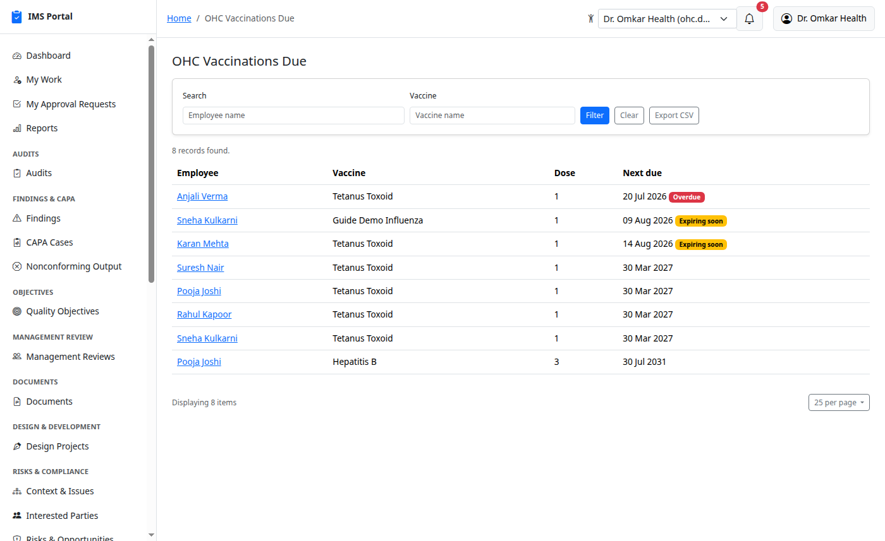

## Dashboard

The Organization Dashboard (Home) shows one **OHC** card: PME overdue
profiles, and vaccinations expiring soon / overdue. Like every other
dashboard card, its counts come from `.accessible_by(current_ability)`,
so a plain employee never sees an org-wide number even if the card is
visible to them at all:

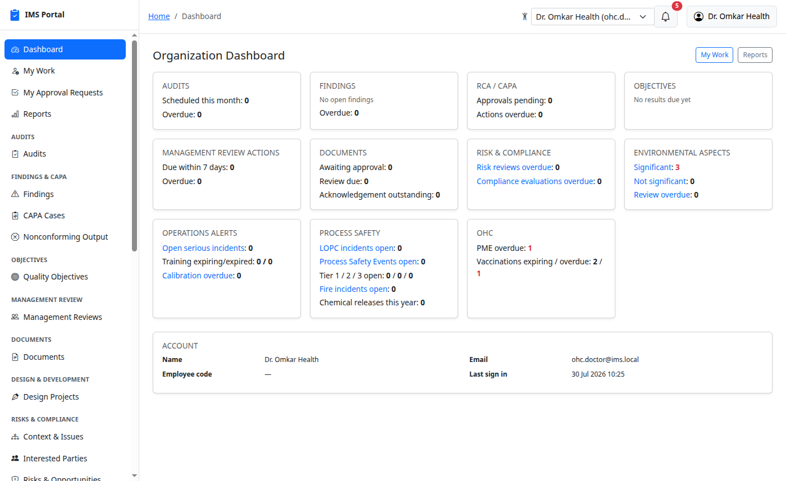

## Pharmacy & Inventory

Sidebar → **OHC / Employee Health → Pharmacy**. A medicine master list
with current stock, reorder level, and a **Below reorder level** badge
once total remaining stock across all batches drops under it:

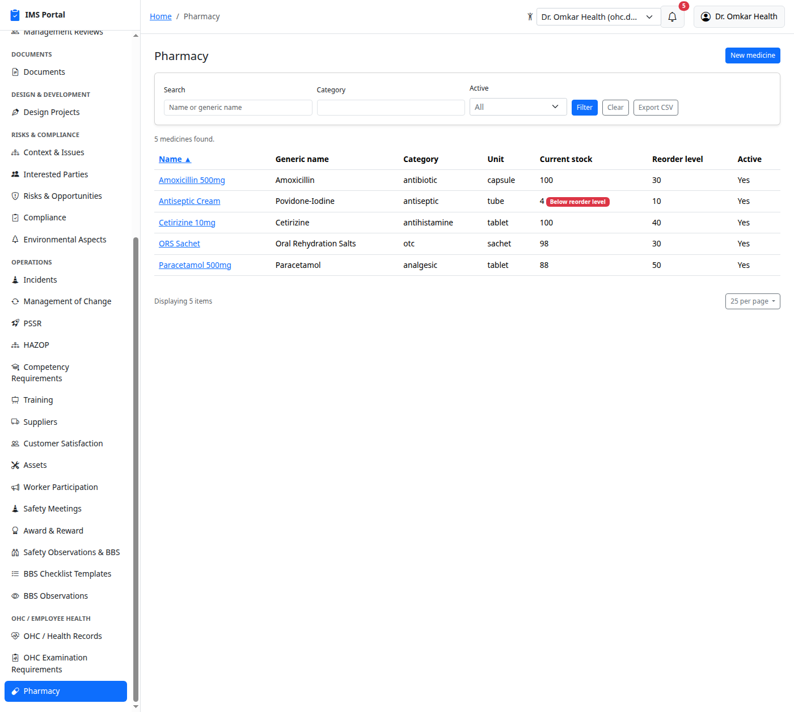

Opening a medicine shows two tabs. **Stock Batches** records each batch
received (the "stock inward" event) — batch number, vendor (optional,
picked from existing Suppliers), quantity received, received/expiry
dates, and an optional invoice/COA upload — with Expiring Soon/Expired
badges once a batch's own expiry date approaches or passes:

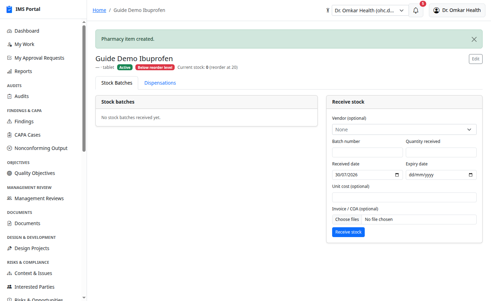

**Dispensations** records stock leaving a batch — either **Dispensed**
to an employee (requires picking who), or **Wastage**/**Expired
Write-off**/**Adjustment** for non-employee stock movements. The batch
you pick is drawn from only its currently available (in-stock,
non-expired) batches; recording a dispensation for more than a batch's
remaining quantity is rejected, and so is dispensing from an
already-expired batch — both real validations, not just UI limits:

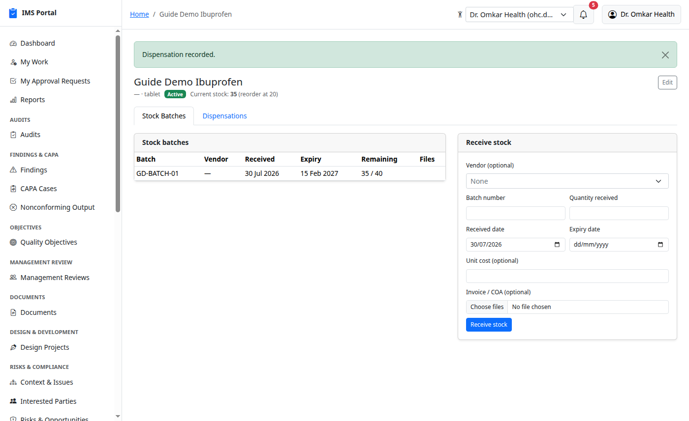

Every employee's own medical profile page has a read-only **Pharmacy**
tab showing what's been dispensed to them — dispensing itself is always
recorded from the medicine's own page, not the employee's.

### Pharmacy reports

[Reports](16-dashboards-and-reports.md) → **Pharmacy Stock Alerts** lists
items below their reorder level and batches expiring soon or expired, in
one view:

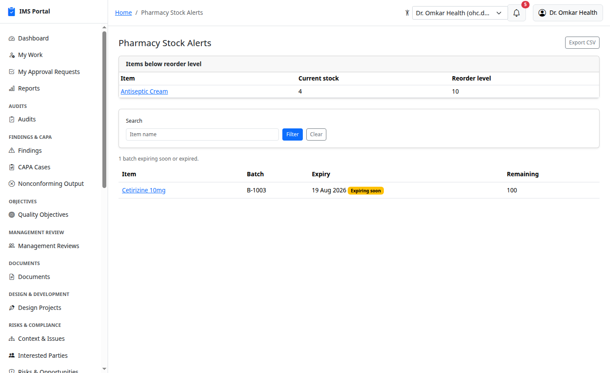

**Pharmacy Consumption** sums dispensed quantity by item over a date
range you choose (defaults to the last 30 days):

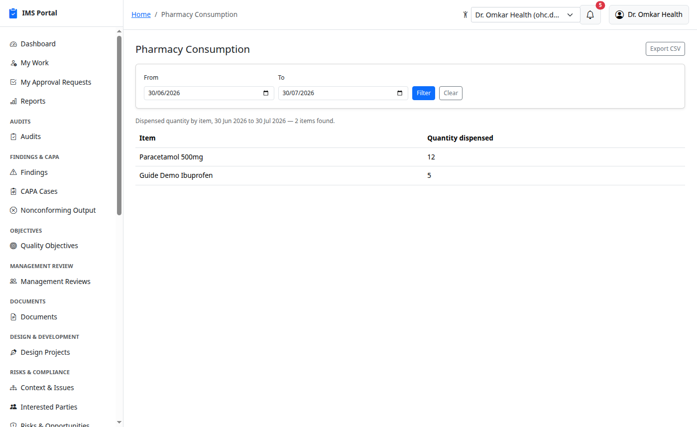

The Organization Dashboard's OHC card also picks up two more lines —
items below reorder level, and batches expiring/expired:

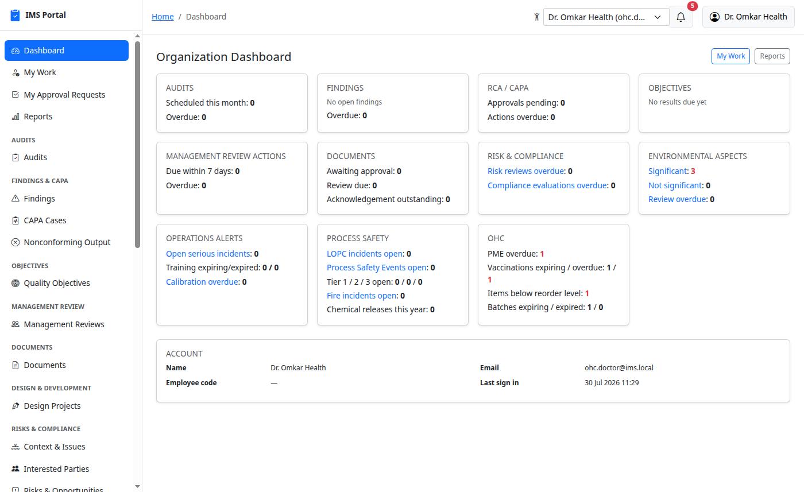

## First aid & emergency cases

Sidebar → **OHC / Employee Health → First Aid & Emergency**. This is the
first aid register: one entry per person treated at (or dispatched from)
the clinic outside the routine OPD and statutory-exam paths. Unlike
everything else in this module it isn't necessarily about an employee —
set **Person type** to Contractor, Visitor or Other and record the person
by name instead, which is exactly the case a statutory register exists to
capture.

Each entry records what happened (nature of case, body part, time it
occurred), the **first aid given** and who gave it, and an **outcome**:
Treated And Returned To Work, Sent Home, Referred To OHC, Referred To
Hospital, or Fatality. Referring to hospital requires naming the
hospital; ticking **Ambulance used** requires the time it was called —
both real validations, not just form hints.

Recording **First aid started at** alongside the time of the event gives
you a **response time** on the case, on the register list, and averaged
across the First Aid Summary report. It's computed from the two
timestamps rather than typed in, so correcting either one keeps it right.

Setting **Case type** to Medical Emergency — or any outcome of Referred
To Hospital or Fatality — notifies the OHC doctor, safety leadership, top
management and the concerned department head immediately, the same
stakeholder list the incident-medical workflow already uses. A routine
first aid case notifies nobody.

### Follow-up, closing, and raising an incident

Tick **Follow-up required** with a date and the case shows a
**Follow-up overdue** badge once that date passes. **Close case** freezes
the entry — a closed case can no longer be edited at all — and closing is
refused while a follow-up date is still in the future, so "closed" always
means genuinely finished.

Most first aid cases are not reportable incidents, so nothing is created
automatically. When a case *is* both, **Raise incident** on the case page
creates a linked OH&S incident prefilled from the case, with a starting
severity derived from the outcome that triage then corrects. The case
needs a department first (an incident requires one). You can also just
pick an existing incident on the case form.

An employee's own medical profile page gains a read-only **First Aid**
tab listing their cases.

## First aid kits

Sidebar → **OHC / Employee Health → First Aid Kits**. Each first aid box
on site is registered with an identifier, location, a named **custodian**,
and an inspection frequency in days.

**Record inspection** on the kit page logs a check: Adequate, Restocked,
or Deficiencies Found (the last two require saying what was short), how
many items were expired or missing, and any action taken. The next due
date is computed from the kit's frequency and stored on that inspection,
so changing the frequency later never rewrites when past inspections were
due. A kit that has **never been inspected counts as overdue** — an
unchecked box is the one you can't rely on.

If someone other than the custodian files an inspection that finds
deficiencies, the custodian is notified. A daily job reminds the
custodian of any overdue kit and escalates to safety leadership.

### First aid reports

[Reports](16-dashboards-and-reports.md) → **First Aid Summary** breaks
the register down by nature of case and outcome over a date range, with
average response time, ambulance count, and the first-aid vs
medical-emergency split. **First Aid Kit Inspections Due** lists kits
overdue for inspection or due within 30 days. The Organization Dashboard's
OHC card picks up open cases, overdue follow-ups, and kits with an
overdue inspection.

## Occupational health surveillance

Sidebar → **OHC / Employee Health → Surveillance Programs**. A program is a
named protocol for one hazard — "Noise exposure surveillance", say — with
an examination frequency and the tests it should include. Several programs
can exist for the same hazard at different exposure intensities, which is
why programs are named rather than keyed on the hazard alone.

This is deliberately separate from **OHC Examination Requirements**: that
master drives the *statutory* PME from each employee's single primary
hazard category, and is unchanged. A surveillance program is
enrolment-based, and an employee can be in several at once.

### Enrolling a worker and the exposure timeline

An employee's medical profile gains a **Surveillance** tab. **Record
hazard exposure** enrols them in a program with an exposure level, a start
date, the work area, and the controls in place. Recording an exposure is
what enrols them — there is no separate enrolment step.

A worker can hold several open exposures at once (noise *and* dust), which
is what lifts this past the single primary hazard category on the Overview
tab. A second open exposure to the *same* program is refused; ending the
first and re-enrolling later is fine, and both periods stay on the
timeline.

**End** on an open exposure closes it with a date. That stops its
surveillance clock — a closed exposure is history and never shows as
overdue — so the end date cannot be in the future or before the exposure
began.

### Surveillance examinations and trends

Surveillance examinations are recorded from the **Examinations** tab like
any other, choosing type **Surveillance** and the program. Only programs
the employee has an open exposure to are offered. The next due date is
computed from that program's frequency rather than the statutory
hazard-category master, and each program the worker is enrolled in runs
its own independent clock.

An open exposure that has **never been examined counts as overdue** — an
unexamined exposed worker is exactly what surveillance exists to catch.

The Surveillance tab's **test trend** panel lays each test type's results
out in date order across every surveillance examination, so a drifting
audiogram reads as a drift rather than as a series of isolated results.

### Surveillance reports

[Reports](16-dashboards-and-reports.md) → **Surveillance Due** lists open
exposures overdue or due within 60 days. A daily job notifies the OHC
doctor and safety leadership about overdue ones — not the employee, who
has no say in scheduling their own surveillance.

## Contractor medical management

Sidebar → **OHC / Employee Health → Contractor Workers**. Contractor
workers are tracked separately from employees: they have no login, no
department, and never appear in user pickers or employee reports. Each is
registered against a contractor firm (an external party, maintained under
Masters & admin) with a worker code unique within that firm.

### Issuing a clearance

**Issue medical clearance** on the worker's page records the examination
date, how long the clearance is valid, the fitness verdict, tests
performed, and findings. Every clearance gets a reference number
(`CMC-…`) and a printable **certificate** — the document the gate
actually holds.

A clearance **cannot be edited once issued**. Correct a mistake by issuing
a fresh one; a clearance that must stop counting is **revoked** from its
own page, with a reason. Revoking stamps the original and leaves it on
file rather than deleting it, and — when the clearance was still in force
— alerts the OHC doctor and safety leadership, since it means someone
already on site has just become non-compliant.

### Gate pass status

Every worker shows a single **gate pass status**, computed from their
whole clearance history rather than stored, so a revocation or an expiry
takes effect immediately:

- **Cleared** / **Expiring soon** — may work.
- **Expired**, **Unfit**, **Revoked**, **Not cleared** — may not.

The worker index filters on this status directly.

### Contractor reports

[Reports](16-dashboards-and-reports.md) → **Contractor Medical
Compliance** counts engaged workers by gate pass status and lists everyone
not cleared for site, by contractor firm. A daily job flags clearances
lapsing within 30 days and workers with no valid clearance at all.

## Health campaigns

Sidebar → **OHC / Employee Health → Health Campaigns**. A campaign is a
health camp, screening drive, awareness session, vaccination drive or
blood donation — anything the OHC runs as an event rather than as routine
care. Unlike everything else in this module, campaigns are **visible to
everyone**: a camp is advertised, not confidential.

Setting a **target participants** figure gives the campaign a coverage
percentage. Leave it blank and coverage simply reads "no target" — that's
a different fact from 0% coverage, and the screens say so.

### Running a campaign

A campaign moves through a real workflow rather than carrying a label:

1. **Planned** — scheduled, but nobody can be recorded against it yet.
   Scheduling notifies the OHC doctor and safety leadership.
2. **Start campaign** moves it to **In Progress**, which is the only state
   in which participants can be recorded.
3. **Complete** closes it and **requires an outcome summary** — a health
   camp with no stated outcome is exactly what this record must never
   become. A completed campaign can no longer be edited.

**Cancel** is available only while planned, and is refused once anyone has
been seen — at that point the campaign happened, so complete it instead.

### Recording participants

**Record participant** takes an employee, a contractor worker, or a
visitor recorded by name — the same three-way choice the first aid
register uses, because a camp draws all three. Each person is recorded
once per campaign; anonymous walk-ins can repeat.

Each record carries an **outcome** (Normal, Advice Given, Referred To OHC,
Referred To Hospital), free-text findings, and an optional follow-up date.
A **referral** outcome notifies the OHC doctor and safety leadership — the
point where a screening stops being a statistic and becomes a clinical
obligation. A normal result notifies nobody. A daily job chases follow-ups
once their date passes.

An employee's medical profile gains a read-only **Campaigns** tab showing
the camps they attended and what was found.

### Campaign reports

[Reports](16-dashboards-and-reports.md) → **Health Campaign Summary**
breaks participation down by outcome and participant type over a date
range, with coverage against target per campaign and outstanding
follow-ups.

## Statutory examination reminders and the register

Periodic Medical Examination and vaccination due dates have been computed
and stored since those features were built, but until now they only showed
up if you went looking — on a report or a dashboard count. Two daily jobs
now act on them.

Both work in two tiers. The **employee** is told first ("your periodic
medical examination is due" / "your Tetanus dose is due") — a PME is an
appointment they have to attend, and the reminder carries no clinical
detail. Then the **OHC doctor and safety leadership** are told, since they
are the ones who schedule it. Reminders start 30 days before the due date
and repeat once overdue, at most once per person per day.

Nothing pre-creates a future examination record. An examination cannot
exist without a doctor's fitness verdict, so the stored due date *is* the
schedule — these reminders are what act on it.

### Medical Examination Register

[Reports](16-dashboards-and-reports.md) → **Medical Examination Register**
is the statutory register: one row per employee with their hazard
category, last periodic examination, fitness verdict and next due date.
Filter by employment type, hazard category, or PME status — **Current**,
**Due Soon**, **Overdue**, or **Never Examined**.

"Never examined" is called out as its own state rather than folded into
overdue, because whether a PME is owed at all depends on an examination
requirement being configured for that employee's hazard category — so an
employee with no examination on record is a gap to look at, not
automatically a breach.

**Print register (PDF)** renders the same rows, filters and all, as a
landscape register with overdue and never-examined rows shaded — the
document to hand an inspector.

## Who can see what

`ohc_doctor`, `ims_admin`, and `top_management` manage every profile,
visit, examination, examination requirement, vaccination, pharmacy and
first aid record. `corporate_safety_head`/`corporate_safety_team` can read
profiles/visits/examinations/vaccinations/dispensations/first aid cases
but not edit them, and not the examination requirement master or pharmacy
inventory (items/batches) at all — those are configuration, not personal
data — the same read-only oversight they already have on incident-medical
records. Every employee can read only their own profile, visits,
examinations, vaccinations, dispensation history (shown on their own
Pharmacy tab), and first aid cases, and cannot create or edit one
themselves — a deliberate break from this app's usual "anyone can report"
pattern, since a clinical record has to be doctor-authored:

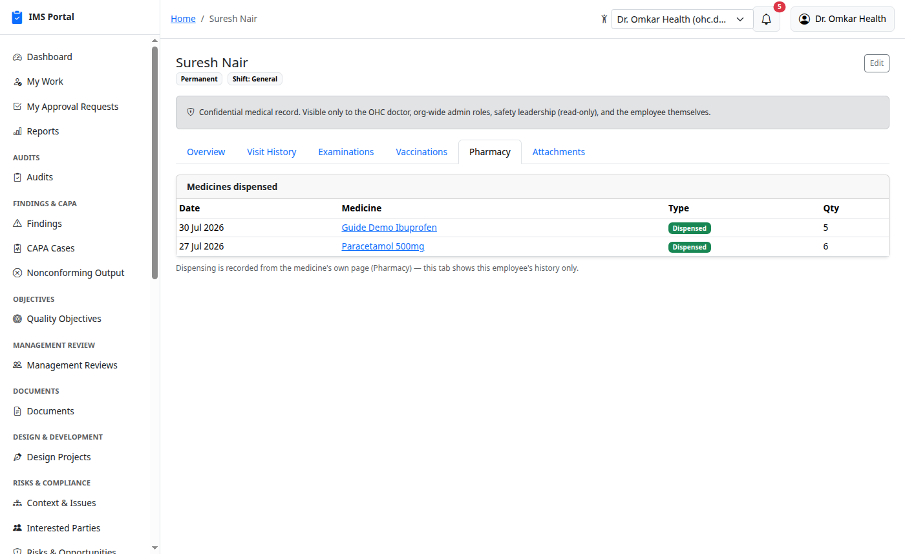

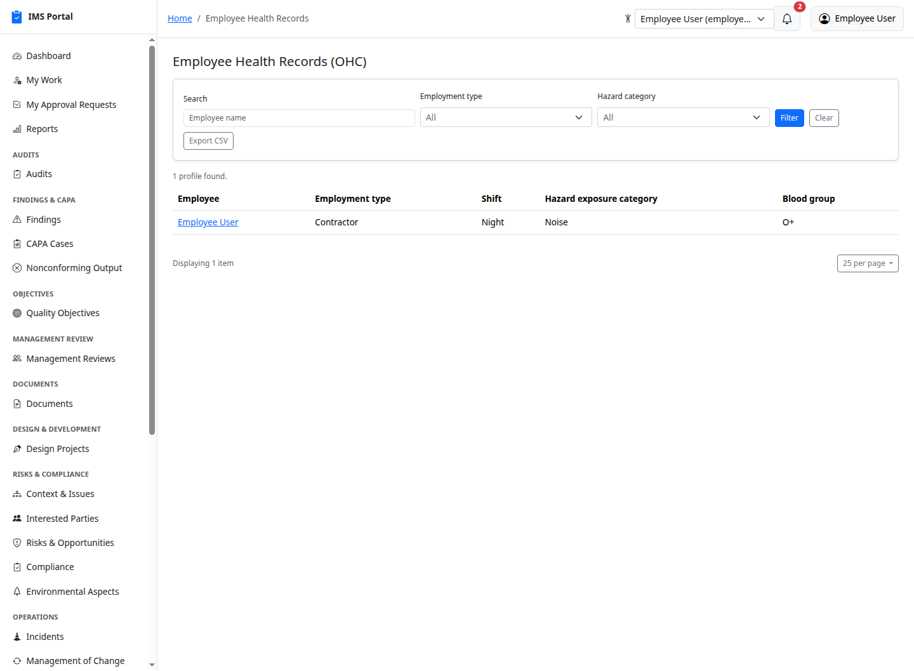

Hazard exposures follow the same clinical rules; **surveillance programs
do not appear to safety leadership at all**, since a program is a medical
protocol master, exactly like the examination requirement master.

**First aid kits, contractor workers and campaigns are the exceptions**,
because none of them holds employee medical data. A first aid box is
emergency-preparedness config, the contractor roster is gate-pass
compliance, and a campaign is an announced site event — so safety
leadership manages all three outright rather than just reading them, and
campaigns are readable by everyone. Three consequences worth knowing:

- A **kit custodian** can see their own kit and file inspections on it
  without any other OHC access at all — but cannot edit the kit's
  configuration, and still sees no clinical record of any kind.
- Safety leadership manages the **contractor roster** but can only *read*
  a contractor's medical clearance — issuing and revoking a clearance is
  a medical verdict, and stays with the OHC doctor.
- Safety leadership likewise runs a **campaign** but cannot record a
  participant's finding, which is clinical. Each employee sees only their
  own campaign findings, on their own Campaigns tab.

Like every other module, a super admin can turn **Employee Health
Records** off entirely from Masters & admin → Module flags.

---
Previous: [Design & Development](27-design-and-development.md) · Back to [Getting Started](00-getting-started.md)
