# Visitor Management

Sidebar → **Visitor Management**. Site gate control: an employee
pre-registers a future visitor, a configurable approval chain clears the
visit, and security checks the visitor in and prints a pass.

## Who does what

| Role | What they get |
|---|---|
| Any signed-in employee | Pre-register a future visitor; read, edit and cancel their own registrations while still awaiting approval |
| The employee being visited (the host) | Reads every visit booked to meet them, and is emailed when one is registered, approved, and when the visitor actually arrives |
| Approvers (configured per level) | Decide the visits routed to them, from their own **My Approval Requests** queue |
| **Security** | The Gate Console: everyone expected today, everyone on site, walk-in registration, check-in/check-out, and the printed pass |
| IMS Admin / Top Management | All of the above, plus the two configuration screens |

## Pre-registering a visitor

**Visitors → Pre-register Visitor** captures the fixed basics — visitor
name and phone (required), company and email (optional) — then the visit
itself: the employee to be met, an optional location, the expected arrival
(and optional departure) time, and the purpose. Any extra fields your
administrator has defined appear below these under **Additional details**.

Submitting sends the visit straight into the approval chain — there is no
draft state. The host is emailed and notified in-app, and the visit sits
at **Pending Approval**.

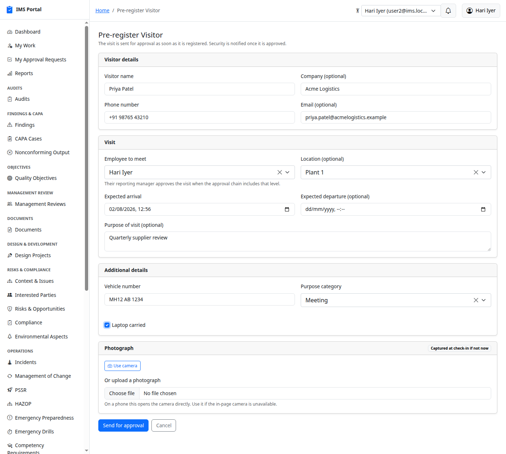

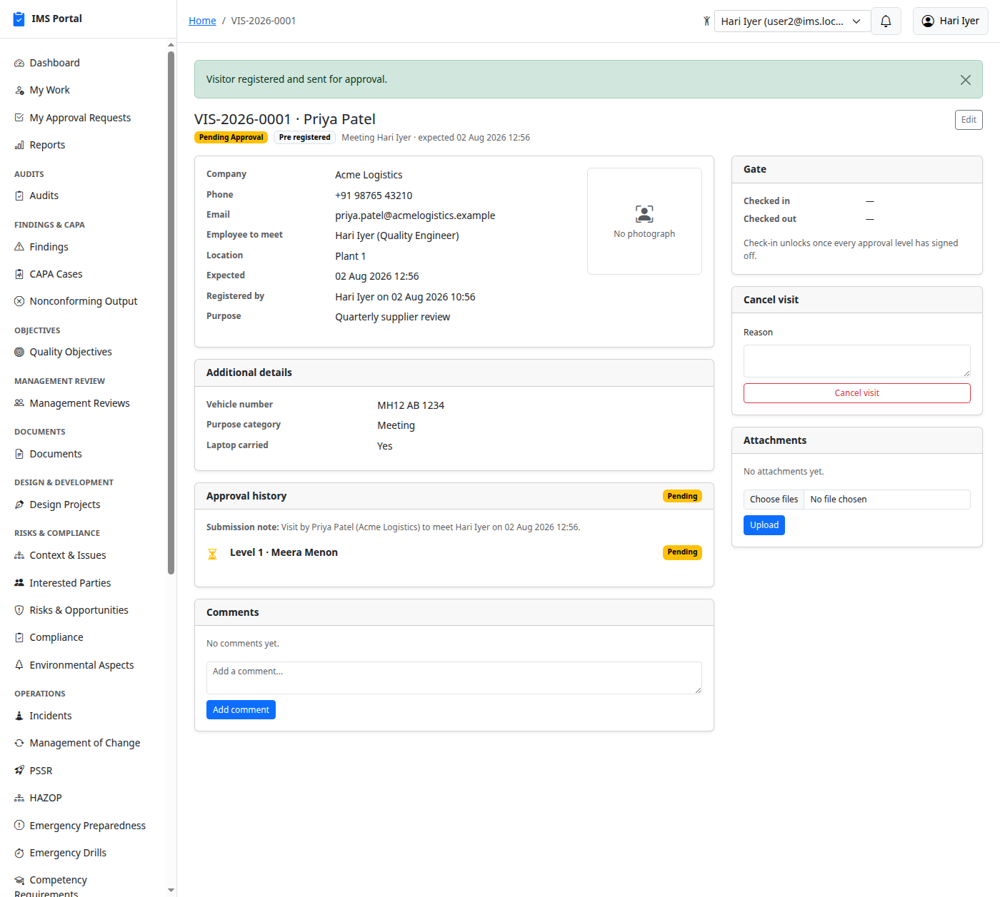

A photograph is optional at this stage: nobody is there to photograph yet.
It becomes mandatory at check-in.

## Approval

Every visit is approved level by level, in the order your administrator
configured, before security can check anyone in. Approvers act from **My
Approval Requests** exactly as they do for any other approval in this app —
the visitor workflow uses the same engine, so there is nothing new to
learn.

When the last level approves, **security is notified** that the visit is
cleared and the pass can be printed, and the host is told too.

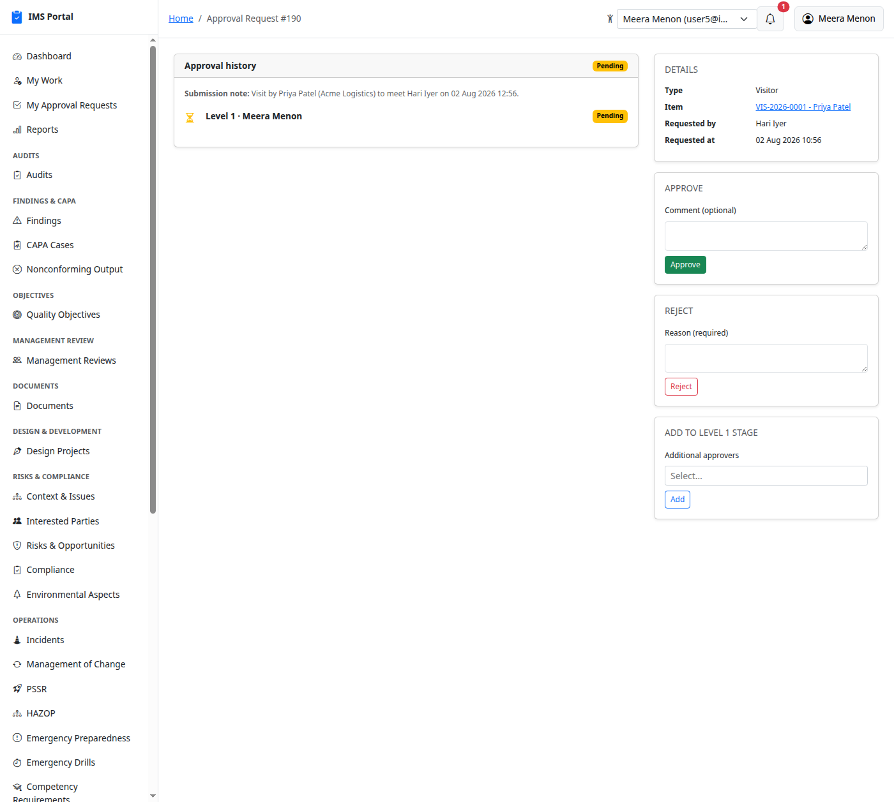

A rejection at any level stops the visit and records the rejecting
approver's comment as the reason on the visit itself.

If **no approval levels are configured at all**, visits are approved the
moment they are registered and security is notified immediately — a visit
is never left waiting on a chain nobody can decide. The Visitor Approval
Levels screen warns you when this is the case.

## The Gate Console

**Visitor Management → Gate Console** is security's landing page. Four
tiles across the top, each a live count and a filter:

- **Expected today** — everyone due in today, whatever their status
- **On site now** — everyone checked in and not yet checked out
- **Awaiting approval** — visits still waiting on a decision
- **Overdue check-out** — anyone still on site past their expected
  departure time

Each view has the same search, filters, sorting, pagination and CSV export
as every other list in this app.

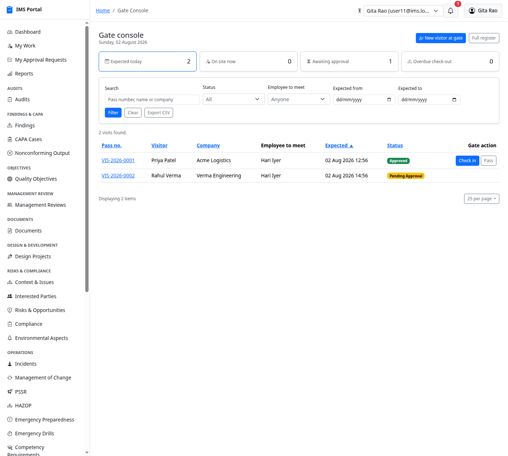

### Registering a walk-in

**New visitor at gate** records someone who has arrived unannounced. It
asks for everything the pre-registration form does, plus two differences:

- The employee to be met must be chosen explicitly (it does not default
  to you).
- **A photograph is mandatory.** Use the in-page camera (**Use camera** →
  **Capture photograph**), or the file upload below it, which opens the
  camera directly on a phone. If your browser blocks camera access or you
  decline the permission, the upload always works.

A walk-in still goes through the full approval chain — approval is what
gates check-in, for everyone. The visitor waits at the gate until it
clears.

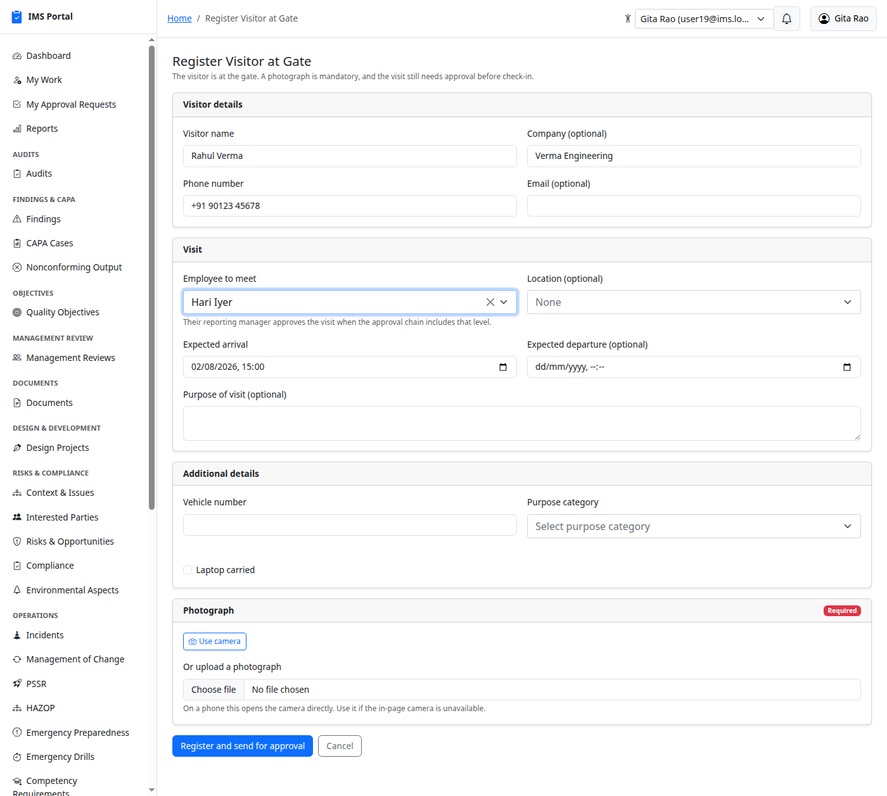

### Check-in and check-out

**Check in** is available on an approved visit that has a photograph on
file. If a pre-registered visitor has no photograph yet, the visit page
offers **Capture and check in** — take the photo and check them in in one
step. Checking in emails the host that their visitor has arrived, and
lands you straight on the printable pass.

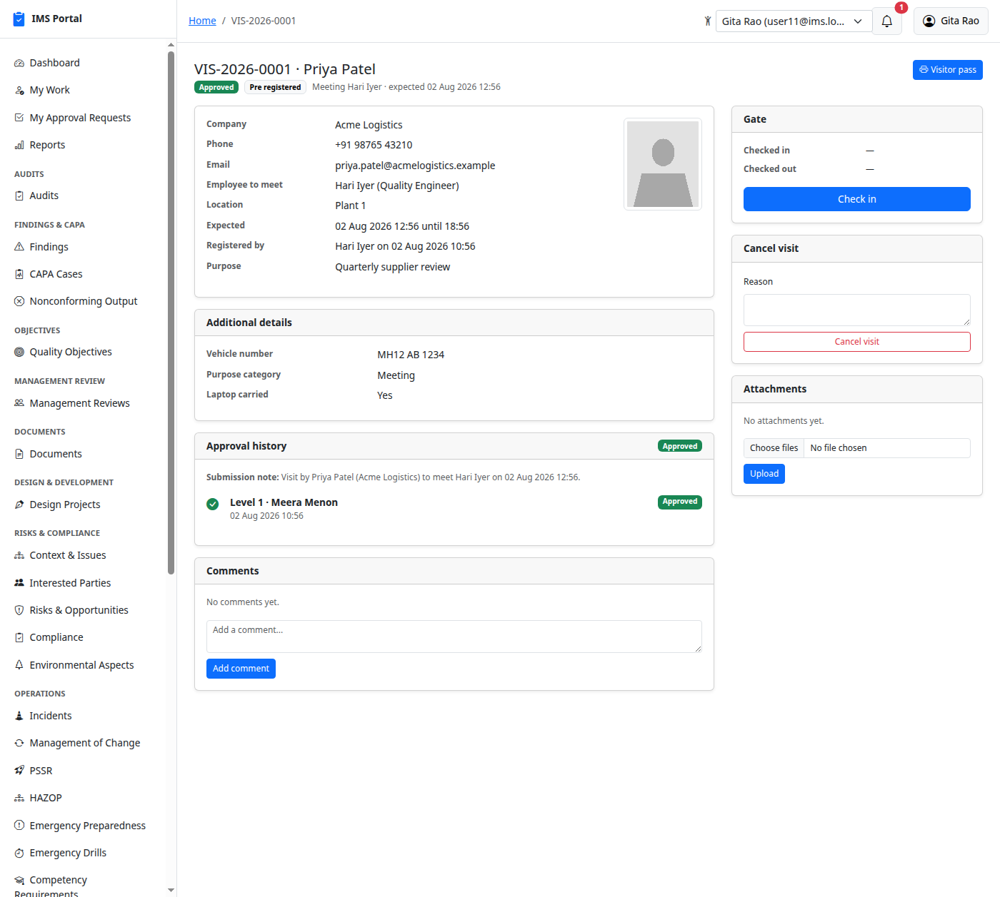

**Check out** closes the visit, and is available to security on anyone who
is on site — from the visit page or straight from the **On site now** view
on the Gate Console. A visitor who is already on site is checked out,
never cancelled — cancelling would erase the fact that they were here,
which is exactly what a gate register exists to record.

### The 12-hour automatic close

**No visit stays open past 12 hours.** Anyone still checked in 12 hours
after they arrived is checked out automatically by an hourly background
sweep, and security is notified for each one.

This exists because the most misleading thing a gate register can show is
someone from days ago still listed as being in the building — that list is
what an evacuation headcount is read from.

Three things to know about an automatic close:

- The recorded check-out time is the **12-hour limit itself**, not the
  moment the sweep happened to run.
- No person is recorded against it. The visit shows "checked out
  automatically" rather than naming a guard who did not do it.
- **It records the fact, it does not verify the visitor left.** The
  notification asks security to confirm. If someone is genuinely still on
  site after 12 hours, that is exactly the case worth chasing.

Visits approaching or past the limit are visible before the sweep runs:
the Gate Console's **Overdue check-out** tile catches both a visitor past
their own expected departure *and* anyone over 12 hours on site (including
visits that never had an expected departure time set), and the visit page
warns when a visit is about to be closed automatically.

## The visitor pass

The pass opens in its own tab with no app navigation around it, ready for
**Print pass** (or your browser's own print dialog).

The pass number is the visit's own reference number (`VIS-2026-0001`), so
it can be quoted at the gate and matched back to the register.

A pass is only available once a visit is approved — there is never a pass
for someone who has not been cleared.

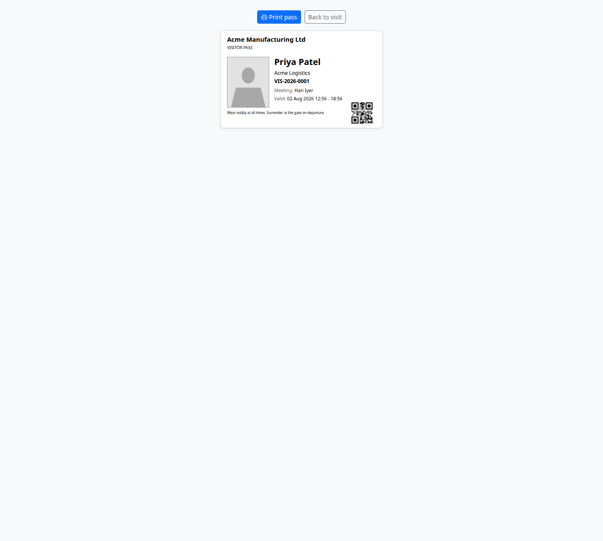

What the pass *looks like* is up to you — see the pass designer below.

## The pass designer

**Visitor Management → Visitor Pass Designer** (IMS Admin / Top Management
only; security can view designs but not change them).

You can keep several designs and mark exactly one **active** — every pass
prints from the active one. That means you can duplicate a design, rework
the copy, preview it, and only then activate it, without ever disturbing
the pass the gate is currently printing.

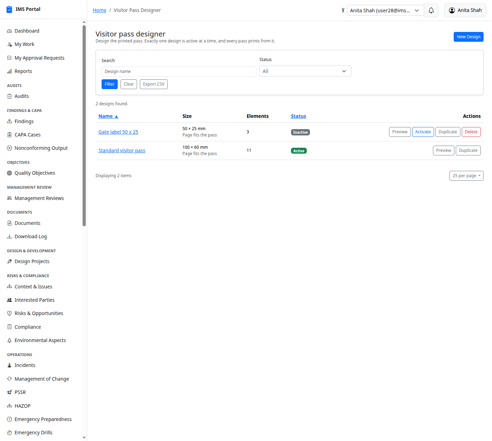

### Designing

**New Design** asks for a name and a size, then opens the canvas pre-filled
with the standard layout, so you start with something to rearrange rather
than a blank card.

The canvas is shown at its real physical size, so what you arrange is what
prints.

- **Add** elements from the palette on the right: the visitor's photo, your
  organization logo, a QR code, a free text block, any visit detail (name,
  company, pass number, who they are meeting, validity window, and so on),
  and any custom visitor field you have configured.
- **Move** an element by dragging it, or select it and use the arrow keys
  (hold Shift for bigger steps).
- **Resize** by dragging the square handle at its bottom-right corner.
- **Fine-tune** the selected element in the properties panel: exact
  position and size in mm, font size, bold, alignment, and an optional
  label prefix (so a field can print as "Meeting: Hari Host" rather than
  bare).

**Save design** stores it. If an element no longer fits on the pass — most
often after shrinking the pass under elements already near its edge — the
save says exactly which ones, rather than silently dropping them.

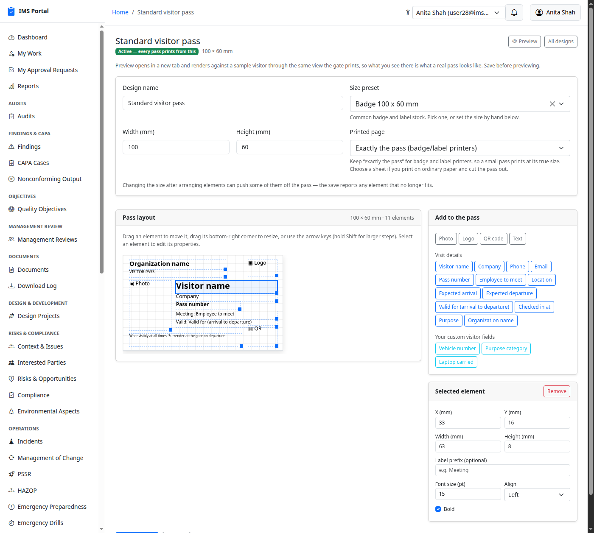

### Pass size and the printed page

Two separate settings, and the difference matters when the pass is small.

**Size preset** covers the common badge and label stock — 100 × 60 mm
badges, CR80 cards in either orientation, 62 × 29 mm and 50 × 25 mm labels,
A7 and A6. Picking one fills in the width and height for you; you can also
type any size by hand between 20 mm and 300 mm, and the preset then reads
"Custom size".

**Printed page** decides what the pass sits on when it prints:

- **Exactly the pass** (the default) makes the printed page the pass
  itself, with no margin. This is what a badge or label printer needs, and
  it is what makes a small pass come out at its true size instead of
  floating in the corner of a sheet.
- **A4 sheet** / **Letter sheet** place the pass on ordinary paper with a
  margin, to be cut out. A pass too big to fit the sheet with margins is
  refused, rather than printing clipped.

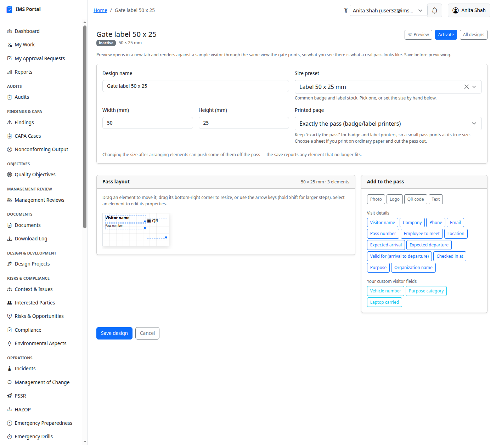

### The QR code

The QR encodes the pass number, so a guard can scan a printed pass to pull
up the visit. It is generated fresh every time the pass is drawn, so there
is nothing to regenerate and nothing that can fall out of sync.

### Preview

**Preview** opens in a new tab and renders your design against a sample
visitor, through the exact same view the gate prints — so a preview is a
genuine preview, not an approximation. Save before previewing.

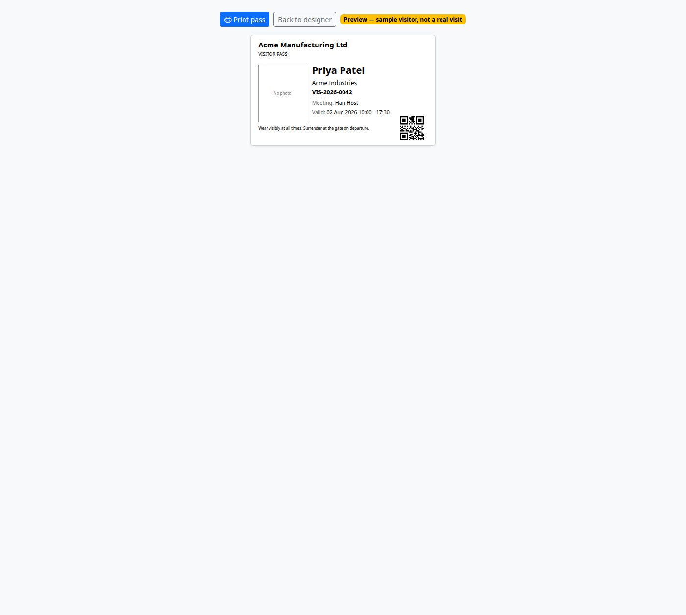

### Activating

**Activate** makes a design the one every pass prints from. Two things are
deliberately prevented:

- You cannot activate a design with nothing on it — that would print a
  blank card.
- You cannot delete the design currently in use. Activate another one
  first.

If no design is active at all (or you have deleted them all), passes fall
back to the built-in standard layout, so the gate can always print
something.

## Configuration

Both screens below are **IMS Admin / Top Management only**. Security can
run the gate but cannot change what the form asks or who approves.

### Visitor form fields

**Visitor Management → Visitor Form Fields** defines the extra questions
every visitor form asks, beyond the fixed name, company, phone and email.
Each field has:

- a **Label** shown on the form,
- a **Key** — the permanent identifier answers are stored under,
- a **Type**: Text, Number, Date, Dropdown or Checkbox,
- **Mandatory** — whether the form refuses to submit without it,
- a **Display order**, and optional **Help text**.

A **Dropdown** needs its choices listed, one per line.

Two rules worth knowing:

- **The key cannot be changed once the field is saved.** Answers are
  stored under it, so renaming it would detach every answer already
  recorded. Create a new field instead.
- **Removing a field that visitors have already answered deactivates it
  instead of deleting it**, so historical visits keep displaying what was
  captured at the time. The field stops appearing on new forms
  immediately.

Marking a Checkbox mandatory has no effect — an unticked box is a real
answer, not a missing one.

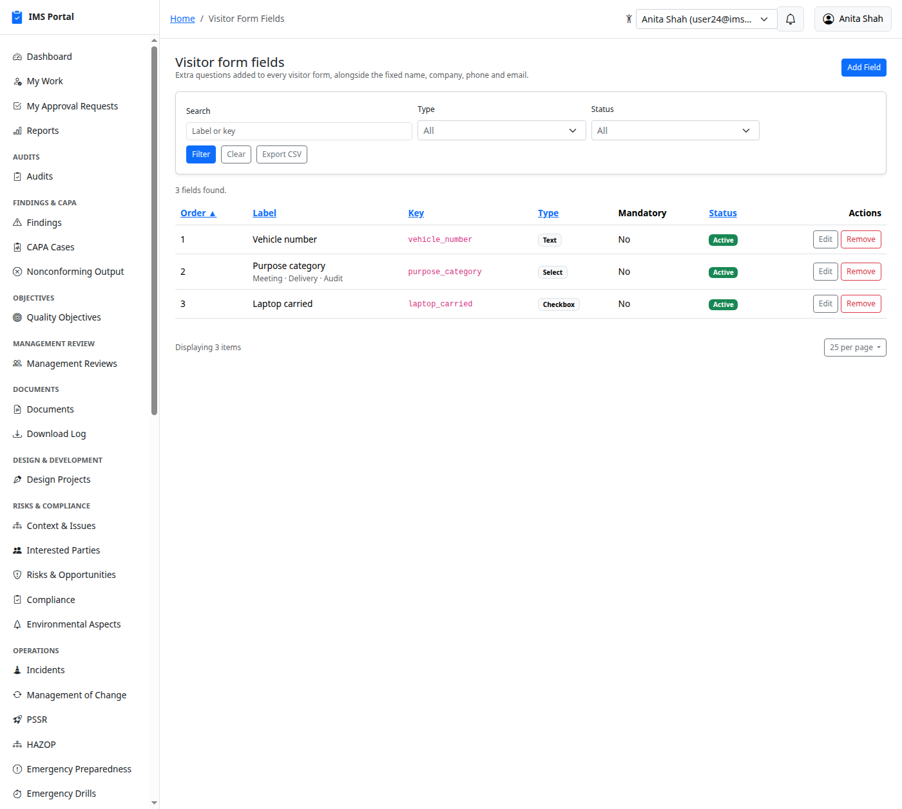

### Visitor approval levels

**Visitor Management → Visitor Approval Levels** defines the chain. Each
level has a number (lower approves first), a name, and who approves it:

- **Everyone holding a role** — every active user with the role you pick
  approves, in parallel. The level completes when all of them have
  approved.
- **Reporting manager of the employee being visited** — the one built-in
  option. It resolves to the host's own reporting manager, or, if none is
  set on their user record, to the head(s) of their department, so an
  incomplete hierarchy never leaves a visit stuck.

Deactivating a level takes it out of every new visit; approvals already in
progress keep the steps they were given.

Two behaviours are deliberate and worth knowing:

- **A level that resolves to nobody is skipped**, not left pending. A
  role with no members, or a host with neither a manager nor a department
  head, would otherwise trap the visitor at the gate permanently.
- **Nobody is ever asked twice**, and the person who registered the visit
  is never asked to approve their own request.

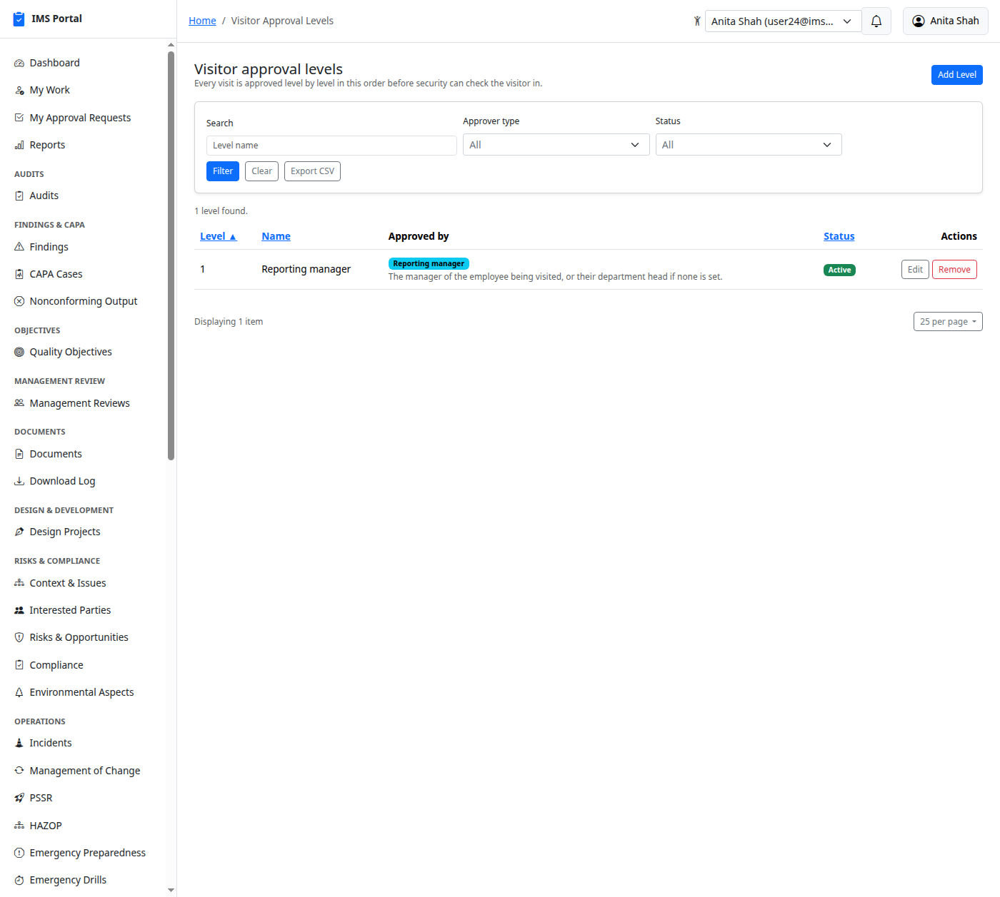

## Editing and cancelling

A visit can be corrected only while it is still **Pending Approval** —
once approved, the approved facts are what the approvers actually decided
on.

Changing the **employee to be met** is the one edit that invalidates a
chain already in flight, since the reporting-manager level resolves
against them. That change withdraws the in-flight request and re-routes
the visit from level one, so the right people are asked.

**Cancel visit** requires a reason and is available up to the point of
arrival. It withdraws the approval chain and notifies both security and
the host.
