# Designing a Permit Form

**Who this is for:** the IMS Administrator or HSEF officer who has to make the
system ask what *your* permit asks — the sections, the checkpoints, the gas
limits and the signatures on your own controlled format.

**What you need before you start:** your permit sheet, as it is actually
issued today. Not the manual's description of it. This guide reproduces one
paper form, box by box, and the fastest route is to have the paper in front of
you.

**Time:** a first form takes an afternoon. A second one takes about an hour,
because you copy most of it from the first.

> Related: [Permit to Work](33-permit-to-work.md) covers raising, approving,
> opening, renewing and closing a permit, plus permit types, the approval
> matrix, shifts and check sheets. This guide covers one screen — the form
> designer — in depth.

---

## Contents

1. [The idea: your form is data](#1-the-idea-your-form-is-data)
2. [Before you design: four decisions](#2-before-you-design-four-decisions)
3. [Create the form](#3-create-the-form)
4. [Add your first section](#4-add-your-first-section)
5. [Add questions](#5-add-questions)
6. [Making a question enforce something](#6-making-a-question-enforce-something)
7. [Showing a section only on some permits](#7-showing-a-section-only-on-some-permits)
8. [Copy a block from another form](#8-copy-a-block-from-another-form)
9. [Read the printed sheet as you build](#9-read-the-printed-sheet-as-you-build)
10. [Signatures and declarations](#10-signatures-and-declarations)
11. [Designing your own sheet layout](#11-designing-your-own-sheet-layout)
12. [Publish](#12-publish)
13. [Revising a form later](#13-revising-a-form-later)
14. [Worked example: a hot work permit](#14-worked-example-a-hot-work-permit)
15. [Rules that will stop you, and why](#15-rules-that-will-stop-you-and-why)
16. [Checklist before you publish](#16-checklist-before-you-publish)

---

## 1. The idea: your form is data

**The permit form is data, not code.** You build it from inside the app, and no
developer is involved. Three things stack up:

| Thing | What it is |
|---|---|
| **Form** | A named format — "Hot Work Permit — HW-402". Carries the document number that prints in the sheet's *Doc. No.* box. |
| **Version** | One revision of that form. `Draft` while you build it, `published` when it goes live, `archived` when the next one replaces it. |
| **Section → Question** | A block of the sheet, and the boxes inside it. |

The version is the part that matters most, and it is worth understanding
before you touch anything:

> **A permit freezes the version it was issued against.** A permit issued in
> March always displays, and always prints, the questions it actually asked in
> March — even after you revise the form in June. That is why you never edit a
> live form directly, and why publishing a revision is safe: it changes what
> the *next* permit asks, and nothing else.

Where you work: **Permit to Work → Permit Forms**. Everything in this guide is
limited to **IMS Admin** and **Top Management**. HSEF officers and permit
issuers can read the configuration but not author it.

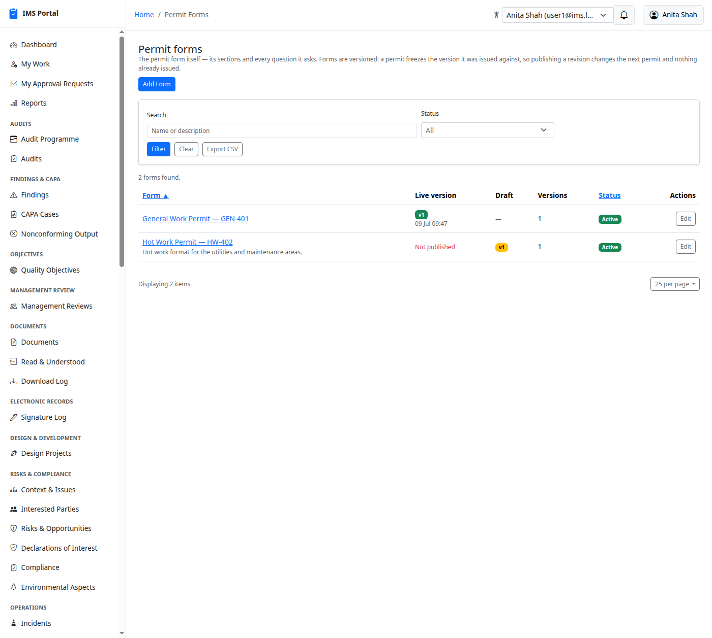

---

## 2. Before you design: four decisions

Answer these from your paper form first. Every one of them maps to a field on
the builder, and deciding them at the screen is what makes a form take a week
instead of an afternoon.

**1. How many formats do you actually run?** A plant typically has two or
three — a hazardous/Category 1 sheet, a non-hazardous/Category 2 sheet, maybe a
separate one for a specific area. Each is one Form here. The person raising a
permit picks the format, and it is frozen from then on. **Do not** build one
enormous form and hide half of it: build the formats you actually issue.

**2. What are the blocks of your sheet, and who fills each one?** Look at the
sheet and mark it up. Most permits split into: what kind of work, what hazards
apply, what the issuer must prepare, what the acceptor must confirm, gas
readings, PPE, and the signatures. Each of those is one **section**, and each
belongs to one **party**:

| Filled by | Who that is |
|---|---|
| **Issuer** | The person authorising the job — usually the area/shift in-charge |
| **Acceptor** | The person taking the permit and doing (or supervising) the work |
| **Approver** | Approver I / II / III on the approval chain |
| **Area Executive / Field Operator** | The field operator who takes the gas readings |
| **Anyone** | Not tied to a party — job description, equipment number, remarks |

This is what reproduces the paper form's two-column issuer/acceptor split. Get
it right and the sheet prints in the right columns without you laying anything
out.

**3. Which questions are pass/fail, and which are just recorded?** A checkpoint
that must be satisfied before the permit can be issued is **critical**, and the
system will refuse to issue on it. Everything else is recorded. Be deliberate
here — see [§6](#6-making-a-question-enforce-something).

**4. Which parts apply only to some permit types?** A confined-space entry row
should not print on a cold-work permit. That is one setting per section, not a
rules engine — see [§7](#7-showing-a-section-only-on-some-permits).

---

## 3. Create the form

**Permit to Work → Permit Forms → New form.** Give it:

- **Name** — what people call it. This is what appears in the *"Which form is
  this permit raised on?"* picker when a permit is raised.
- **Document number** — your controlled document number. It prints in the
  sheet's *Doc. No.* box. Leave it blank and the sheet prints the form's name
  there instead, so the box is never empty.
- **Description** — where this format is used.

A new form opens with a `v1` draft waiting for you. The form page is its
history: the live version on the left, the draft in progress on the right, and
every version ever published underneath.

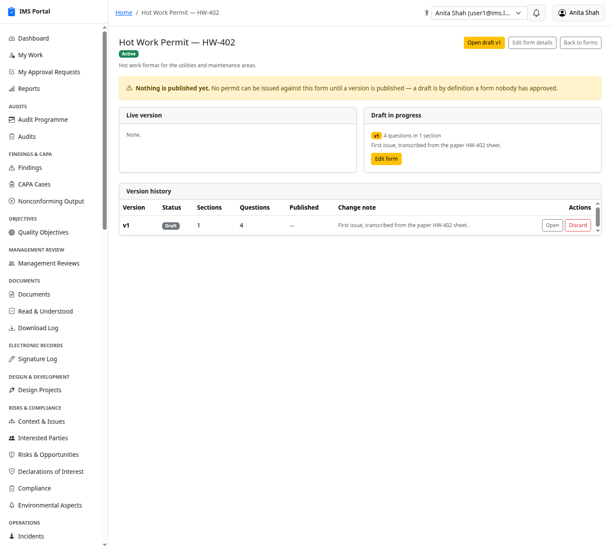

> **"Nothing is published yet."** A brand-new form shows this warning, and no
> permit can be raised on it until you publish. A draft is by definition a form
> nobody has approved.

Click **Edit form** to open the builder. It is empty, with the printed sheet
waiting beside it:

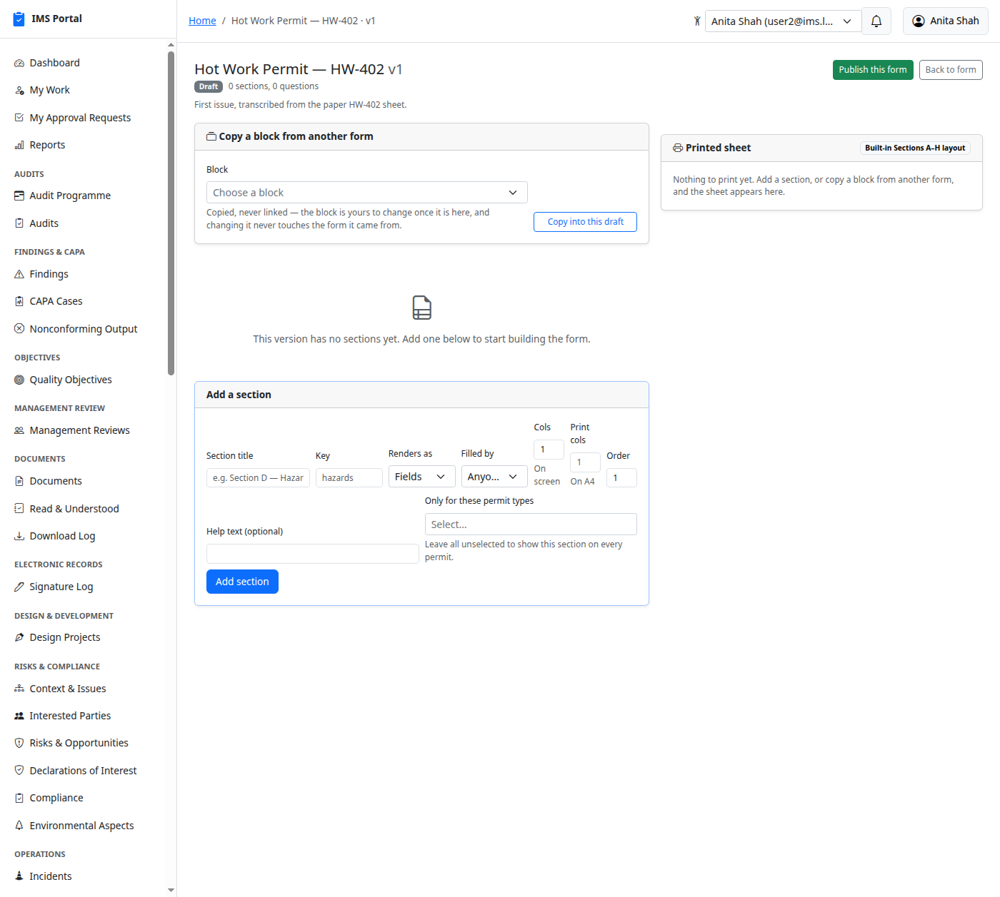

---

## 4. Add your first section

Scroll to **Add a section** at the bottom of the builder. Take the first block
off your paper form and fill it in.

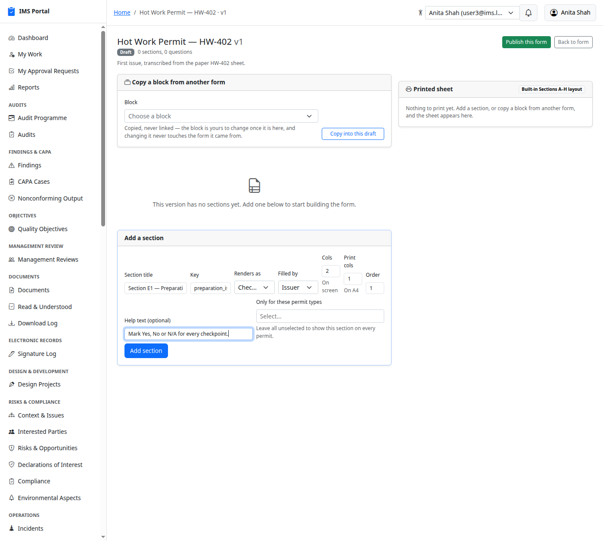

| Field | What to put in it |
|---|---|
| **Section title** | Exactly what the paper says — `Section E1 — Preparation required (Issuer)`. Reproduce the paper's own numbering; it is what your users already know. |
| **Key** | A short permanent name — `preparation_issuer`. Lowercase letters, numbers and underscores. |
| **Renders as** | How the block behaves. See the table below. |
| **Filled by** | The party from [§2](#2-before-you-design-four-decisions). |
| **Cols** | 1–4. How many across on screen. |
| **Print cols** | 1–8. How many across on the A4 sheet. Leave blank to match Cols. |
| **Order** | Where it sits. Sections sort by this number. |
| **Help text** | The instruction printed above the block — *"Mark Yes, No or N/A for every checkpoint."* |
| **Only for these permit types** | Leave all unselected for now. [§7](#7-showing-a-section-only-on-some-permits). |

### Renders as — pick the behaviour, not the look

| Renders as | Use it for | Looks like |
|---|---|---|
| **Fields** | Ordinary boxes — job description, equipment number, remarks | A labelled grid |
| **Tick list** | A list where you tick whatever applies — nature of work, hazards, PPE | Checkboxes, many across |
| **Checkpoints** | Preparation items that must each be answered | A **Yes / No / N/A** table |
| **Gas test** | The clearing test before work starts | Readings with their limits |
| **Signatures** | A signature block | Name, signature, date and time rows |

**Checkpoints is the one to understand.** It gives every row three boxes — Yes,
**No** and **N/A** — rather than a single tick. On a safety document *"not
applicable"* and *"not answered"* are different facts, and collapsing them is
exactly how a missed check becomes invisible. If your paper form has a single
tick column, this is the one place worth improving on it.

**Cols vs Print cols is not a mistake.** The entry screen may be a phone at the
gate; the printed sheet is A4 at 6pt. A hazard list that runs 3 across on screen
runs 7 across on paper. Set both.

Click **Add section**. It appears immediately, and the sheet beside it redraws:

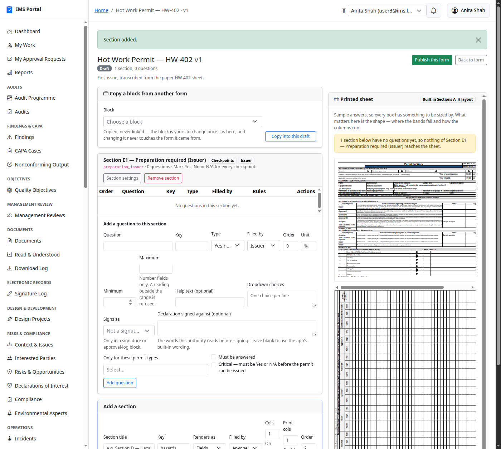

---

## 5. Add questions

Every section has an **Add a question to this section** form at its foot.

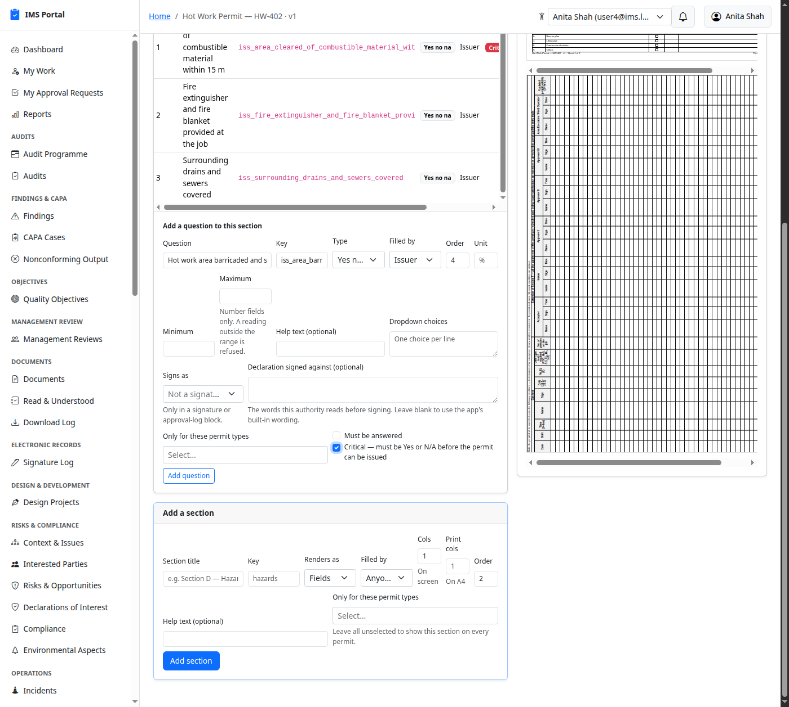

| Field | What to put in it |
|---|---|
| **Question** | The wording from the paper, verbatim |
| **Key** | Permanent — `iss_area_barricaded`. See the warning below. |
| **Type** | See the table below |
| **Filled by** | Defaults to the section's party; override for a single row |
| **Order** | Position within the section |
| **Help text** | Guidance printed under the question |
| **Dropdown choices** | One per line — only for Select / Multiselect |
| **Must be answered** | A blank is an omission |
| **Critical** | Blocks issue — [§6](#6-making-a-question-enforce-something) |

### Question types

| Type | For |
|---|---|
| **Text** | A short entry — tag number, reference point, a name |
| **Textarea** | A paragraph — job description, remarks |
| **Number** | A reading. The only type that can carry a **range** — [§6](#6-making-a-question-enforce-something) |
| **Date** / **Datetime** | A date, or a date and time |
| **Select** / **Multiselect** | One or several from a fixed list |
| **Checkbox** | A tick — the building block of a tick list |
| **Yes no na** | A checkpoint's three boxes |
| **Signature block** | One authority's signature row — [§10](#10-signatures-and-declarations) |

> ### Keys are permanent
>
> Every answer on every permit is stored against its question's **key**.
> Renaming a key would silently orphan every answer already recorded under the
> old one — the permits would still exist, and the answers would no longer be
> attached to any question. So once a question is saved, the screen disables
> the key field and says so:
>
> *"Answers are keyed by this, so it is permanent."*
>
> **You can freely change the wording, the type, the order and the rules.** It
> is only the key that is fixed. Pick something descriptive at the outset; if
> you truly must change one, remove the question and add a new one — and accept
> that permits issued earlier keep the old one, which is correct, because they
> asked the old one.

---

## 6. Making a question enforce something

Three settings turn a question from a record into a control. This is the part
of the builder that changes what the system will and will not let happen.

### Must be answered

A blank is treated as an omission rather than a "no". Available on every type
except Checkbox and Signature block, where a blank is a legitimate "not
ticked".

### Critical

**A critical question must be Yes or N/A before the permit can be issued.** A
*No*, or an unanswered box, refuses issue with a stated reason.

Available only on Yes/No/NA, Checkbox, Select and Number questions — a
"critical" free-text box could never be evaluated as pass or fail, so the
screen will not let you set one.

Use it for the checkpoints your procedure treats as unconditional. On the
seeded standard form there is exactly one such checkpoint on the acceptor's
side: *"Every work permit must have a Task Based Risk Assessment attached"* —
the form's own note makes it unconditional, so it is critical, and a permit
without it cannot be issued.

> **Restraint is the point.** Mark every checkpoint critical and you have built
> a form nobody can issue a permit against at 2 a.m., which is how permits stop
> being raised at all. Mark the ones your procedure genuinely refuses to
> proceed without.

### Minimum / maximum / unit — enforceable gas limits

On a **Number** question, a minimum, a maximum and a unit make the limit
*enforceable* rather than advisory. **A reading outside the range is refused.**

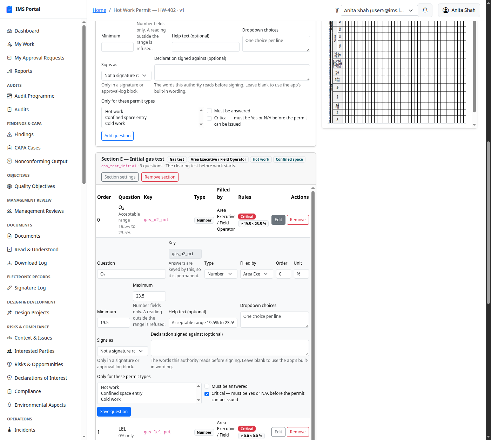

The standard gas test is two of these:

| Reading | Min | Max | Unit | Critical | Meaning |
|---|---|---|---|---|---|
| O₂ | `19.5` | `23.5` | `%` | yes | Outside 19.5–23.5% is refused |
| LEL | `0` | `0` | `%` | yes | 0% only — anything above it is refused |

Setting both minimum and maximum to `0` is not a mistake: it is how "0% only"
is expressed, and it is the difference between a form that *asks* for a gas
reading and one that *acts* on it. A failed gas test suspends the permit
rather than being noted on it.

---

## 7. Showing a section only on some permits

Both sections and individual questions carry **Only for these permit types**.

- **Leave everything unselected** and the section shows on *every* permit. This
  is the common case and the reason the field defaults to empty.
- **Select one or more types** and it shows only on permits carrying one of
  them.

That is the whole mechanism — no rules engine, no conditional logic. A
confined-space row appears on a confined-space permit because you said so on
the section, and a permit clubbing hot work *and* confined space shows both
sets.

> **A section scoped to a type you later rename or remove will not silently
> vanish.** The builder refuses a section pointing at an unknown permit type,
> because a safety section that never renders is worse than a missing one — the
> form still looks complete.

Note the asymmetry with check sheets ([Permit to Work §
Check sheets](33-permit-to-work.md#check-sheets)): a *section* with no types
applies to everything, but a *check sheet* with no types applies to nothing. A
check sheet is about a particular hazard, so an unscoped one is a configuration
mistake rather than a universal sheet.

---

## 8. Copy a block from another form

This is the fastest way to build your second, third and fourth format.

Your formats overlap heavily — the same PPE grid, the same hazard list, the
same declarations. So the block library is **the forms themselves**: pick any
block from any other form, and it is copied in whole, questions and all.

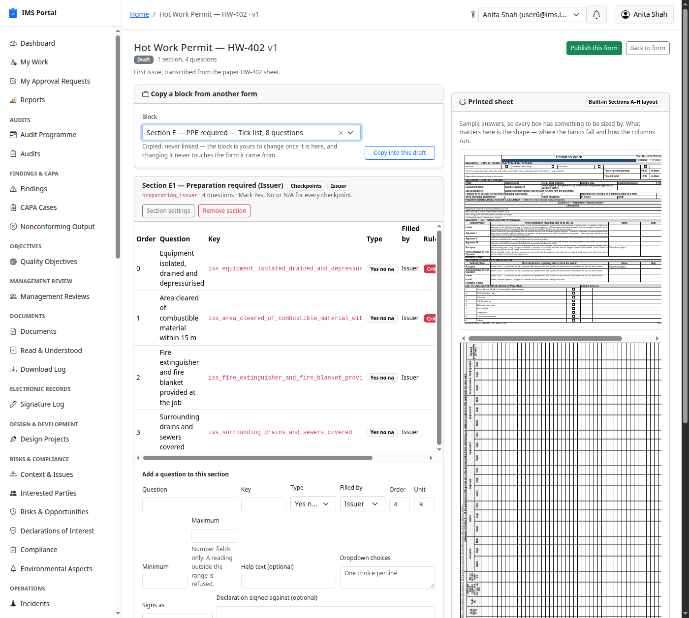

Pick the block, click **Copy into this draft**, and it lands at the bottom of
your form ready to be reordered and edited:

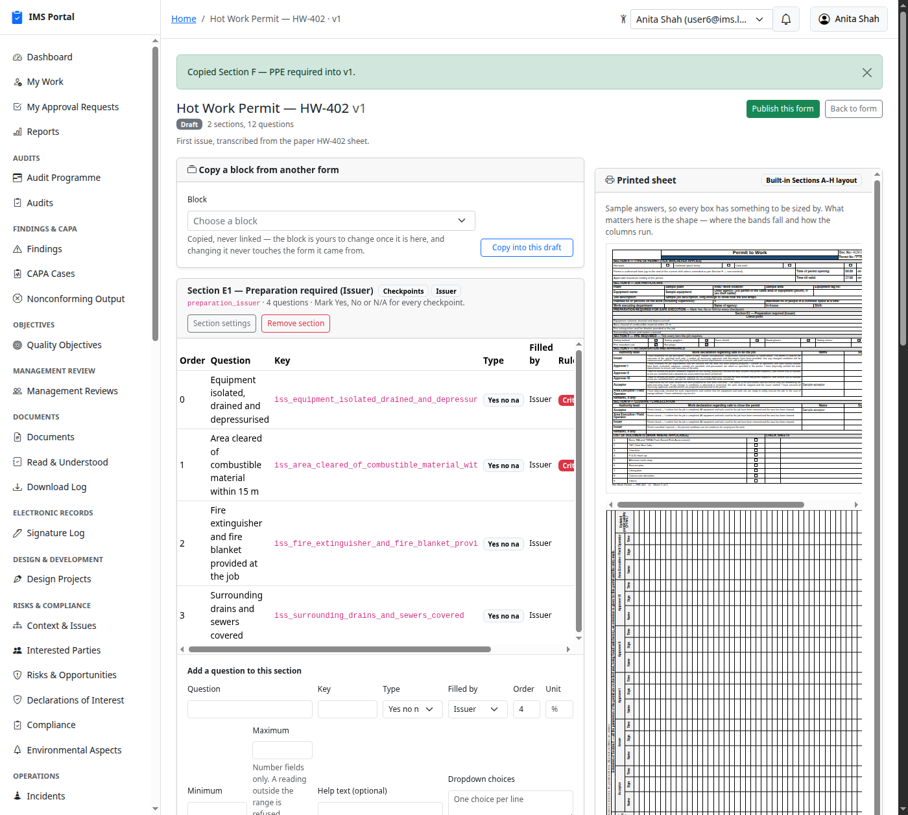

Three things to know:

- **It is a copy, never a link.** Change it here and the form it came from is
  untouched. That is deliberate: a published form is immutable, so a copied
  block has to be free to diverge.
- **Keys are made unique for you.** Copy a block into a form that already has a
  `ppe` section and the copy becomes `ppe_2`. You are not asked to solve it.
- **It is appended, not slotted in.** Where the block belongs is your
  judgement — set its **Order** afterwards.

---

## 9. Read the printed sheet as you build

The right-hand panel is not a mock-up. **It is the printed sheet, rendered
through the print's own code** — what you see is what comes out of the printer.
Every edit redirects back to the builder, so it is rebuilt on each change with
no "refresh" to remember.

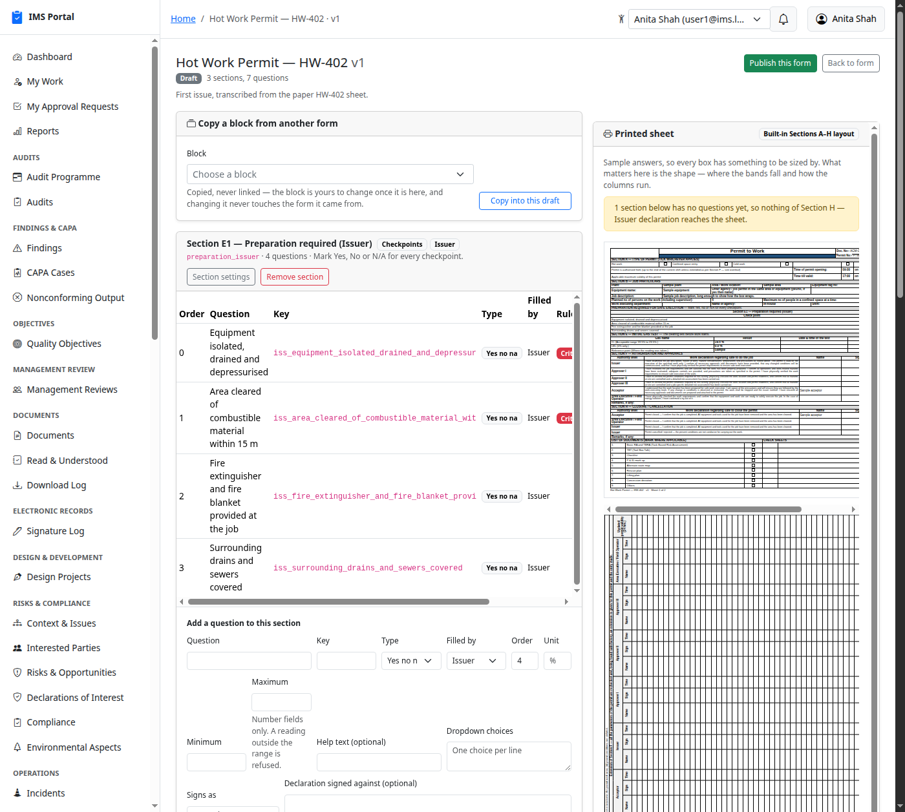

Read three things on it:

1. **The sample answers.** Every box is filled with stand-in text so it has
   something to be sized by. Ignore the words; **look at the shape** — where the
   bands fall, how the columns run, whether a checkpoint list is squeezed. If a
   block looks cramped, change its **Print cols**.
2. **The badge, top right.** It says either *"Built-in Sections A–H layout"* or
   *"This form's own layout"*. See [§11](#11-designing-your-own-sheet-layout).
3. **The warning band.** A section with no questions prints nothing — correct on
   paper, baffling in a designer — so the preview calls it out by name rather
   than swallowing it. If you see it, either add the questions or remove the
   section before you publish.

---

## 10. Signatures and declarations

A **Signatures** section holds the sheet's signature block. Each question
inside it is not a question but one authority's row, set through two fields:

- **Signs as** — Issuer, Approver I, Approver II, Approver III, Acceptor, Area
  Executive / Field Operator, Fire Watcher, or Safety District Clearance.
  Leave it as *"Not a signature row"* on an ordinary question.
- **Declaration signed against** — **the words that authority reads before
  signing.** Leave it blank to use the app's built-in wording; fill it in to use
  your own.

> **Put your own declaration in.** A signature means the words the signer
> actually read, and your controlled format's wording is what your procedure,
> your auditor and your incident investigation will all refer back to. This is
> the single field on the builder most worth spending five minutes on.

Who is *required* to sign, and when, is not set here — that is the **Approval
Matrix**, permit type by permit type and shift by shift. See
[Permit to Work § Changing who approves what](33-permit-to-work.md#changing-who-approves-what).

---

## 11. Designing your own sheet layout

Most organisations never need this section. Read it only if the printed sheet
must match a controlled format the built-in one does not fit.

By default, a form prints on the **built-in Sections A–H sheet** — the standard
frame, with your sections placed inside it. That is the *"Built-in Sections A–H
layout"* badge on the preview.

If you need the sheet's own furniture to be yours too, add sections with these
**Renders as** kinds. They carry no questions of their own; they *are* parts of
the sheet:

| Renders as | The part of the sheet it draws |
|---|---|
| **Permit types** | The top row of permit-type boxes |
| **Job particulars** | The plant / equipment / location / description grid |
| **Authorisation** | The approval and signature band |
| **Closure** | The closing declarations band |
| **Attachments** | The attachments / check sheets menu |
| **Extension log** | The overleaf renewal log |

Add even one of these and the badge changes to **"This form's own layout"** —
the form now describes its own sheet, and the built-in frame steps aside. A form
that declares none of them keeps the built-in frame, so a format written before
this existed is unaffected.

---

## 12. Publish

Click **Publish this form**, confirm, and three things happen in one step:

1. This draft becomes the live form.
2. The previous live version is archived.
3. Every permit raised from now on uses the new version.

**Permits already issued are untouched.** They keep the version they were
issued against.

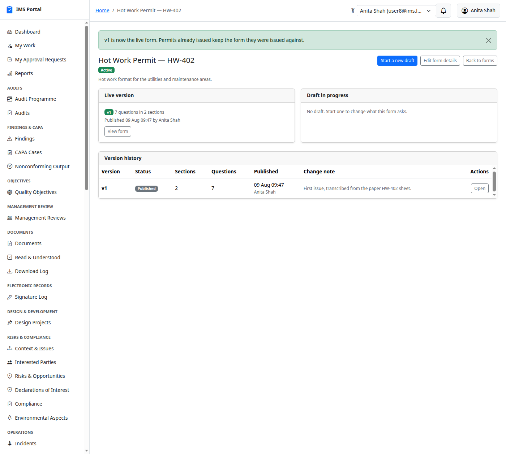

A published version is read-only, and says so:

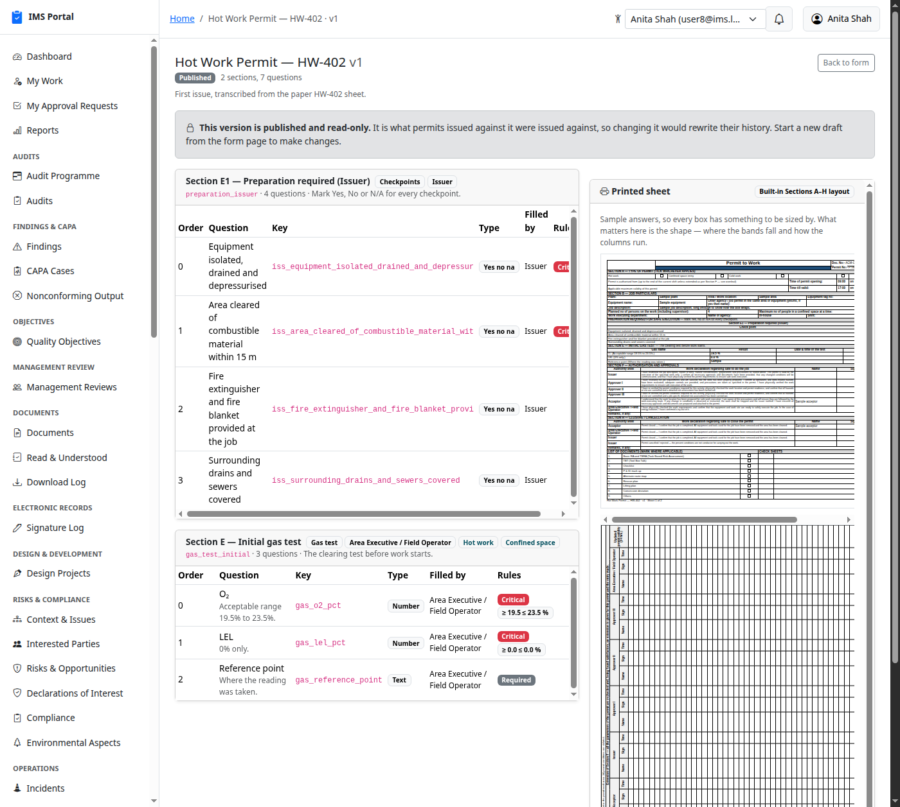

> **You cannot publish an empty form.** A form with no sections or no questions
> would issue a blank permit, so the system refuses. Fix the form, then publish.

---

## 13. Revising a form later

You never edit a live form. You revise it:

1. Open the form → **Start a new draft**. The draft is a **full copy** of the
   published one. Revising a form in practice means changing two checkpoints out
   of a hundred and thirty, and you should not have to retype the other
   hundred and twenty-eight.
2. Write a **change note** — what you changed and why. It shows in the version
   history, which is what an auditor reads.
3. Edit the draft.
4. **Publish**. The previous version is archived in the same moment.

Two rules keep this tidy:

- **Only one draft at a time.** A second parallel draft would make "what is the
  next version?" unanswerable.
- **Only a draft can be discarded.** Published and archived versions stay
  forever, because issued permits point at them.

---

## 14. Worked example: a hot work permit

Reproducing a typical hot work sheet, end to end. Adjust the wording to your
own format — the shape is what to copy.

**Form:** `Hot Work Permit — HW-402`, document number `ACM-G00-HSE-402-0012`.

| # | Section | Renders as | Filled by | Cols / Print | Only for types |
|---|---|---|---|---|---|
| 1 | Section C — Nature of work | Tick list | Issuer | 3 / 5 | — |
| 2 | Section D — Hazard considerations | Tick list | Issuer | 3 / 7 | — |
| 3 | Section E1 — Preparation required (Issuer) | Checkpoints | Issuer | 2 / 1 | — |
| 4 | Section E2 — Preparation required (Acceptor) | Checkpoints | Acceptor | 2 / 1 | — |
| 5 | Section E — Initial gas test | Gas test | Field Operator | 2 / 1 | Hot work, Confined space |
| 6 | Section F — PPE required | Tick list | Issuer | 3 / 6 | — |
| 7 | Section H — Declarations | Signatures | Issuer | 1 / 1 | — |

Sections 1, 2 and 6 are checkbox lists, ending with an **Other (specify)** text
question so anything unlisted has somewhere to go.

Section 3 and 4 are Yes/No/NA checkpoints. Mark critical only what your
procedure refuses to proceed without — on the issuer's side typically
*isolation done* and *area cleared of combustibles*; on the acceptor's side the
*TBRA attached*.

Section 5 is the enforceable part:

| Question | Type | Min | Max | Unit | Rules |
|---|---|---|---|---|---|
| O₂ | Number | 19.5 | 23.5 | % | Critical |
| LEL | Number | 0 | 0 | % | Critical |
| Other gas test if required | Text | | | | |
| Reference point | Text | | | | Must be answered |
| Name of gas tester | Text | | | | Must be answered |

Section 7 carries one signature row per authority, each with your own
declaration wording.

**Then, outside this screen** — three things the form does not decide, covered
in [Permit to Work](33-permit-to-work.md):

- **Permit Types** — hot work needs a gas test, a fire watcher and an HSEF copy,
  and has a maximum validity.
- **Approval Matrix** — who signs a hot work permit, and after which shift.
- **Check Sheets** — the hot work check sheet that attaches itself to every hot
  work permit.

---

## 15. Rules that will stop you, and why

Everything the builder refuses, and the reason it refuses it:

| What you tried | What happens | Why |
|---|---|---|
| Editing a published version | Refused; you are told to start a draft | It is what issued permits were issued against — changing it would rewrite their history |
| Changing a question's key | The field is disabled | Answers are stored against the key; renaming orphans every one already recorded |
| Publishing a form with no questions | Refused | It would issue a blank permit |
| Keeping two drafts | Only one is allowed | "What is the next version?" has to have one answer |
| Discarding a published version | Refused | Issued permits point at it |
| Marking a free-text question critical | Not offered | Pass or fail cannot be evaluated on prose |
| A range on a non-number question | Not offered | Nothing to compare |
| Scoping a section to an unknown permit type | Refused | A safety section that never renders is worse than a missing one |
| Copying a block whose key is taken | Allowed, key suffixed `_2` | You wanted the block, not a lecture about keys |
| Raising a permit on a form with nothing published | Refused | A draft is a form nobody has approved |

---

## 16. Checklist before you publish

- [ ] Every block of the paper sheet exists as a section, in the paper's own order
- [ ] Every section says who fills it — issuer, acceptor, approver, field operator
- [ ] No section is empty (the preview warns you by name)
- [ ] Checkpoints render as **Checkpoints**, so N/A and unanswered stay different facts
- [ ] Gas readings are **Number** questions with min, max and unit — not text
- [ ] Critical is set on what your procedure genuinely refuses to proceed without, and nothing else
- [ ] Confined-space and other type-specific blocks are scoped to their permit types
- [ ] Signature rows carry your own declaration wording
- [ ] **Print cols** set on wide lists, and the printed sheet checked at the shape
- [ ] A change note written, saying what changed and why
- [ ] Permit types, approval matrix and check sheets configured to match

---

*Next: [Permit to Work](33-permit-to-work.md) — raising, approving, opening,
renewing and closing a permit against the form you just built.*
